# RunningHub 模块依赖关系

生成时间：2026-06-27  
来源：`settings.gradle.kts`、Gradle build files。

## 总览

```mermaid
graph TD
    composeApp[":composeApp"] --> core_model[":core:model"]
    composeApp --> core_storage[":core:storage"]
    composeApp --> auth_domain[":feature:auth:domain"]
    composeApp --> auth_presentation[":feature:auth:presentation"]
    composeApp --> community_domain[":feature:community:domain"]
    composeApp --> community_presentation[":feature:community:presentation"]
    composeApp --> discovery_domain[":feature:discovery:domain"]
    composeApp --> discovery_presentation[":feature:discovery:presentation"]
    composeApp --> detail_presentation[":feature:detail:presentation"]
    composeApp --> task_domain[":feature:task:domain"]
    composeApp --> task_presentation[":feature:task:presentation"]
    composeApp --> quickcreate_domain[":feature:quickcreate:domain"]
    composeApp --> quickcreate_presentation[":feature:quickcreate:presentation"]
    composeApp_android_ios[":composeApp androidMain/iosMain"] --> core_network[":core:network"]
    composeApp_android_ios --> auth_data[":feature:auth:data"]
    composeApp_android_ios --> community_data[":feature:community:data"]
    composeApp_android_ios --> discovery_data[":feature:discovery:data"]
    composeApp_android_ios --> model_data[":feature:model:data"]
    composeApp_android_ios --> task_data[":feature:task:data"]
    composeApp_android_ios --> quickcreate_data[":feature:quickcreate:data"]
    composeApp_android_ios --> audio_data[":feature:audio:data"]
    core_network --> core_common[":core:common"]
    core_network --> core_storage
    core_storage --> core_common
    auth_data --> auth_domain
    auth_data --> core_common
    auth_data --> core_model
    auth_data --> core_network
    auth_data --> core_storage
    auth_presentation --> auth_domain
    auth_presentation --> discovery_domain
    community_data --> community_domain
    community_data --> core_network
    community_presentation --> community_domain
    discovery_data --> discovery_domain
    discovery_data --> core_model
    discovery_data --> core_network
    discovery_presentation --> discovery_domain
    discovery_presentation --> core_model
    detail_presentation --> core_model
    detail_presentation --> discovery_domain
    detail_presentation --> task_domain
    task_data --> task_domain
    task_data --> core_common
    task_data --> core_model
    task_data --> core_network
    task_data --> core_storage
    task_presentation --> task_domain
    audio_data --> audio_domain[":feature:audio:domain"]
    audio_data --> core_network
    model_data --> model_domain[":feature:model:domain"]
    model_data --> core_common
    model_data --> core_network
    model_data --> core_storage
    quickcreate_data --> quickcreate_domain
    quickcreate_data --> auth_domain
    quickcreate_data --> model_domain
    quickcreate_data --> core_model
    quickcreate_data --> core_network
    quickcreate_data --> core_storage
    quickcreate_presentation --> quickcreate_domain
```

## 模块清单

| 模块 | 类型 | 命名空间 | 内部依赖摘要 |
|---|---|---|---|
| `:core:model` | library | `com.runninghub.core.model` | 无 |
| `:core:common` | library | `com.runninghub.core.common` | 无 |
| `:core:network` | library | `com.runninghub.core.network` | `:core:common`, `:core:storage` |
| `:core:storage` | library | `com.runninghub.core.storage` | `:core:common` |
| `:feature:auth:domain` | library | `com.runninghub.feature.auth.domain` | `:core:model` |
| `:feature:auth:data` | library | `com.runninghub.feature.auth.data` | Core + Auth Domain |
| `:feature:auth:presentation` | library | `com.runninghub.feature.auth.presentation` | Core Model + Auth/Discovery Domain |
| `:feature:community:domain` | library | `com.runninghub.feature.community.domain` | 无 |
| `:feature:community:data` | library | `com.runninghub.feature.community.data` | `:core:network`, Community Domain |
| `:feature:community:presentation` | library | `com.runninghub.feature.community.presentation` | Community Domain |
| `:feature:discovery:domain` | library | `com.runninghub.feature.discovery.domain` | `:core:model` |
| `:feature:discovery:data` | library | `com.runninghub.feature.discovery.data` | Core Model/Network + Discovery Domain |
| `:feature:discovery:presentation` | library | `com.runninghub.feature.discovery.presentation` | Core Model + Discovery Domain |
| `:feature:detail:presentation` | library | `com.runninghub.feature.detail.presentation` | Core Model + Discovery/Task Domain |
| `:feature:task:domain` | library | `com.runninghub.feature.task.domain` | `:core:model` |
| `:feature:task:data` | library | `com.runninghub.feature.task.data` | Core + Task Domain |
| `:feature:task:presentation` | library | `com.runninghub.feature.task.presentation` | Task Domain |
| `:feature:audio:domain` | library | `com.runninghub.feature.audio.domain` | 无 |
| `:feature:audio:data` | library | `com.runninghub.feature.audio.data` | `:core:network`, Audio Domain |
| `:feature:model:domain` | library | `com.runninghub.feature.model.domain` | 无 |
| `:feature:model:data` | library | `com.runninghub.feature.model.data` | Core + Model Domain |
| `:feature:quickcreate:domain` | library | `com.runninghub.feature.quickcreate.domain` | 无 |
| `:feature:quickcreate:presentation` | library | `com.runninghub.feature.quickcreate.presentation` | QuickCreate Domain |
| `:feature:quickcreate:data` | library | `com.runninghub.feature.quickcreate.data` | Core + Auth/Model/QuickCreate Domain |
| `:composeApp` | application | `com.runninghub.app` | App shell + platform runtime assembly |

## 边界结论

- 当前模块图符合 `Core -> Feature Domain -> Feature Data/Presentation -> composeApp` 的 KMP 分层。
- Data 实现集中由 `composeApp` 平台 source set 装配，`commonMain` 保持领域和表现入口依赖。
- 未从当前 Gradle 模块图发现 `:shared`；根门禁禁止其回归。
- 循环依赖最终以 Gradle 和 `checkArchitectureBoundaries` 为准；当前依赖图未显示显式循环。
