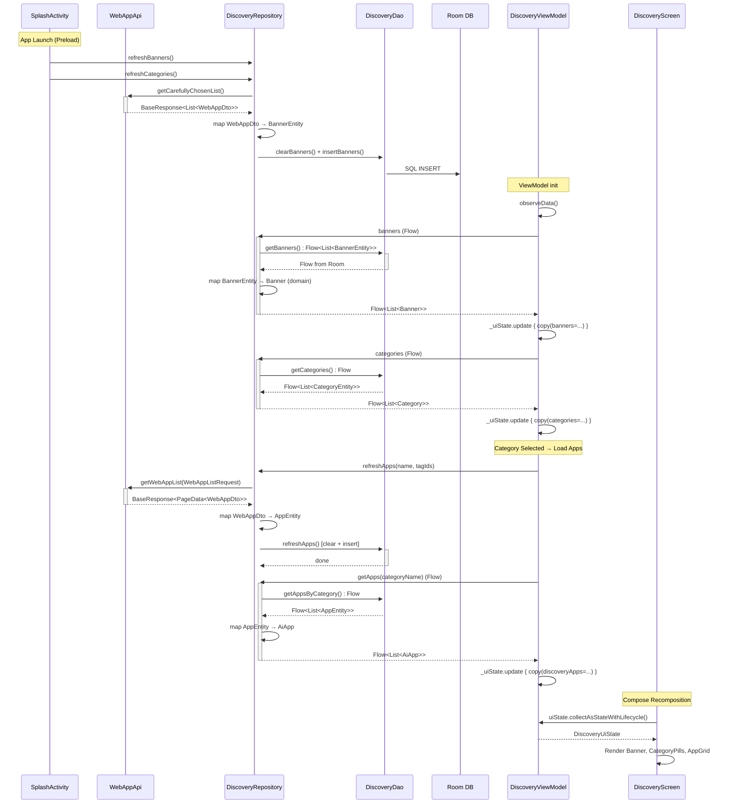

# RunningHub 代码架构深度分析报告

> 分析时间: 2026-04-25 | 分析范围: app/src/main/kotlin/com/runninghub/app/ (53 Kotlin 文件)

---

## 1. 执行摘要

| 指标 | 数值 |
|------|------|
| **Kotlin 源文件数** | 53 |
| **总代码行数 (LOC)** | ≈7,497 |
| **架构风格** | MVVM (Model-View-ViewModel) + Repository 模式 |
| **DI 框架** | Hilt (Dagger 2.50) |
| **UI 框架** | Jetpack Compose (BOM 2024.10) + Material3 |
| **网络层** | Retrofit 2.9 + OkHttp 4.12 + Gson |
| **本地存储** | Room 2.6.1 + SharedPreferences |
| **导航** | Navigation Compose 2.7.7 |
| **媒体** | Media3/ExoPlayer 1.3.1 + Coil 2.6 + Lottie 6.4 |
| **模块数** | 1 (单模块 `:app`) |
| **业务功能数** | 8 个 Screen |
| **ViewModel 数** | 7 个 |
| **Repository 数** | 4 个 (+ 1 Preferences) |
| **API 接口数** | 2 个 (WebAppApi: 14 端点, AudioApi: 2 端点) |

**核心结论**: 项目采用标准 Android MVVM + Repository 分层，单模块结构，代码量适中。架构整体合理但存在若干耦合问题，需要在模块化和关注点分离方面进行优化，才能支撑后续功能扩大和 KMP 迁移。

---

## 2. 架构分析

### 2.1 架构风格: MVVM + Repository

项目严格遵循 Google 推荐的 MVVM + Repository 架构：

```
┌─────────────────────────────────────────────────────────────┐
│                    UI Layer (Compose)                        │
│  Screen ← collectAsStateWithLifecycle ← ViewModel           │
│  (声明式 UI)       (StateFlow)         (业务逻辑)           │
├─────────────────────────────────────────────────────────────┤
│                    Data Layer                                │
│  Repository ← API (Retrofit) + DAO (Room) + Prefs          │
│  (数据协调)   (远程数据源)    (本地缓存)   (偏好)           │
└─────────────────────────────────────────────────────────────┘
```

**模式特征**:
- ✅ 单向数据流: ViewModel → StateFlow → Compose UI
- ✅ Repository 封装数据源协调逻辑 (Network-first + Local Cache)
- ✅ Hilt 依赖注入贯穿全栈
- ✅ UiState 数据类作为 UI 状态的单一真相源 (SSOT)
- ⚠️ 无独立 Domain 层 (无 UseCase/Interactor 抽象)
- ⚠️ 部分 ViewModel 直接访问 API 接口 (绕过 Repository)

### 2.2 架构图 (Mermaid)

```mermaid
graph TB
    subgraph "Android Entry"
        SA[SplashActivity] --> MA[MainActivity]
        APP[RunningHubApp<br/>@HiltAndroidApp<br/>ImageLoaderFactory]
    end

    subgraph "UI Layer"
        direction TB
        NAV[AppNavigation<br/>NavHost: 10 routes]

        subgraph "Feature Screens"
            DS[DiscoveryScreen<br/>679 LOC]
            ADS[AppDetailScreen<br/>755 LOC]
            PS[ProfileScreen<br/>225 LOC]
            PSD[ProfileSettingsDialog<br/>663 LOC]
            CPS[CreatorProfileScreen<br/>356 LOC]
            SS[SearchScreen<br/>121 LOC]
            CS[CommunityScreen<br/>177 LOC]
            AGS[AudioGenerationScreen<br/>378 LOC]
            SDS[SecretDecodeScreen<br/>566 LOC]
            THS[TaskHistoryScreen<br/>114 LOC]
        end

        subgraph "ViewModels"
            DVM[DiscoveryViewModel]
            ADVM[AppDetailViewModel]
            PVM[ProfileViewModel]
            CPVM[CreatorProfileViewModel]
            AGVM[AudioGenerationViewModel]
            SDVM[SecretDecodeViewModel]
            HVM[HistoryViewModel]
        end

        subgraph "Shared Components"
            SAI[SmartAsyncImage]
            VP[VideoPlayer]
            FMO[FabMenuOverlay]
        end
    end

    subgraph "Data Layer"
        subgraph "Repositories"
            DR[DiscoveryRepository]
            UR[UserRepository]
            AR[AudioRepository]
            SR[SteganographyRepository]
            UPR[UserPreferencesRepository]
        end

        subgraph "Remote"
            WAA[WebAppApi<br/>14 endpoints]
            AA[AudioApi<br/>2 endpoints]
            subgraph "DTOs"
                WR[WebAppResponse.kt<br/>198 LOC]
                BR[BaseResponse]
                ACR[AccountResponse]
                TR[TagResponse]
                AM[AudioModel]
            end
        end

        subgraph "Local"
            DB[(AppDatabase<br/>Room)]
            DAO[DiscoveryDao]
            ENT[DiscoveryEntities<br/>4 entities]
            SP[(SharedPreferences)]
            THM[TaskHistoryManager]
        end
    end

    subgraph "DI Layer"
        NM[NetworkModule<br/>Retrofit+OkHttp]
        DBM[DatabaseModule<br/>Room]
        APM[AppModule<br/>Dispatchers]
    end

    MA --> NAV
    SA -.preload.-> DR
    SA -.preload.-> UR

    NAV --> DS & ADS & PS & CPS & SS & CS & AGS & SDS & THS

    DS --> DVM
    ADS --> ADVM
    PS --> PVM
    CPS --> CPVM
    AGS --> AGVM
    SDS --> SDVM
    THS --> HVM

    DVM --> DR
    ADVM --> WAA
    ADVM --> DR
    PVM --> UR
    CPVM --> WAA
    AGVM --> AR
    SDVM --> SR

    DR --> WAA & DAO
    UR --> WAA & UPR
    AR --> AA

    DAO --> DB
    UPR --> SP
    THM --> SP

    NM -.provides.-> WAA & AA
    DBM -.provides.-> DB & DAO
    APM -.provides.-> DVM

    style DS fill:#10B981,color:#000
    style ADS fill:#10B981,color:#000
    style DVM fill:#6366F1,color:#fff
    style DR fill:#F59E0B,color:#000
    style WAA fill:#EC4899,color:#fff
```

---

## 3. 模块结构与依赖图

### 3.1 包结构统计

| 包路径 | 文件数 | LOC | 职责 |
|--------|--------|-----|------|
| `data/remote/api/` | 2 | 138 | Retrofit API 接口定义 |
| `data/remote/model/` | 5 | 340 | 网络 DTO 模型 |
| `data/local/` | 3 | 118 | Room DB + SharedPreferences |
| `data/local/dao/` | 1 | 60 | Room DAO |
| `data/local/entity/` | 1 | 60 | Room Entity |
| `data/repository/` | 4 | 708 | Repository 协调层 |
| `di/` | 3 | 177 | Hilt 依赖注入模块 |
| `ui/feature/discovery/` | 3 | 910 | 发现页 (主页) |
| `ui/feature/detail/` | 3 | 1,051 | 应用详情页 |
| `ui/feature/profile/` | 5 | 1,062 | 个人中心 |
| `ui/feature/creator/` | 2 | 565 | 创作者主页 |
| `ui/feature/community/` | 1 | 177 | 创意工坊 |
| `ui/feature/community/tools/` | 4 | 1,157 | 工具页面 (音频/隐写/检查) |
| `ui/feature/search/` | 1 | 121 | 搜索页 |
| `ui/component/` | 3 | 312 | 共享组件 |
| `ui/navigation/` | 2 | 209 | 导航定义 |
| `ui/theme/` | 3 | 93 | 主题系统 |
| `util/` | 2 | 160 | 工具类 |
| 根目录 | 3 | 513 | App/Activity 入口 |

### 3.2 依赖方向

```
UI Layer ──depends on──> Data Layer ──depends on──> Framework
   │                         │
   ├── Screen → ViewModel    ├── Repository → API + DAO
   │   (Compose)   (Hilt)    │   (Singleton)  (Retrofit, Room)
   │                         │
   └── Component             └── Prefs (SharedPreferences)
         (SmartAsyncImage,
          VideoPlayer,
          FabMenuOverlay)
```

### 3.3 耦合问题

| 问题 | 严重度 | 详情 |
|------|--------|------|
| **ViewModel 直接访问 API** | 🔴 高 | `AppDetailViewModel` 和 `CreatorProfileViewModel` 直接注入 `WebAppApi`，绕过 Repository 层 |
| **UI Model 定义在 UI 包** | 🟡 中 | `Banner`, `AiApp`, `Category` 等 domain model 定义在 `ui.feature.discovery` 包中，被 `data.repository` 反向引用 |
| **UiState 包含 Android 类型** | 🟡 中 | `AppDetailUiState.nodeLocalUris` 使用 `android.net.Uri`，阻碍 KMP 迁移 |
| **ViewModel 持有 Application** | 🟡 中 | `AppDetailViewModel` 注入 `Application`，用于文件操作 |
| **Splash 直接注入 Repository** | 🟢 低 | `SplashActivity` 通过 field injection 预加载数据，可考虑 Startup Library |

---

## 4. 数据流追踪: Discovery 功能

### 4.1 完整数据流 (API → Repository → ViewModel → UI)



### 4.2 数据流关键特征

1. **Network-First + Room Cache**: 先从网络拉数据写入 Room，UI 通过 Flow 观察 Room 变化
2. **响应式链路**: Room DAO 返回 `Flow`，Repository 做 `map` 转换，ViewModel `collect` 并更新 `MutableStateFlow`，UI 通过 `collectAsStateWithLifecycle` 订阅
3. **预加载机制**: `SplashActivity` 在启动动画期间并发预加载 Banners 和 Categories
4. **分页**: 手动实现的分页逻辑 (`loadMore`), 通过 `snapshotFlow` 监听列表滚动位置触发
5. **DTO → Entity → Domain 三层映射**: `WebAppDto` → `AppEntity`(Room) → `AiApp`(UI Model)

---

## 5. KMP 迁移可行性评估

### 5.1 迁移矩阵

| 模块/文件 | 类型 | KMP 迁移性 | 阻碍项 | 建议 |
|-----------|------|------------|--------|------|
| **data/remote/model/*.kt** | DTO 模型 (5文件, 340 LOC) | ✅ 可直接迁移 | `@SerializedName` (Gson) → 需换 `@Serializable` (kotlinx.serialization) | `commonMain` |
| **data/remote/api/*.kt** | Retrofit 接口 (2文件, 138 LOC) | ❌ Android 专属 | Retrofit = JVM-only | `androidMain`，commonMain 用 Ktor Client |
| **data/local/entity/*.kt** | Room Entity (1文件, 60 LOC) | ❌ Android 专属 | Room = Android-only | `androidMain`，commonMain 用 SqlDelight |
| **data/local/dao/*.kt** | Room DAO (1文件, 60 LOC) | ❌ Android 专属 | Room = Android-only | `androidMain` |
| **data/local/AppDatabase.kt** | Room DB (21 LOC) | ❌ Android 专属 | Room | `androidMain` |
| **data/local/UserPreferencesRepository.kt** | SharedPreferences (55 LOC) | ❌ Android 专属 | `SharedPreferences`, `Context` | `expect/actual`，commonMain 用 `multiplatform-settings` |
| **data/local/TaskHistoryManager.kt** | SharedPreferences (42 LOC) | ❌ Android 专属 | `SharedPreferences`, `Context`, Gson | `expect/actual` |
| **data/repository/DiscoveryRepository.kt** | 业务逻辑 (189 LOC) | 🟡 部分可迁移 | 引用 Room DAO, 但协调逻辑是纯 Kotlin | 接口抽象后 `commonMain` |
| **data/repository/UserRepository.kt** | 业务逻辑 (110 LOC) | 🟡 部分可迁移 | 引用 Android SharedPreferences | 接口抽象后 `commonMain` |
| **data/repository/AudioRepository.kt** | 业务逻辑 (80 LOC) | ✅ 可直接迁移 | 纯 Kotlin + Coroutines Flow | `commonMain` |
| **data/repository/SteganographyRepository.kt** | 图片处理 (329 LOC) | ❌ Android 专属 | `android.graphics.Bitmap`, `BitmapFactory`, `android.net.Uri` | `androidMain` |
| **ui/feature/discovery/DiscoveryUiState.kt** | Domain Models (62 LOC) | ✅ 可直接迁移 | 纯 data class | `commonMain` |
| **ui/feature/detail/AppDetailUiState.kt** | UI State (16 LOC) | ⚠️ 需修改 | 包含 `android.net.Uri` | 替换为 String 路径 |
| **ui/feature/profile/ProfileUiState.kt** | UI State (21 LOC) | ✅ 可直接迁移 | 纯 data class | `commonMain` |
| **ui/feature/*/ViewModel.kt** | ViewModel (7文件, ~1,100 LOC) | ❌ Android 专属 | `AndroidX ViewModel`, `HiltViewModel` | `androidMain`，或用 KMP ViewModel |
| **ui/feature/*Screen.kt** | Compose UI (~4,000 LOC) | ❌ Android 专属 | Jetpack Compose | `androidMain`，iOS 用 SwiftUI |
| **ui/component/*.kt** | Compose 组件 (312 LOC) | ❌ Android 专属 | Compose, ExoPlayer, Coil | `androidMain` |
| **ui/theme/*.kt** | 主题 (93 LOC) | ❌ Android 专属 | Compose Material3 | `androidMain` |
| **ui/navigation/*.kt** | 导航 (209 LOC) | ❌ Android 专属 | Navigation Compose | `androidMain` |
| **di/*.kt** | Hilt 模块 (177 LOC) | ❌ Android 专属 | Dagger/Hilt | `androidMain`，commonMain 用 Koin |
| **util/*.kt** | 工具类 (160 LOC) | ⚠️ 混合 | `ResourceCacheManager` Android 专属; `PermissionManager` Android 专属 | `androidMain` |
| **RunningHubApp.kt** | Application (36 LOC) | ❌ Android 专属 | HiltAndroidApp, Coil ImageLoaderFactory | `androidMain` |
| **MainActivity.kt** | Activity (38 LOC) | ❌ Android 专属 | ComponentActivity | `androidMain` |
| **SplashActivity.kt** | Activity (439 LOC) | ❌ Android 专属 | Activity + Compose | `androidMain` |

### 5.2 KMP 迁移汇总

```
┌──────────────────────────────────────────────────────────────────┐
│  commonMain (可共享代码)                      ≈ 700 LOC (9.3%)  │
│  ├── DTO Models (替换 Gson → kotlinx.serialization)             │
│  ├── Domain Models (Banner, AiApp, Category, etc.)              │
│  ├── Repository 接口定义                                         │
│  ├── AudioRepository (纯 Kotlin 业务逻辑)                       │
│  └── UiState 数据类 (移除 android.net.Uri 引用)                 │
├──────────────────────────────────────────────────────────────────┤
│  androidMain (Android 专属代码)              ≈ 6,800 LOC (90.7%)│
│  ├── Compose UI (全部 Screen, Component, Theme)                 │
│  ├── Hilt DI Modules                                            │
│  ├── Room Database + DAO + Entity                               │
│  ├── Retrofit API + OkHttp                                      │
│  ├── SharedPreferences                                          │
│  ├── ExoPlayer / Coil / Lottie                                  │
│  ├── SteganographyRepository (Bitmap 处理)                      │
│  ├── Activities + Navigation                                    │
│  └── Android Utilities                                          │
└──────────────────────────────────────────────────────────────────┘
```

**迁移可行性结论**: 当前可共享代码比例较低 (~9%)。若要提升到 30%+，需要:
1. 引入 Domain 层 (UseCase), 将业务逻辑从 ViewModel 提取到纯 Kotlin 类
2. 将 DTO 迁移到 kotlinx.serialization
3. 定义 Repository 接口 (commonMain) + 实现 (androidMain/iosMain)
4. 将网络层换为 Ktor Client (KMP 兼容)
5. 将本地存储换为 SqlDelight + multiplatform-settings

---

## 6. 质量指标

### 6.1 评分

| 维度 | 评分 | 状态 | 说明 |
|------|------|------|------|
| **架构合理性** | 72/100 | 👍 | MVVM+Repository 基础良好，但缺 Domain 层，部分 ViewModel 绕过 Repository |
| **可维护性** | 68/100 | ⚠️ | 大文件较多 (4 文件>400 LOC)，单模块导致缺乏边界约束 |
| **可测试性** | 45/100 | ⚠️ | 无测试代码，Repository 无接口抽象，部分 ViewModel 直接依赖具体实现 |
| **代码规范** | 75/100 | 👍 | 有统一的文件头注释，命名规范，Kotlin 风格一致 |
| **类型安全** | 60/100 | ⚠️ | API 调用大量使用 `Map<String, Any>`，DTO 字段大量 nullable |
| **安全性** | 65/100 | ⚠️ | API Key 明文存储在 SharedPreferences，OkHttp Interceptor 直接读取明文 |
| **文档完整性** | 70/100 | 👍 | 有 CLAUDE.md、文件头 `[INPUT]/[OUTPUT]/[POS]` 约定 |
| **整体评分** | **65/100** | ⚠️ | 功能实现完整，架构基础健康，但可维护性和可测试性需提升 |

### 6.2 代码规模分布

```
UI Layer:     5,476 LOC  (73.0%)  ← 典型 UI-heavy 应用
Data Layer:   1,424 LOC  (19.0%)
DI Layer:       177 LOC  ( 2.4%)
Util:           160 LOC  ( 2.1%)
Entry:          513 LOC  ( 3.5%)  (含 SplashActivity 439 LOC 动画代码)
```

### 6.3 复杂度热点 (Top 5 大文件)

| 文件 | LOC | 复杂度因素 |
|------|-----|-----------|
| `AppDetailScreen.kt` | 755 | 单文件包含 Task 执行 UI + 输入表单 + 结果展示 + 文件上传 |
| `DiscoveryScreen.kt` | 679 | 包含 Banner、Categories、AppGrid、BottomNav、FAB、ShimmerLoading |
| `ProfileSettingsDialog.kt` | 663 | 多 Tab 设置页 (API Key 绑定、Cookie 绑定、企业密钥) |
| `SecretDecodeScreen.kt` | 566 | 隐写术解码完整 UI (文件选择、密码输入、结果展示、保存) |
| `SplashActivity.kt` | 439 | 复杂的 Compose 动画序列，应拆分动画逻辑 |

---

## 7. 发现的问题

### 7.1 🔴 严重 (Critical)

| # | 问题 | 位置 | 影响 |
|---|------|------|------|
| C1 | **ViewModel 绕过 Repository 直接调用 API** | `AppDetailViewModel` (Line 7: 注入 `WebAppApi`), `CreatorProfileViewModel` (Line 27: 注入 `WebAppApi`) | 破坏分层架构，无法统一缓存/错误处理/测试替换 |
| C2 | **API Key 明文存储** | `UserPreferencesRepository`, `NetworkModule` Interceptor | SharedPreferences 无加密，Root 设备可直接读取 |

### 7.2 🟠 主要 (Major)

| # | 问题 | 位置 | 影响 |
|---|------|------|------|
| M1 | **循环包依赖** | `data.repository.DiscoveryRepository` → `ui.feature.discovery.{Banner, AiApp, Category}` | data 层反向依赖 ui 层，违反分层原则 |
| M2 | **无 Repository 接口抽象** | 所有 Repository 都是具体类 | 无法进行单元测试 Mock，无法支持 KMP expect/actual |
| M3 | **巨型 Screen 文件** | 4 个文件 > 500 LOC | 难以维护，建议拆分为子 Composable 文件 |
| M4 | **API 调用使用 `Map<String, Any>`** | `WebAppApi.getWebAppDetail`, `getWebAppUserList` | 失去类型安全，编译期无法捕获参数错误 |
| M5 | **UiState 包含 Android 平台类型** | `AppDetailUiState.nodeLocalUris: Map<String, Uri>` | 阻碍 KMP 迁移，违反纯数据原则 |

### 7.3 🟡 次要 (Minor)

| # | 问题 | 位置 | 影响 |
|---|------|------|------|
| m1 | `runBlocking` 导入未使用 | `AppDetailViewModel` imports | 潜在的线程阻塞风险 |
| m2 | `android.util.Log` 散落在 ViewModel 中 | `AppDetailViewModel`, `CreatorProfileViewModel` | 应使用统一日志框架 (Timber) |
| m3 | 硬编码 URL 在 API 接口中 | `WebAppApi` 多个全路径 URL | 应抽取到常量或配置 |
| m4 | SplashActivity 包含大量 Compose 代码 | `SplashActivity.kt` 439 LOC | 动画代码应拆分到独立 Composable |
| m5 | NetworkModule 直接读取 SharedPreferences | `NetworkModule.provideOkHttpClient` | 应通过 UserPreferencesRepository 间接访问 |
| m6 | 无 ProGuard/R8 配置 | `build.gradle.kts` `isMinifyEnabled = false` | Release 包未混淆 |

---

## 8. 改进建议 (按优先级)

### P0: 架构修复 (立即执行)

1. **引入 Domain 层**: 将 `Banner`, `AiApp`, `Category` 等 domain model 移至独立 `domain/model/` 包
2. **修复循环依赖**: `data.repository` 不应引用 `ui.feature.discovery` 的类型
3. **为 Repository 增加接口**: `interface DiscoveryRepository` + `class DiscoveryRepositoryImpl`
4. **将 AppDetailViewModel/CreatorProfileViewModel 的 API 调用收敛到 Repository**

### P1: 安全与质量 (短期)

5. **API Key 加密存储**: 使用 `EncryptedSharedPreferences` (AndroidX Security)
6. **启用 R8 混淆**: `isMinifyEnabled = true` + 编写 ProGuard 规则
7. **替换 `Map<String, Any>` 为具体 Request 类**: 提升类型安全
8. **引入 Timber 统一日志**: 替换 `android.util.Log`

### P2: 可维护性 (中期)

9. **拆分巨型 Screen 文件**: `AppDetailScreen` → `AppDetailContent` + `TaskRunPanel` + `InputFormSection`
10. **单模块 → 多模块**: `:core:data`, `:core:domain`, `:core:ui`, `:feature:discovery`, `:feature:detail`
11. **引入 UseCase/Interactor**: 将复杂业务逻辑从 ViewModel 抽取

### P3: KMP 准备 (长期)

12. **Gson → kotlinx.serialization**: DTO 序列化迁移
13. **Retrofit → Ktor Client**: 网络层 KMP 化
14. **Room → SqlDelight**: 本地存储 KMP 化
15. **SharedPreferences → multiplatform-settings**: 偏好存储 KMP 化
16. **Hilt → Koin**: DI 框架 KMP 化

---

## 9. 文件清单索引

<details>
<summary>展开完整文件列表 (53 文件)</summary>

### 入口 (3)
- `RunningHubApp.kt` (36 LOC) - Application + Coil 配置
- `MainActivity.kt` (38 LOC) - 主入口 Activity
- `SplashActivity.kt` (439 LOC) - 启动页 + 动画

### DI (3)
- `di/NetworkModule.kt` (121 LOC) - Retrofit + OkHttp
- `di/DatabaseModule.kt` (32 LOC) - Room
- `di/AppModule.kt` (24 LOC) - Dispatchers

### Data Remote (7)
- `data/remote/api/WebAppApi.kt` (106 LOC) - 主 API 接口
- `data/remote/api/AudioApi.kt` (32 LOC) - 音频 API
- `data/remote/model/WebAppResponse.kt` (198 LOC) - WebApp DTO
- `data/remote/model/BaseResponse.kt` (19 LOC) - 基础响应
- `data/remote/model/AccountResponse.kt` (49 LOC) - 账户 DTO
- `data/remote/model/TagResponse.kt` (18 LOC) - 标签 DTO
- `data/remote/model/AudioModel.kt` (56 LOC) - 音频 DTO

### Data Local (5)
- `data/local/AppDatabase.kt` (21 LOC) - Room 数据库
- `data/local/dao/DiscoveryDao.kt` (60 LOC) - DAO
- `data/local/entity/DiscoveryEntities.kt` (60 LOC) - Entity
- `data/local/UserPreferencesRepository.kt` (55 LOC) - 偏好
- `data/local/TaskHistoryManager.kt` (42 LOC) - 历史

### Data Repository (4)
- `data/repository/DiscoveryRepository.kt` (189 LOC) - 发现
- `data/repository/UserRepository.kt` (110 LOC) - 用户
- `data/repository/AudioRepository.kt` (80 LOC) - 音频
- `data/repository/SteganographyRepository.kt` (329 LOC) - 隐写

### UI Features (19)
- `ui/feature/discovery/DiscoveryScreen.kt` (679 LOC)
- `ui/feature/discovery/DiscoveryViewModel.kt` (169 LOC)
- `ui/feature/discovery/DiscoveryUiState.kt` (62 LOC)
- `ui/feature/detail/AppDetailScreen.kt` (755 LOC)
- `ui/feature/detail/AppDetailViewModel.kt` (280 LOC)
- `ui/feature/detail/AppDetailUiState.kt` (16 LOC)
- `ui/feature/profile/ProfileScreen.kt` (225 LOC)
- `ui/feature/profile/ProfileSettingsDialog.kt` (663 LOC)
- `ui/feature/profile/ProfileViewModel.kt` (153 LOC)
- `ui/feature/profile/ProfileUiState.kt` (21 LOC)
- `ui/feature/profile/HistoryViewModel.kt` (11 LOC)
- `ui/feature/profile/TaskHistoryScreen.kt` (114 LOC)
- `ui/feature/creator/CreatorProfileScreen.kt` (356 LOC)
- `ui/feature/creator/CreatorProfileViewModel.kt` (209 LOC)
- `ui/feature/search/SearchScreen.kt` (121 LOC)
- `ui/feature/community/CommunityScreen.kt` (177 LOC)
- `ui/feature/community/tools/AudioGenerationScreen.kt` (378 LOC)
- `ui/feature/community/tools/AudioGenerationViewModel.kt` (127 LOC)
- `ui/feature/community/tools/SecretDecodeScreen.kt` (566 LOC)
- `ui/feature/community/tools/SecretDecodeViewModel.kt` (76 LOC)
- `ui/feature/community/tools/UiInspectorScreen.kt` (87 LOC)

### UI Shared (8)
- `ui/component/SmartAsyncImage.kt` (125 LOC)
- `ui/component/VideoPlayer.kt` (64 LOC)
- `ui/component/FabMenuOverlay.kt` (123 LOC)
- `ui/navigation/AppNavigation.kt` (185 LOC)
- `ui/navigation/Screen.kt` (24 LOC)
- `ui/theme/Color.kt` (21 LOC)
- `ui/theme/Theme.kt` (35 LOC)
- `ui/theme/Type.kt` (37 LOC)

### Util (2)
- `util/ResourceCacheManager.kt` (116 LOC)
- `util/PermissionManager.kt` (44 LOC)

</details>

---

*报告生成工具: code-analyzer skill | 分析者: Claude Opus 4.6*
