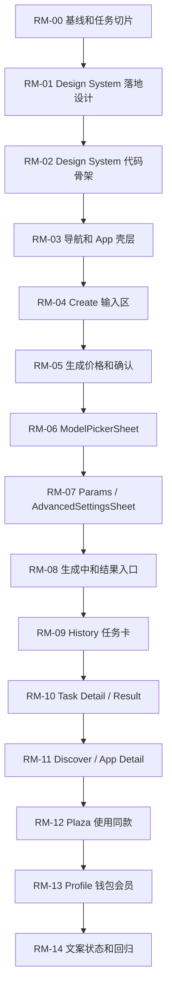

# RunningHub 产品重设计 Roadmap

日期：2026-06-30  
来源：`artifacts/runninghub-product-redesign-audit-2026-06-29.md`  
目标：把产品分析转成可执行的设计到代码改造顺序。每一处改造都必须先完成落地设计，再进入代码改造，不能跳序。

## 0. 顺序锁

本 roadmap 的核心约束是：**设计落地先行，代码改造跟进，验收后才能进入下一项代码改造**。

不可打乱的规则：

1. 不允许先改页面代码再补设计说明。
2. 不允许在 Design System token 未落地前批量改页面视觉。
3. 不允许在 `PriceBadge / TaskStatusBadge / BillingInfoCard` 语义未统一前重做 History 和 Task Detail。
4. 不允许在 Create 计费确认闭环未完成前做 Plaza 的“使用同款”生成转化。
5. 不允许在任务结果和保存/过期状态未清晰前把 History 改成资产库。
6. 不允许为了视觉统一把业务状态拉回 `composeApp`；复杂状态仍归 Feature Presentation。
7. 每一项都必须有 verifier；没有验证证据时只能标记为未完成。

推荐执行顺序：



## 1. 执行格式

每个 roadmap item 固定采用同一执行格式：

| 字段 | 要求 |
|---|---|
| 目标 | 这一步解决哪个产品问题 |
| 落地设计 | 先产出具体布局、状态、组件、文案、token 或交互规则 |
| 代码改造 | 设计确认后才改的源码范围 |
| 禁止事项 | 防止越界或乱序 |
| 验收 | 命令、截图、测试或人工检查标准 |
| 进入下一步条件 | 当前 item 完成的硬门槛 |

## RM-00 基线和任务切片

目标：锁定当前状态，避免后续实现污染用户已有改动。

落地设计：

- 把本 roadmap 作为后续实现的任务拆分基准。
- 明确首轮只走方案 B 的目标 IA，但第一批代码按低风险顺序迁移。
- 明确第一轮主视觉采用“专业工具型”，Plaza 局部吸收“创作者社区型”。

代码改造：

- 无生产代码改造。
- 后续每个实现任务开始前都运行 `git status --short --branch`。

禁止事项：

- 不在本阶段创建 UI 组件或改业务逻辑。
- 不把后续阶段合并成一次大改。

验收：

- `git status --short --branch` 已确认当前工作区。
- roadmap 文件已写入 `artifacts/`。

进入下一步条件：

- 当前 roadmap 被作为后续实现顺序的唯一执行入口。

## RM-01 Design System 落地设计

目标：先统一视觉语言，再让页面代码有稳定依赖，避免每个页面继续私有调色和私有圆角。

落地设计：

- 定稿暗色优先 token：
  - `background.*`
  - `surface.*`
  - `text.*`
  - `border.*`
  - `brand.*`
  - `status.*`
  - `price.*`
  - `overlay.*`
- 定稿字体层级：
  - `Display`
  - `PageTitle`
  - `SectionTitle`
  - `CardTitle`
  - `Body`
  - `BodyStrong`
  - `Caption`
  - `Meta`
  - `Button`
  - `Price`
  - `StatusBadge`
- 定稿 spacing scale：4 / 8 / 12 / 16 / 20 / 24 / 32 / 40。
- 定稿 radius scale：xs / sm / md / lg / xl / sheet / full。
- 定稿基础组件视觉草案：
  - `PrimaryButton`
  - `SecondaryButton`
  - `GhostButton`
  - `IconButton`
  - `PriceBadge`
  - `TaskStatusBadge`
  - `RhBottomSheet`
  - `EmptyState`
  - `LoadingState`
  - `ErrorState`

代码改造：

- 无页面代码改造。
- 可先新增设计文档或在本 roadmap 补充 token 决策，不急着动 Compose。

禁止事项：

- 不允许直接去 `DiscoveryScreen.kt`、`QuickCreateScreen.kt` 等页面里替换颜色。
- 不允许继续新增 `Color(0x...)` 私有色板作为设计系统。

验收：

- token 名称和使用边界完整。
- 每个 token 都有“用在哪里”和“不用在哪里”。
- 组件草案覆盖 default / selected / disabled / loading / error。

进入下一步条件：

- token 和基础组件的命名已经稳定，能直接映射为 Kotlin 类型。

## RM-02 Design System 代码骨架

目标：把 RM-01 的设计落地为可复用 Compose 基础设施。

落地设计：

- 设计侧确认 `composeApp` 内先收敛，不立即新增 Gradle 模块。
- 短期包结构固定为：

```text
composeApp/src/commonMain/kotlin/com/runninghub/app/ui/designsystem/
  theme/
  components/
  patterns/
```

- 明确只提供 UI token 和 UI 组件，不依赖 Feature Data、不持有业务状态。

代码改造：

- 新增：
  - `composeApp/src/commonMain/kotlin/com/runninghub/app/ui/designsystem/theme/RhColors.kt`
  - `composeApp/src/commonMain/kotlin/com/runninghub/app/ui/designsystem/theme/RhTypography.kt`
  - `composeApp/src/commonMain/kotlin/com/runninghub/app/ui/designsystem/theme/RhSpacing.kt`
  - `composeApp/src/commonMain/kotlin/com/runninghub/app/ui/designsystem/theme/RhShapes.kt`
  - `composeApp/src/commonMain/kotlin/com/runninghub/app/ui/designsystem/theme/RhTheme.kt`
- 修改：
  - `composeApp/src/commonMain/kotlin/com/runninghub/app/ui/theme/Theme.kt`
  - 必要时桥接 `Color.kt`、`Dimens.kt`、`Type.kt`，避免一次性删除旧 token。
- 新增基础组件：
  - `components/buttons/`
  - `components/badges/`
  - `components/sheets/`
  - `components/states/`

禁止事项：

- 不删除旧主题 token，先兼容桥接。
- 不在 Design System 内引用 `QuickCreateUiState`、`GenerationHistoryItem` 等 feature 状态。

验收：

- `.\gradlew.bat --console=plain :composeApp:assembleDebug`
- `.\gradlew.bat --console=plain checkArchitectureBoundaries`
- `.\gradlew.bat --console=plain checkLongTermGovernance`
- `composeApp/src/commonTest/kotlin/com/runninghub/app/ui/theme/RunningHubThemeTokenTest.kt` 按需补 token 测试。

进入下一步条件：

- 新 token 和基础组件可被页面引用，构建通过。

## RM-03 导航和 App 壳层

目标：先让五个 Tab 的职责变清楚，再进入页面内部重排。

落地设计：

- 导航命名采用：`创作 / 发现 / 灵感 / 任务 / 账户`。
- 设计确认：
  - `创作` 是默认主路径入口。
  - `发现` 是模板、应用、模型入口。
  - `灵感` 是社区作品和使用同款。
  - `任务` 是运行状态、历史、结果和账单。
  - `账户` 是钱包、会员和设置。
- 导航视觉确认：
  - selected 使用 `brand.primary`。
  - 未选状态只保留图标和弱文字。
  - 余额只作为弱入口，不抢主 CTA。

代码改造：

- 修改：
  - `composeApp/src/commonMain/kotlin/com/runninghub/app/ui/navigation/MainScreen.kt`
  - `composeApp/src/commonMain/composeResources/values/strings.xml`
- 可新增：
  - `designsystem/components/navigation/AppBottomBar.kt`
  - `designsystem/components/scaffold/AppScaffold.kt`
- 保留 `BottomNavTab` 枚举语义，先改展示文案和组件，不强行重命名 enum，降低风险。

禁止事项：

- 不在本阶段移动 Voyager Screen 注册关系。
- 不恢复旧 `CreateVoyagerScreen` / `CreateScreenModel`。

验收：

- `.\gradlew.bat --console=plain :composeApp:assembleDebug`
- 窄屏底栏、宽屏 `NavigationRail` 都显示新职责文案。
- 软键盘出现时底栏处理不回退。

进入下一步条件：

- 用户从导航能理解五个入口职责。

## RM-04 Create 输入区

目标：把 Create 从“空白区 + 加号”改成明确的创作输入工具。

落地设计：

- `PromptInputBar` 设计确认：
  - 有 Prompt 时主按钮必须显示“生成”或“生成 · 预计费用”。
  - 无 Prompt 时加号只表示“添加素材”，不表示生成。
  - 输入区包含 placeholder、字数、参考图、模型入口、参数入口、价格入口。
  - `Prompt 为空`、`Prompt 太短`、`参数缺失` 使用 inline error，不只 Toast。
- `UploadImageBox` 设计确认：
  - 上传中、成功、失败、删除、格式不支持有明确状态。

代码改造：

- 修改：
  - `composeApp/src/commonMain/kotlin/com/runninghub/app/ui/feature/quickcreate/presentation/editor/composer/QuickCreateCompactComposerContent.kt`
  - `composeApp/src/commonMain/kotlin/com/runninghub/app/ui/feature/quickcreate/AdaptivePromptTextField.kt`
  - `composeApp/src/commonMain/kotlin/com/runninghub/app/ui/feature/quickcreate/MediaChipCard.kt`
  - `composeApp/src/commonMain/composeResources/values/strings.xml`
- 可新增：
  - `designsystem/components/input/PromptInputBar.kt`
  - `designsystem/components/upload/UploadImageBox.kt`

禁止事项：

- 不改 `QuickCreateCoordinator` 的生成逻辑。
- 不把 Prompt 校验文案写进 Domain/Data。

验收：

- `Prompt 为空` 时不能提交，并显示 inline 提示。
- 有 Prompt 后按钮不再只显示图标。
- `.\gradlew.bat --console=plain :composeApp:assembleDebug`
- `.\gradlew.bat --console=plain :composeApp:allTests` 或相关 `QuickCreateConversationContentTest` 按实际任务可用性执行。

进入下一步条件：

- Create 首屏已经清楚表达“输入 -> 选择 -> 生成”。

## RM-05 生成价格和确认

目标：建立“生成前预估费用、提交时确认、成功后扣费、失败后退款/未扣费说明”的信任闭环。

落地设计：

- `PriceBadge` 设计确认：
  - `loading`：价格确认中。
  - `pending`：价格待确认。
  - `free`：免费生成。
  - `amount`：`37 RHB` 或 `¥2.00`。
  - `insufficient`：余额不足。
- `GenerationConfirmSheet` 设计确认：
  - 显示预计消耗、当前余额、会员减免、失败扣费说明。
  - 首次扣费或高价任务必须弹确认。
- `BillingInfoCard` 设计确认：
  - 实际扣费、原价、优惠、支付方式、退款状态、关联任务 ID。

代码改造：

- 修改：
  - `feature/quickcreate/presentation/src/commonMain/kotlin/com/runninghub/feature/quickcreate/presentation/billing/QuickCreateBillingUiText.kt`
  - `feature/quickcreate/presentation/src/commonMain/kotlin/com/runninghub/feature/quickcreate/presentation/billing/QuickCreateFeePreviewInteractor.kt`
  - `feature/quickcreate/presentation/src/commonMain/kotlin/com/runninghub/feature/quickcreate/presentation/state/QuickCreateUiState.kt`
  - `composeApp/src/commonMain/kotlin/com/runninghub/app/ui/feature/quickcreate/QuickCreateScreenModel.kt`
  - `composeApp/src/commonMain/kotlin/com/runninghub/app/ui/feature/quickcreate/presentation/editor/composer/QuickCreateCompactComposerContent.kt`
- 新增：
  - `designsystem/components/billing/PriceBadge.kt`
  - `designsystem/components/billing/BillingInfoCard.kt`
  - `designsystem/components/sheets/GenerationConfirmSheet.kt`

禁止事项：

- 不展示服务端原始错误文本。
- 不混排 `RH 币 / RHB / CNY`；创作消耗优先统一为 `RHB 点数`，CNY 只作为钱包现金余额或人民币金额。
- 不在价格确认失败时展示旧价格让用户提交。

验收：

- `.\gradlew.bat --console=plain :feature:quickcreate:presentation:allTests`
- `.\gradlew.bat --console=plain :feature:quickcreate:data:allTests`，如果触及 fee preview 请求或 DTO。
- `.\gradlew.bat --console=plain :composeApp:assembleDebug`
- 覆盖状态：价格确认中、价格待确认、余额不足、免费、金额、生成失败未扣费/已退回。

进入下一步条件：

- 用户在提交前知道预计消耗，在失败后知道扣费/退款状态。

## RM-06 ModelPickerSheet

目标：让模型选择从技术列表变成可理解、可比较、可信的生成方式选择。

落地设计：

- `ModelCard` 设计确认：
  - 模型名、能力类型、适用场景、价格、选中状态固定位置。
  - 技术标签如 `text-to-image` 降级为辅助信息。
  - 选中模型展示 `selected` 明确边框和 check。
- `ModelPickerSheet` 设计确认：
  - 搜索、分类、列表、错误、空结果。
  - 价格加载失败时不能让按钮误导用户。

代码改造：

- 修改：
  - `composeApp/src/commonMain/kotlin/com/runninghub/app/ui/feature/quickcreate/presentation/modelselector/QuickCreateModelSelectorContent.kt`
  - `feature/quickcreate/presentation/src/commonMain/kotlin/com/runninghub/feature/quickcreate/presentation/modelcatalog/QuickCreateServiceModelUiModel.kt`
  - `feature/quickcreate/presentation/src/commonMain/kotlin/com/runninghub/feature/quickcreate/presentation/modelcatalog/QuickCreateModelCatalogInteractor.kt`
- 新增：
  - `designsystem/components/cards/ModelCard.kt`
  - `designsystem/components/sheets/ModelPickerSheet.kt`

禁止事项：

- 不把模型 DTO 暴露给 UI。
- 不把搜索、筛选状态散落在 Composable 私有变量里。

验收：

- `.\gradlew.bat --console=plain :feature:quickcreate:presentation:allTests`
- `.\gradlew.bat --console=plain :composeApp:assembleDebug`
- 空列表、搜索无结果、加载失败、选中态可见。

进入下一步条件：

- 用户能理解当前选了什么模型、适合什么、预计多少钱。

## RM-07 Params / AdvancedSettingsSheet

目标：把参数配置从字段表改成“常用参数优先，高级参数渐进披露”。

落地设计：

- 参数首层只展示：
  - 比例
  - 分辨率
  - 数量
  - 上传素材
  - 必要 Prompt 字段
- 高级设置折叠：
  - endpoint
  - seed
  - negative prompt
  - 技术字段
  - 工作流节点细节
- 字段命名规则：
  - `aspectRatio` -> `画面比例`
  - `resolution` -> `分辨率`
  - `endpoint` -> `技术端点`，默认折叠。
- `ParameterSelector` 设计确认 default / selected / disabled / error。

代码改造：

- 修改：
  - `composeApp/src/commonMain/kotlin/com/runninghub/app/ui/feature/quickcreate/presentation/editor/params/QuickCreateParamsSheetContent.kt`
  - `feature/quickcreate/presentation/src/commonMain/kotlin/com/runninghub/feature/quickcreate/presentation/fields/QuickCreationServiceFieldUiModel.kt`
  - `feature/quickcreate/presentation/src/commonMain/kotlin/com/runninghub/feature/quickcreate/presentation/editor/QuickCreateEditorUiModels.kt`
- 新增：
  - `designsystem/components/parameters/ParameterSelector.kt`
  - `designsystem/components/sheets/AdvancedSettingsSheet.kt`

禁止事项：

- 不删除服务端动态字段能力，只改变展示层级。
- 不把技术字段直接暴露到首屏。

验收：

- `.\gradlew.bat --console=plain :feature:quickcreate:presentation:allTests`
- `.\gradlew.bat --console=plain :composeApp:assembleDebug`
- 参数缺失、参数冲突、空参数、只读字段都有 UI 状态。

进入下一步条件：

- 常用用户不需要理解 endpoint 也能完成生成。

## RM-08 生成中和结果入口

目标：提交后不要让用户迷失，必须展示排队、运行、成功、失败、取消和结果入口。

落地设计：

- `TaskStatusBadge` 设计确认：
  - `queued`
  - `running`
  - `success`
  - `failed`
  - `canceled`
- `ResultPreview` 设计确认：
  - 图片/视频预览。
  - 保存、下载、复用参数、复制 Prompt。
  - 云端 24 小时过期提醒。
- Create 内生成状态设计：
  - 生成中显示任务 ID 和“查看任务”。
  - 成功显示“查看结果 / 再来一张”。
  - 失败显示“重试 / 查看详情 / 退款状态”。

代码改造：

- 修改：
  - `composeApp/src/commonMain/kotlin/com/runninghub/app/ui/feature/quickcreate/presentation/result/QuickCreateResultContent.kt`
  - `feature/quickcreate/presentation/src/commonMain/kotlin/com/runninghub/feature/quickcreate/presentation/result/QuickCreateTaskStatusUi.kt`
  - `feature/quickcreate/presentation/src/commonMain/kotlin/com/runninghub/feature/quickcreate/presentation/result/QuickCreateResultUiModel.kt`
  - `feature/quickcreate/presentation/src/commonMain/kotlin/com/runninghub/feature/quickcreate/presentation/result/QuickCreateTaskPollingController.kt`
- 新增：
  - `designsystem/components/badges/TaskStatusBadge.kt`
  - `designsystem/components/result/ResultPreview.kt`

禁止事项：

- 不声称保存成功，除非平台保存流程实际返回成功。
- 不把远端原始错误直接展示给用户。

验收：

- `.\gradlew.bat --console=plain :feature:quickcreate:presentation:allTests`
- `.\gradlew.bat --console=plain :composeApp:assembleDebug`
- 生成中、队列中、成功、失败、取消都有稳定文案和动作。

进入下一步条件：

- Create 生成链路形成输入、提交、状态、结果的闭环。

## RM-09 History 任务卡

目标：把 History 从后台任务列表改成任务状态、结果资产和账单入口。

落地设计：

- `HistoryTaskCard` 设计确认：
  - 缩略图。
  - 任务名。
  - 状态。
  - 生成方式。
  - 费用。
  - 耗时。
  - 过期提示。
  - 成功任务主操作：查看结果。
  - 失败任务主操作：重试。
- 费用展示规则：
  - 创作消耗统一显示 RHB 点数。
  - CNY 不和 RHB 同一行混排。

代码改造：

- 修改：
  - `composeApp/src/commonMain/kotlin/com/runninghub/app/ui/feature/history/TaskHistoryScreen.kt`
  - `composeApp/src/commonMain/kotlin/com/runninghub/app/ui/feature/history/TaskHistoryScreenModel.kt`
  - `feature/task/presentation/src/commonMain/kotlin/com/runninghub/feature/task/presentation/TaskHistoryStateHolder.kt`
  - `feature/task/domain/src/commonMain/kotlin/com/runninghub/feature/task/domain/GenerationHistory.kt`
- 新增：
  - `designsystem/components/cards/HistoryTaskCard.kt`

禁止事项：

- 不在列表卡默认展示长任务 ID。
- 不在列表层展开 JSON 或请求参数。

验收：

- `.\gradlew.bat --console=plain :feature:task:presentation:allTests`
- `.\gradlew.bat --console=plain :composeApp:assembleDebug`
- 全部/进行中/成功/失败筛选仍可用。

进入下一步条件：

- History 首屏能回答：任务是什么、状态如何、花了多少、下一步做什么。

## RM-10 Task Detail / Result

目标：让任务详情先服务用户结果处理，再服务技术排查。

落地设计：

- `Task Detail` 新顺序：
  1. 状态摘要。
  2. 结果预览。
  3. 操作区：保存、下载、复用、重试。
  4. 计费信息。
  5. Prompt 和关键参数。
  6. 技术详情折叠。
- `Task Result` 新顺序：
  1. 结果图/视频。
  2. 保存状态。
  3. 24 小时过期提醒。
  4. 复用参数。
  5. 请求信息折叠。

代码改造：

- 修改：
  - `composeApp/src/commonMain/kotlin/com/runninghub/app/ui/feature/history/TaskHistoryScreen.kt`
  - `composeApp/src/commonMain/kotlin/com/runninghub/app/ui/feature/history/UnifiedGenerationHistoryRepository.kt`
  - `feature/task/domain/src/commonMain/kotlin/com/runninghub/feature/task/domain/GenerationHistory.kt`
  - `feature/task/data/src/commonMain/kotlin/com/runninghub/feature/task/data/remote/dto/WebAppTaskMappers.kt`
- 复用：
  - `designsystem/components/result/ResultPreview.kt`
  - `designsystem/components/billing/BillingInfoCard.kt`
  - `designsystem/components/badges/TaskStatusBadge.kt`

禁止事项：

- 不默认展开请求 JSON。
- 不把 Task Detail 做成纯调试控制台。
- 不改 Data mapper，除非 UI 需要的字段 Domain 已经缺失。

验收：

- `.\gradlew.bat --console=plain :feature:task:domain:allTests`
- `.\gradlew.bat --console=plain :feature:task:data:allTests`，若改 mapper。
- `.\gradlew.bat --console=plain :feature:task:presentation:allTests`
- `.\gradlew.bat --console=plain :composeApp:assembleDebug`
- 成功、失败、退款、过期、保存状态都有明确 UI。

进入下一步条件：

- 用户打开任务详情后先看到结果和扣费，不先看到技术字段。

## RM-11 Discover / App Detail

目标：把发现页和应用详情从市场陈列改成可转化的创作入口。

落地设计：

- `AppCard` 设计确认：
  - 模板名。
  - 能力类型。
  - 结果预览。
  - 预计费用。
  - 使用次数或成功率作为辅助。
  - 主 CTA：查看/生成。
- `App Detail` 设计确认：
  - 首屏必须显示用途、必要输入、预计费用、立即生成。
  - 作者和简介后置。
  - 技术参数折叠。
  - 运行后进入任务状态和结果。

代码改造：

- 修改：
  - `composeApp/src/commonMain/kotlin/com/runninghub/app/ui/feature/discovery/DiscoveryScreen.kt`
  - `composeApp/src/commonMain/kotlin/com/runninghub/app/ui/feature/discovery/DiscoveryScreenModel.kt`
  - `feature/discovery/presentation/src/commonMain/kotlin/com/runninghub/feature/discovery/presentation/DiscoveryStateHolder.kt`
  - `composeApp/src/commonMain/kotlin/com/runninghub/app/ui/feature/detail/AppDetailScreen.kt`
  - `composeApp/src/commonMain/kotlin/com/runninghub/app/ui/feature/detail/AppDetailScreenModel.kt`
  - `feature/detail/presentation/src/commonMain/kotlin/com/runninghub/feature/detail/presentation/AppDetailStateHolder.kt`
- 新增：
  - `designsystem/components/cards/AppCard.kt`
  - `designsystem/components/input/ParameterSelector.kt` 复用到 App Detail。

禁止事项：

- 不让 App Detail 首屏继续被大封面和长简介占满。
- 不把 API/工作流节点名作为普通用户的首要信息。

验收：

- `.\gradlew.bat --console=plain :feature:discovery:presentation:allTests`
- `.\gradlew.bat --console=plain :feature:detail:presentation:allTests`
- `.\gradlew.bat --console=plain :composeApp:assembleDebug`
- 搜索无结果、详情加载失败、上传失败、任务提交失败状态仍可读。

进入下一步条件：

- 从发现页到应用详情再到生成，是一条清楚的创作路径。

## RM-12 Plaza 使用同款

目标：把 Plaza 从瀑布流浏览改成灵感到创作的转化入口。

落地设计：

- `PlazaWorkCard` 设计确认：
  - 图片/视频为主。
  - 作者和使用数为辅助。
  - 卡片或详情必须有“使用同款”。
- `作品详情` 设计确认：
  - 原作品预览。
  - 作者信息。
  - 可复用参数摘要。
  - 保护作者来源。
  - 主 CTA：使用同款生成。
- 复用参数规则：
  - 自动带入模型、模板/SKU、Prompt、比例、分辨率、参考图。
  - 用户可以修改 Prompt、比例、分辨率、数量和参考图。

代码改造：

- 修改：
  - `composeApp/src/commonMain/kotlin/com/runninghub/app/ui/feature/plaza/PlazaScreen.kt`
  - `composeApp/src/commonMain/kotlin/com/runninghub/app/ui/feature/plaza/PlazaScreenModel.kt`
  - `feature/community/presentation/src/commonMain/kotlin/com/runninghub/feature/community/presentation/PlazaStateHolder.kt`
  - `feature/community/domain/src/commonMain/kotlin/com/runninghub/feature/community/domain/Plaza.kt`
  - `feature/quickcreate/presentation/src/commonMain/kotlin/com/runninghub/feature/quickcreate/presentation/inspiration/QuickCreateInspirationStateHolder.kt`
- 新增：
  - `designsystem/components/cards/PlazaWorkCard.kt`
  - `designsystem/components/sheets/ReuseTemplateSheet.kt`

禁止事项：

- 不在复用流程里绕过 Create 的价格确认。
- 不丢失作者信息和来源说明。
- 不假设所有广场作品都有完整可复用参数。

验收：

- `.\gradlew.bat --console=plain :feature:community:presentation:allTests`
- `.\gradlew.bat --console=plain :feature:quickcreate:presentation:allTests`
- `.\gradlew.bat --console=plain :composeApp:assembleDebug`
- 作品详情能带参数进入 Create，但仍需经过 RM-05 的价格确认。

进入下一步条件：

- Plaza 已经能自然转化为同款生成，而不是只浏览。

## RM-13 Profile 钱包会员

目标：把账户页从设置页改成可信资产中心。

落地设计：

- `WalletBalanceCard` 设计确认：
  - 主数值：RHB 点数。
  - 次数值：钱包余额 CNY。
  - 操作：充值、明细。
  - 风险提示：预计可生成次数或余额不足。
- `MembershipCard` 设计确认：
  - 会员等级。
  - 剩余天数。
  - 权益。
  - 续费入口。
- `消费明细` 设计确认：
  - 类型：生成 / 退款 / 充值 / 会员。
  - 金额。
  - 状态。
  - 关联任务。
  - 点击跳 Task Detail。

代码改造：

- 修改：
  - `composeApp/src/commonMain/kotlin/com/runninghub/app/ui/feature/profile/ProfileScreen.kt`
  - `composeApp/src/commonMain/kotlin/com/runninghub/app/ui/feature/profile/ProfileScreenModel.kt`
  - `feature/auth/presentation/src/commonMain/kotlin/com/runninghub/feature/auth/presentation/profile/ProfileStateHolder.kt`
  - 如需要任务跳转，复用 `TaskHistoryScreen` 的 detail 入口或新增明确导航事件。
- 新增：
  - `designsystem/components/billing/WalletBalanceCard.kt`
  - `designsystem/components/billing/MembershipCard.kt`
  - `designsystem/components/billing/TransactionListItem.kt`

禁止事项：

- 不把会员广告插入 Create 主输入区。
- 不把钱包余额和创作消耗混成一行。
- 不声称消费明细已打通任务，除非任务 ID 可跳转。

验收：

- `.\gradlew.bat --console=plain :feature:auth:presentation:allTests`
- `.\gradlew.bat --console=plain :composeApp:assembleDebug`
- 未登录、余额加载失败、会员过期、消费明细为空都有状态。

进入下一步条件：

- 用户能理解 RHB、CNY、钱包、会员和每次生成扣费的关系。

## RM-14 文案状态和回归

目标：把所有新增设计变成可维护的状态文案和回归检查，不留下“看起来完成但状态缺失”的漏洞。

落地设计：

- 统一状态文案矩阵：
  - 首次进入 App。
  - 首页加载中。
  - 搜索无结果。
  - 模型加载失败。
  - 模型价格获取失败。
  - 上传图片中/成功/失败/删除。
  - Prompt 为空/太短。
  - 参数缺失/冲突。
  - 余额不足。
  - 会员过期。
  - 生成前价格确认。
  - 生成中/队列中/成功/失败/取消/重试。
  - 复制 Prompt/任务 ID。
  - 复用参数。
  - 保存到本地。
  - 云端结果 24 小时过期。
  - 历史记录为空。
  - 网络错误。
  - 钱包明细为空。
  - 扣费成功/失败。
  - 失败是否退款。
- 文案进入 Compose Resources。
- Toast / Snackbar / Dialog / Bottom Sheet / Inline Notice 使用边界明确。

代码改造：

- 修改：
  - `composeApp/src/commonMain/composeResources/values/strings.xml`
  - 各页面的 stringResource 映射函数。
  - 各 feature presentation 的稳定错误语义测试。
- 检查：
  - 页面内硬编码中文文案。
  - 页面内裸色值。
  - 页面内重复 Button/Badge/Card。

禁止事项：

- 不把最终中文文案写进 Domain/Data。
- 不把服务端原始 message 直接显示给用户。

验收：

- `.\gradlew.bat --console=plain checkArchitectureBoundaries`
- `.\gradlew.bat --console=plain checkLongTermGovernance`
- `.\gradlew.bat --console=plain :composeApp:assembleDebug`
- 影响 QuickCreate、History、Auth、Task、Discovery、Detail、Community 时分别跑对应 presentation tests。
- 至少对 Android 真实渲染或截图做一次检查；只有 Gradle 通过不代表 UI 体验完成。

进入下一步条件：

- 所有 P0/P1 页面状态可读、文案可维护、视觉 token 可复用。

## 2. 页面级顺序表

| 顺序 | 页面/区域 | 必须先完成的落地设计 | 然后才能做的代码改造 |
|---:|---|---|---|
| 1 | Design System | token、字体、间距、圆角、基础组件状态 | 新增 `ui/designsystem/**`，桥接旧 theme |
| 2 | 主导航 | 五个 Tab 职责和中文命名 | 改 `MainScreen.kt` 和 resources |
| 3 | Create 输入区 | PromptInputBar、UploadImageBox、生成按钮状态 | 改 `QuickCreateCompactComposerContent.kt` |
| 4 | 价格确认 | PriceBadge、ConfirmSheet、BillingInfoCard | 改 billing presentation、ScreenModel、composer |
| 5 | 模型选择 | ModelCard、ModelPickerSheet、错误/空状态 | 改 modelselector 和 modelcatalog |
| 6 | 参数设置 | 常用参数和高级参数分层 | 改 params sheet 和 field ui model |
| 7 | 生成状态 | TaskStatusBadge、ResultPreview | 改 result content 和 polling UI |
| 8 | History | HistoryTaskCard、费用/状态层级 | 改 TaskHistoryScreen 和 task presentation |
| 9 | Task Detail/Result | 结果优先、账单、技术详情折叠 | 改 TaskHistory detail/result 区域 |
| 10 | Discover/App Detail | AppCard、详情页首屏 CTA | 改 DiscoveryScreen 和 AppDetailScreen |
| 11 | Plaza | PlazaWorkCard、作品详情、使用同款 | 改 Plaza 和 QuickCreate inspiration |
| 12 | Profile | WalletBalanceCard、MembershipCard、TransactionList | 改 Profile 和 auth profile presentation |
| 13 | 文案和状态 | 状态矩阵和载体边界 | 改 Compose Resources 和状态映射 |

## 3. 阶段验收门槛

### P0 门槛

必须完成：

- RM-01 到 RM-08。
- Create 能清楚完成输入、选模型、选参数、看价格、确认生成、查看状态。
- `PriceBadge / TaskStatusBadge / BillingInfoCard / ResultPreview` 可复用。

建议验证：

```powershell
.\gradlew.bat --console=plain :composeApp:assembleDebug
.\gradlew.bat --console=plain :feature:quickcreate:presentation:allTests
.\gradlew.bat --console=plain checkArchitectureBoundaries
```

### P1 门槛

必须完成：

- RM-09 到 RM-11。
- History、Task Detail、Discover、App Detail 统一使用 P0 组件。
- 成功、失败、退款、过期、保存状态都有明确入口。

建议验证：

```powershell
.\gradlew.bat --console=plain :feature:task:presentation:allTests
.\gradlew.bat --console=plain :feature:detail:presentation:allTests
.\gradlew.bat --console=plain :feature:discovery:presentation:allTests
.\gradlew.bat --console=plain :composeApp:assembleDebug
```

### P2 门槛

必须完成：

- RM-12 到 RM-14。
- Plaza 能转化到 Create。
- Profile 能解释钱包、会员、消费明细和任务关系。
- 文案和状态矩阵收口。

建议验证：

```powershell
.\gradlew.bat --console=plain :feature:community:presentation:allTests
.\gradlew.bat --console=plain :feature:auth:presentation:allTests
.\gradlew.bat --console=plain checkLongTermGovernance
.\gradlew.bat --console=plain :composeApp:assembleDebug
```

## 4. 首个实现任务建议

第一张可执行任务卡应该是：

```text
任务：RM-01 + RM-02 的最小闭环
范围：
  - 设计 token 定稿
  - 新增 ui/designsystem/theme
  - 新增 PrimaryButton / PriceBadge / TaskStatusBadge 的最小版本
禁止：
  - 不改 Create 页面布局
  - 不改业务状态
  - 不改 Data
验收：
  - :composeApp:assembleDebug
  - checkArchitectureBoundaries
  - checkLongTermGovernance
```

第二张任务卡才能进入：

```text
任务：RM-04 Create 输入区改造
依赖：
  - RM-02 通过
范围：
  - PromptInputBar 落地设计
  - QuickCreateCompactComposerContent 使用 design system 组件
  - 生成按钮从图标型变成文案型
禁止：
  - 不改 fee preview 业务逻辑
验收：
  - :composeApp:assembleDebug
  - QuickCreate 相关 UI/state 测试
```

这样顺序不会乱：先有系统，再有组件，再有 Create，再有计费，再有历史和广场转化。
