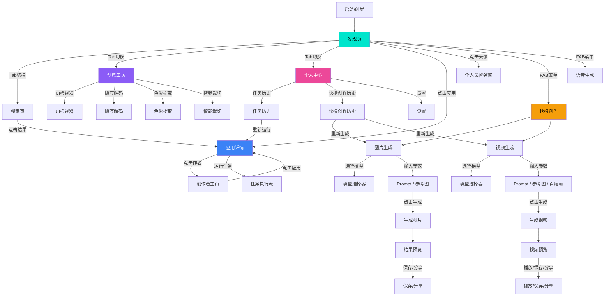
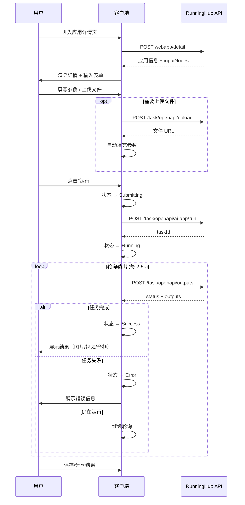
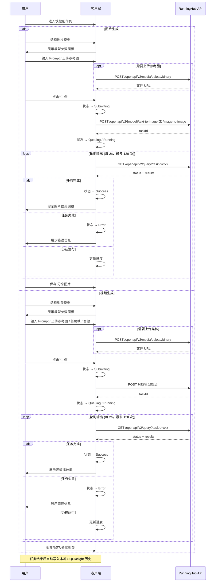
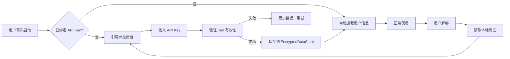

# RunningHub v2.0 产品需求文档 (PRD)

---

## 1. 文档信息

| 字段       | 内容                                         |
| ---------- | -------------------------------------------- |
| 文档名称   | RunningHub v2.0 KMP 重构 PRD                 |
| 版本       | v2.0.0-draft                                 |
| 创建日期   | 2026-04-25                                   |
| 最后更新   | 2026-05-01                                   |
| 文档状态   | **草案 (Draft)** → 评审中 → 已批准 → 已发布  |
| 产品负责人 | （待填写）                                   |
| 技术负责人 | （待填写）                                   |
| 设计负责人 | （待填写）                                   |
| 目标版本   | Android 2.0.0 / iOS 1.0.0                   |

---

## 2. 背景与目标

### 2.1 项目背景

RunningHub 是一个面向 AI 应用创作者和消费者的移动客户端平台，用户可以浏览、搜索和运行基于 ComfyUI 工作流的 AI 应用（图像生成、语音合成、隐写术等）。当前版本 v1.x 仅支持 Android 端，技术栈为 Kotlin + Jetpack Compose + Hilt + Retrofit + Room。

经过 v1.x 迭代，暴露出以下问题：

- **平台覆盖不足**：仅 Android 单端，iOS 用户无法使用，丢失约 40% 的潜在用户
- **技术栈老化**：Hilt 仅适用于 Android、Retrofit 依赖 JVM、Room 无法跨平台
- **代码复用低**：业务逻辑与 Android 平台深度耦合，无法共享给 iOS
- **UI 一致性差**：缺乏设计系统，各模块视觉风格不统一
- **社区模块未完成**：多个工具（色彩提取、智能裁切）停留在占位状态

### 2.2 重构目标

| 编号 | 目标                       | 衡量标准                                       |
| ---- | -------------------------- | ---------------------------------------------- |
| G1   | 实现 Android + iOS 双端发布 | iOS App Store 上架，双端功能对等率 ≥ 95%        |
| G2   | 代码共享率最大化            | `shared` 模块代码占比 ≥ 70%                     |
| G3   | 技术栈全面迁移              | Hilt→Koin、Retrofit→Ktor、Room→SQLDelight 100%  |
| G4   | 统一设计系统                | 建立 Design Token + 组件库，双端视觉一致性 ≥ 98% |
| G5   | 性能不退化                  | 首屏加载 ≤ 2s，任务提交响应 ≤ 1s，帧率 ≥ 55fps  |
| G6   | 完善未完成功能              | 社区工坊所有工具上线，搜索功能增强               |

### 2.3 成功指标 (KPI)

| 指标                     | 当前基线 | v2.0 目标 | 衡量方式            |
| ------------------------ | -------- | --------- | ------------------- |
| 月活用户 (MAU)           | N/A      | +50%      | Firebase Analytics  |
| iOS 新增用户             | 0        | 占比 30%  | App Store Connect   |
| 任务完成率               | ~65%     | ≥ 80%     | 后端埋点            |
| 应用详情→运行转化率      | ~20%     | ≥ 35%     | 客户端埋点          |
| 崩溃率                   | ~1.5%    | ≤ 0.5%    | Firebase Crashlytics|
| 冷启动时间               | ~3.5s    | ≤ 2s      | 性能监控            |
| 用户满意度 (NPS)         | 未测量   | ≥ 40      | 应用内调查          |

### 2.4 非目标 (Out of Scope)

- Web 端适配（后续 v3.0 考虑）
- 桌面端 (Windows/macOS) 支持
- 自有账号体系（继续使用 API Key 认证）
- 创作者端工作流编辑器（仅消费端）

---

## 3. 用户场景

### 3.1 目标用户画像

#### 画像 A：AI 应用消费者 (Alex)

- **年龄**：22-35 岁
- **职业**：设计师、内容创作者、自媒体从业者
- **技术水平**：非技术背景，能使用手机完成复杂操作
- **核心诉求**：快速找到好用的 AI 工具，一键运行得到结果，无需了解技术细节
- **痛点**：不懂 ComfyUI 工作流，Web 端操作不方便，移动端缺少 iOS 版本

#### 画像 B：AI 应用创作者 (Bob)

- **年龄**：25-40 岁
- **职业**：AI 工程师、独立开发者、ComfyUI 工作流设计师
- **技术水平**：熟悉 AI 模型和工作流
- **核心诉求**：作品被更多人发现和使用，获取数据反馈，建立个人品牌
- **痛点**：作品曝光不足，缺少移动端的作品管理入口

#### 画像 C：企业用户 (Carol)

- **年龄**：30-50 岁
- **职业**：企业管理者、产品经理
- **技术水平**：中等
- **核心诉求**：团队协作使用 AI 工具，管理企业 API 配额
- **痛点**：缺少企业级管理功能，需要 iOS 设备支持

### 3.2 核心用户故事

| 编号   | 角色     | 故事                                                               | 验收标准                                                     |
| ------ | -------- | ------------------------------------------------------------------ | ------------------------------------------------------------ |
| US-001 | Alex     | 我想在首页浏览热门 AI 应用，找到感兴趣的应用一键运行               | 首页加载 ≤ 2s，瀑布流展示应用卡片，点击进入详情并运行        |
| US-002 | Alex     | 我想通过关键词搜索特定类型的 AI 应用                               | 输入关键词 300ms 后自动搜索，结果实时展示，支持按分类筛选     |
| US-003 | Alex     | 我想查看 AI 应用运行后的结果，并下载或分享输出文件                 | 运行完成后展示图片/视频/音频结果，支持保存到本地               |
| US-004 | Alex     | 我想在 iPhone 上使用 RunningHub 的所有功能                         | iOS 端功能与 Android 对等，原生体验流畅                       |
| US-005 | Bob      | 我想查看自己发布的应用的使用数据（浏览量、使用量、点赞量）         | 创作者主页展示统计数据，数据刷新延迟 ≤ 5min                   |
| US-006 | Bob      | 我想让更多用户关注我，并浏览我发布的所有应用                       | 创作者主页展示关注/粉丝数，支持关注/取关操作                  |
| US-007 | Carol    | 我想绑定企业 API Key，管理团队的使用配额                           | 支持个人/企业双 Key 绑定，展示配额使用状态                    |
| US-008 | Alex     | 我想查看自己的任务运行历史                                         | 任务历史页按时间倒序展示，支持重新运行和查看结果               |
| US-009 | Alex     | 我想使用社区工坊中的 AI 辅助工具                                   | 工坊工具网格展示，每个工具独立可用                            |
| US-010 | Alex     | 即使网络不好，我也想浏览之前看过的应用                             | 离线缓存已浏览的 Banner、分类和应用列表                       |

---

## 4. 功能需求

### 4.1 功能模块总览

```
RunningHub v2.0
├── 🏠 Discovery（发现/首页）
├── 🔍 Search（搜索）
├── 📱 AppDetail（应用详情/运行）
├── 👤 CreatorProfile（创作者主页）
├── 🛠 Community（创意工坊）
│   ├── 🎤 AudioGeneration（语音生成）
│   ├── 🔐 SecretDecode（隐写解码）
│   ├── 🎨 ColorExtraction（色彩提取）[新]
│   ├── ✂️ SmartCrop（智能裁切）[新]
│   └── 📏 UiInspector（UI 检视器）
├── ⚡ QuickCreate（快捷创作）[新]
│   ├── 🖼 ImageGeneration（图片生成）
│   └── 🎬 VideoGeneration（视频生成）
├── 👨‍💼 Profile（个人中心）
├── 📋 TaskHistory（任务历史）
└── ⚙️ Settings（设置）[新]
```

### 4.2 Discovery（发现/首页）

#### FR-D-001 轮播 Banner [P0]

| 属性     | 描述                                                         |
| -------- | ------------------------------------------------------------ |
| 功能描述 | 首页顶部展示运营推荐的 Banner 轮播图，自动轮播间隔 5 秒      |
| 数据来源 | `webapp/carefullyChosenList` API                             |
| 交互     | 支持手动滑动切换，点击跳转到对应应用详情页                    |
| 缓存     | SQLDelight 离线缓存，首次加载后支持离线浏览                   |
| **验收标准** | ① 自动轮播正常，间隔 5±0.5s ② 手动滑动时暂停自动轮播 ③ 底部显示分页指示器 ④ 离线时展示缓存数据 ⑤ 图片加载失败展示占位图 |

#### FR-D-002 分类导航 [P0]

| 属性     | 描述                                                                  |
| -------- | --------------------------------------------------------------------- |
| 功能描述 | 横向滚动的标签药丸列表，按 Tag 分类筛选应用列表                        |
| 数据来源 | `portal/tag/tree` API 获取标签树，展平为一级列表                       |
| 交互     | 点击切换选中状态，选中后刷新下方应用列表                               |
| 默认状态 | 默认选中"全部"                                                        |
| **验收标准** | ① 横向滑动流畅不卡顿 ② 选中态有视觉高亮（品牌色填充） ③ 切换分类后应用列表 ≤ 1s 更新 ④ 缓存分类数据 |

#### FR-D-003 应用瀑布流 [P0]

| 属性     | 描述                                                                      |
| -------- | ------------------------------------------------------------------------- |
| 功能描述 | 两列瀑布流展示 AI 应用卡片，包含封面图、标题、作者信息、统计数据          |
| 数据来源 | `webapp/list` API，支持分页                                               |
| 交互     | 下拉刷新 + 上拉加载更多（预加载阈值 3 条），点击进入应用详情              |
| HOT 标记 | 点赞数 > 5000 的应用展示 HOT 角标                                         |
| 空状态   | 无数据时展示空状态图标和文案                                               |
| **验收标准** | ① 瀑布流布局正确，卡片高度自适应 ② 下拉刷新展示刷新指示器 ③ 滚动到底部自动加载更多 ④ 加载中展示底部进度条 ⑤ 无更多数据展示"没有更多作品了" ⑥ 首屏加载 ≤ 2s |

#### FR-D-004 下拉刷新 [P0]

| 属性     | 描述                                                           |
| -------- | -------------------------------------------------------------- |
| 功能描述 | Material 3 PullToRefresh 组件，重新拉取 Banner + 分类 + 应用   |
| **验收标准** | ① 下拉手势灵敏 ② 刷新过程中展示加载动画 ③ 刷新完成后自动回弹 ④ 刷新失败展示 Toast |

#### FR-D-005 底部导航栏 [P0]

| 属性     | 描述                                                                           |
| -------- | ------------------------------------------------------------------------------ |
| 功能描述 | 5 Tab 底部导航：探索、搜索、(+)、创意工坊、我的                                |
| 中间按钮 | 浮动 FAB (+) 按钮，点击展开快捷操作菜单（旋转 45° 动画）                       |
| 状态保持 | Tab 切换时保持各页面滚动状态                                                    |
| **验收标准** | ① 5个 Tab 图标和文字正确 ② 选中态以品牌色高亮 ③ FAB 展开/收起动画流畅 ④ 页面切换保持状态 |

#### FR-D-006 用户头像入口 [P1]

| 属性     | 描述                                                                      |
| -------- | ------------------------------------------------------------------------- |
| 功能描述 | 顶部导航栏右侧展示用户头像，未绑定 API Key 时展示默认渐变头像             |
| 交互     | 点击弹出个人设置对话框                                                     |
| **验收标准** | ① 已绑定用户显示真实头像 ② 未绑定显示默认图标 ③ 头像加载失败 fallback 为默认 |

### 4.3 Search（搜索）

#### FR-S-001 关键词搜索 [P0]

| 属性     | 描述                                                                     |
| -------- | ------------------------------------------------------------------------ |
| 功能描述 | 搜索栏输入关键词，自动防抖搜索（延迟 300ms），展示搜索结果列表            |
| 数据来源 | `webapp/list` API，传入搜索关键词，分页 30 条/页                         |
| 交互     | 输入即搜索（debounce），点击结果卡片跳转应用详情                          |
| **验收标准** | ① 输入后 300ms 触发搜索 ② 搜索中展示 Loading ③ 无结果展示空状态文案 ④ 清空输入清除结果 |

#### FR-S-002 搜索结果展示 [P0]

| 属性     | 描述                                                                   |
| -------- | ---------------------------------------------------------------------- |
| 功能描述 | 纵向列表展示搜索结果，每项展示应用名称（后续扩展封面、作者、统计数据）  |
| **验收标准** | ① 列表滚动流畅 ② 点击跳转到正确的应用详情 ③ 支持键盘回车触发搜索       |

#### FR-S-003 搜索历史 [P2]

| 属性     | 描述                                                    |
| -------- | ------------------------------------------------------- |
| 功能描述 | 本地存储最近 20 条搜索历史，空搜索状态下展示历史列表     |
| **验收标准** | ① 历史按时间倒序 ② 点击历史项自动填充搜索框并搜索 ③ 支持清除全部历史 |

#### FR-S-004 搜索推荐/热门 [P2]

| 属性     | 描述                                                      |
| -------- | --------------------------------------------------------- |
| 功能描述 | 空搜索状态下展示热门搜索关键词                             |
| **验收标准** | ① 热门词从服务端获取或本地配置 ② 点击热门词自动搜索       |

### 4.4 AppDetail（应用详情）

#### FR-AD-001 应用信息展示 [P0]

| 属性     | 描述                                                                       |
| -------- | -------------------------------------------------------------------------- |
| 功能描述 | 展示应用封面（16:9 宽图）、名称、作者信息、标签、描述、统计数据             |
| 统计数据 | 浏览量、使用量、点赞数、收藏数（智能格式化：≥10000 显示 x.xw，≥1000 显示 x.xk）|
| **验收标准** | ① 封面图正确加载和裁剪 ② 作者行可点击跳转创作者主页 ③ 标签横向滚动展示 ④ 统计数据格式化正确 |

#### FR-AD-002 输入参数表单 [P0]

| 属性     | 描述                                                                     |
| -------- | ------------------------------------------------------------------------ |
| 功能描述 | 根据 `inputNodes` 动态渲染参数表单，支持文本输入和下拉选择               |
| 字段类型 | STRING（单行）、STRING_MULTILINE（多行，最小 3 行）、COMBO（下拉选择）   |
| 默认值   | 从 `fieldValue` 读取默认值                                                |
| **验收标准** | ① 各字段类型正确渲染 ② 下拉选择展示所有选项 ③ 输入值实时同步到 ViewModel ④ 表单支持滚动 |

#### FR-AD-003 文件上传 [P0]

| 属性     | 描述                                                                  |
| -------- | --------------------------------------------------------------------- |
| 功能描述 | 支持从相册或文件选择器上传图片/视频作为输入参数                         |
| 上传接口 | `/task/openapi/upload` Multipart 上传                                 |
| 文件类型 | 图片（JPG/PNG/WEBP）、视频（MP4），文件大小限制由服务端控制            |
| **验收标准** | ① 图片选择器正常弹出 ② 上传进度可视化 ③ 上传成功后自动填充参数值 ④ 上传失败展示错误提示 |

#### FR-AD-004 任务运行 [P0]

| 属性     | 描述                                                                      |
| -------- | ------------------------------------------------------------------------- |
| 功能描述 | 点击"运行"按钮提交任务，展示任务状态流转（空闲→提交中→运行中→成功/失败）   |
| 状态流转 | Idle → Submitting → Running → Success \| Error                            |
| 轮询机制 | 提交成功后轮询 `/task/openapi/outputs` 获取任务结果                        |
| **验收标准** | ① 按钮状态随任务状态变化 ② 运行中展示 Loading 动画 ③ 成功后展示结果 ④ 失败展示错误信息 ⑤ 支持重试和重新运行 |

#### FR-AD-005 任务结果展示 [P0]

| 属性     | 描述                                                                     |
| -------- | ------------------------------------------------------------------------ |
| 功能描述 | 任务成功后展示输出文件列表，图片类文件直接预览，其他类型展示文件名        |
| 文件类型 | image/*（预览）、video/*（视频播放器）、audio/*（音频播放器）、其他（下载）|
| 状态标签 | 成功（绿色 SUCCESS 标签）、失败（红色 ERROR 标签）                       |
| **验收标准** | ① 图片结果正确预览 ② 视频结果可播放 ③ 文件名正确显示 ④ 动画淡入展示 |

#### FR-AD-006 结果保存与分享 [P1]

| 属性     | 描述                                                                |
| -------- | ------------------------------------------------------------------- |
| 功能描述 | 支持将任务结果保存到本地相册/文件系统，支持系统分享                   |
| 权限     | Android: WRITE_EXTERNAL_STORAGE (SDK<29) / MediaStore；iOS: Photos   |
| **验收标准** | ① 保存后在相册/文件中可见 ② 分享打开系统分享面板 ③ 正确请求权限    |

### 4.5 CreatorProfile（创作者主页）

#### FR-CP-001 创作者信息 [P0]

| 属性     | 描述                                                            |
| -------- | --------------------------------------------------------------- |
| 功能描述 | 展示创作者昵称、头像、个人简介、粉丝数                           |
| **验收标准** | ① 信息从 `/uc/getUserInfo` 正确获取 ② 简介为空时不展示 ③ 加载失败展示重试 |

#### FR-CP-002 关注/取关 [P0]

| 属性     | 描述                                                                    |
| -------- | ----------------------------------------------------------------------- |
| 功能描述 | 支持关注/取消关注创作者，操作后实时更新按钮状态和粉丝计数                |
| 接口     | `/uc/follow/followUser` 和 `/uc/follow/unFollowUser`                    |
| **验收标准** | ① 关注状态正确同步 ② 按钮文字和样式随状态切换 ③ 粉丝数±1实时更新 ④ 未登录时引导绑定 API Key |

#### FR-CP-003 创作者应用列表 [P0]

| 属性     | 描述                                                             |
| -------- | ---------------------------------------------------------------- |
| 功能描述 | 展示创作者发布的所有应用，列表形式，点击跳转应用详情              |
| 数据来源 | `webapp/user/list` API                                           |
| **验收标准** | ① 应用列表正确加载 ② 列表为空时展示空状态 ③ 点击跳转正确       |

### 4.6 Community（创意工坊）

#### FR-CW-001 工具网格 [P0]

| 属性     | 描述                                                                  |
| -------- | --------------------------------------------------------------------- |
| 功能描述 | 2 列网格展示工坊工具卡片，每卡含图标（彩色）、标题、描述              |
| 工具列表 | UI 检视器、隐写解码、色彩提取、智能裁切、语音生成                     |
| **验收标准** | ① 网格布局正确 ② 已实现工具可点击进入 ③ 未实现工具展示"开发中"标记  |

#### FR-CW-002 语音生成 (AudioGeneration) [P0]

| 属性     | 描述                                                             |
| -------- | ---------------------------------------------------------------- |
| 功能描述 | 基于 MiniMax TTS API 的文本转语音工具                            |
| 输入     | 文本内容、语音选择（音色列表）、语速调节                          |
| 输出     | 音频文件播放 + 下载                                              |
| **验收标准** | ① 文本输入不超过限制 ② 音色选择下拉正常 ③ 生成后可播放 ④ 支持下载 |

#### FR-CW-003 隐写解码 (SecretDecode) [P0]

| 属性     | 描述                                                              |
| -------- | ----------------------------------------------------------------- |
| 功能描述 | 从图片/视频中提取隐藏数据的隐写术工具                              |
| 输入     | 从相册选择或拍照获取图片/视频                                      |
| 输出     | 解码后的隐藏文本或数据                                             |
| **验收标准** | ① 支持图片和视频输入 ② 正确提取隐写数据 ③ 无数据时展示提示 ④ 权限请求正确 |

#### FR-CW-004 UI 检视器 (UiInspector) [P1]

| 属性     | 描述                                                     |
| -------- | -------------------------------------------------------- |
| 功能描述 | 展示设备屏幕参数（分辨率、DPI、尺寸）和系统信息          |
| **验收标准** | ① 信息准确 ② 支持 Android/iOS 双端 ③ 信息可复制          |

#### FR-CW-005 色彩提取 (ColorExtraction) [P2] [新功能]

| 属性     | 描述                                                          |
| -------- | ------------------------------------------------------------- |
| 功能描述 | 从图片中提取主色调和调色板                                     |
| 输入     | 从相册选择图片                                                 |
| 输出     | 调色板展示（5-8 个主色），每色展示 HEX 值，支持复制            |
| **验收标准** | ① 色彩提取准确 ② 调色板视觉美观 ③ HEX 值可复制到剪贴板       |

#### FR-CW-006 智能裁切 (SmartCrop) [P2] [新功能]

| 属性     | 描述                                                           |
| -------- | -------------------------------------------------------------- |
| 功能描述 | 自动识别图片主体进行智能裁切                                    |
| 输入     | 从相册选择图片，选择目标比例（1:1、4:3、16:9、自由裁切）        |
| 输出     | 裁切后的图片预览 + 保存                                         |
| **验收标准** | ① 主体识别准确率 ≥ 85% ② 支持多种比例 ③ 可保存到本地          |

### 4.7 Profile（个人中心）

#### FR-P-001 用户信息展示 [P0]

| 属性     | 描述                                                                       |
| -------- | -------------------------------------------------------------------------- |
| 功能描述 | 展示已绑定用户的昵称、ID，未绑定时展示"未登录"和引导文案                    |
| **验收标准** | ① 已绑定展示昵称+ID ② 未绑定展示引导绑定 ③ 加载中展示骨架屏               |

#### FR-P-002 API Key 绑定 [P0]

| 属性     | 描述                                                                       |
| -------- | -------------------------------------------------------------------------- |
| 功能描述 | 支持绑定个人 API Key 和企业 API Key，支持解绑（清除本地存储）              |
| 存储     | DataStore Preferences（已迁移），加密存储                                    |
| **验收标准** | ① 输入框支持密码遮罩 ② 绑定后自动刷新用户信息 ③ 解绑后清除所有本地凭证 ④ Key 格式校验 |

#### FR-P-003 账户状态 [P1]

| 属性     | 描述                                                           |
| -------- | -------------------------------------------------------------- |
| 功能描述 | 展示 API 配额使用状态，通过 `/uc/openapi/accountStatus` 获取   |
| **验收标准** | ① 展示剩余配额 ② 配额不足时警告 ③ 支持手动刷新               |

#### FR-P-004 导航入口 [P0]

| 属性     | 描述                                                          |
| -------- | ------------------------------------------------------------- |
| 功能描述 | 提供快捷入口：任务历史、设置、关于、反馈                       |
| **验收标准** | ① 每个入口可点击跳转 ② 图标和文字正确                        |

### 4.8 TaskHistory（任务历史）

#### FR-TH-001 历史列表 [P0]

| 属性     | 描述                                                                |
| -------- | ------------------------------------------------------------------- |
| 功能描述 | 按时间倒序展示用户已运行的任务列表，包含应用名称、运行时间、状态     |
| 存储     | 本地 SQLDelight 存储                                                 |
| **验收标准** | ① 按时间倒序 ② 状态标签颜色正确（成功绿/失败红/运行中蓝） ③ 空状态友好 |

#### FR-TH-002 重新运行 [P1]

| 属性     | 描述                                                           |
| -------- | -------------------------------------------------------------- |
| 功能描述 | 支持从历史记录直接重新运行任务，自动填充上次的输入参数          |
| **验收标准** | ① 点击跳转到应用详情 ② 参数自动填充 ③ 应用已下线时展示提示    |

### 4.9 Settings（设置）[新模块]

#### FR-SET-001 主题切换 [P1]

| 属性     | 描述                                                   |
| -------- | ------------------------------------------------------ |
| 功能描述 | 支持亮色/暗色/跟随系统三种主题模式                      |
| **验收标准** | ① 切换即时生效 ② 重启后保持选择 ③ 默认跟随系统        |

#### FR-SET-002 语言切换 [P2]

| 属性     | 描述                                                   |
| -------- | ------------------------------------------------------ |
| 功能描述 | 支持中文/英文两种语言                                   |
| **验收标准** | ① 切换后全局生效 ② 内容翻译完整 ③ 默认跟随系统语言    |

#### FR-SET-003 缓存管理 [P1]

| 属性     | 描述                                                     |
| -------- | -------------------------------------------------------- |
| 功能描述 | 展示缓存大小，支持一键清理图片/数据缓存                   |
| **验收标准** | ① 准确计算缓存大小 ② 清理后大小归零 ③ 清理不影响核心数据 |

#### FR-SET-004 关于与反馈 [P2]

| 属性     | 描述                                               |
| -------- | -------------------------------------------------- |
| 功能描述 | 展示版本号、构建号，提供反馈邮箱/链接              |
| **验收标准** | ① 版本号正确 ② 反馈链接可跳转                     |

### 4.10 QuickCreate（快捷创作）[新模块]

> 快捷创作是 RunningHub v2.0 的核心 P0 功能，允许用户无需选择具体 AI 应用，直接通过自然语言 Prompt 调用指定的图片或视频生成模型，快速获取 AI 生成内容。所有模型通过 RunningHub 标准 API 接口实现，任务提交后通过轮询机制跟踪状态直至完成。

#### FR-QC-001 图片生成器 [P0]

| 属性       | 描述                                                               |
| ---------- | ------------------------------------------------------------------ |
| 功能描述   | 用户选择图片模型、输入 Prompt、配置可选参数，一键生成图片            |
| 支持模型   | 全能图片 G-2.0（官方/低价）、全能图片 X（官方/低价）、全能图片 Pro（官方/低价）、全能图片 2.0（官方/低价）、Seedream 5.0 Lite、Seedream 4.0 |
| 模型切换   | 底部模型选择器，支持按类型筛选，展示模型名称和简短描述               |
| 输入参数   | Prompt（必填）、负向 Prompt（可选）、参考图（可选，支持图生图）、宽高比、分辨率、生图数量、Seed |
| 媒体上传   | 参考图通过 `/openapi/v2/media/upload/binary` 上传获取 URL             |
| 状态流转   | Idle → Submitting → Queuing → Running → Success / Failed           |
| 轮询机制   | 提交成功后每 2 秒轮询 `/openapi/v2/query` 获取任务状态              |
| 超时处理   | 最多轮询 120 次（4 分钟），超时后展示"任务超时"                     |
| **验收标准** | ① 模型选择器正确展示所有 9 个模型 ② 文生图/图生图路由正确 ③ 各模型参数映射正确 ④ 任务状态实时更新 ⑤ 成功展示图片预览 ⑥ 失败展示错误信息 ⑦ 支持重新生成 |

**图片模型路由矩阵**

| 模型                    | 文生图 | 图生图 | API 端点                                              | 关键参数                    |
| ----------------------- | ------ | ------ | ----------------------------------------------------- | --------------------------- |
| 全能图片 G-2.0 官方     | ✅     | ✅     | `/openapi/v2/rhart-image-g-2-official/*`              | prompt, aspect_ratio, resolution, batch_count, seed |
| 全能图片 G-2.0 低价     | ✅     | ✅     | `/openapi/v2/rhart-image-g-2-official/*`              | 同上（共享端点）            |
| 全能图片 X 官方         | ✅     | ✅     | `/openapi/v2/rhart-image-x-official/*`                | prompt, aspect_ratio, resolution, batch_count, seed |
| 全能图片 X 低价         | ✅     | ✅     | `/openapi/v2/rhart-image-x-official/*`                | 同上（共享端点）            |
| 全能图片 Pro 官方       | ✅     | ✅     | `/openapi/v2/rhart-image-pro-official/*`              | prompt, aspect_ratio, resolution, batch_count, seed |
| 全能图片 Pro 低价       | ✅     | ✅     | `/openapi/v2/rhart-image-pro-official/*`              | 同上（共享端点）            |
| 全能图片 2.0 官方       | ✅     | ✅     | `/openapi/v2/rhart-image-v2-official/*`              | prompt, aspect_ratio, resolution, batch_count, seed |
| 全能图片 2.0 低价       | ✅     | ✅     | `/openapi/v2/rhart-image-v2-official/*`              | 同上（共享端点）            |
| Seedream 5.0 Lite      | ✅     | ❌     | `/openapi/v2/seedream-v5-lite/text-to-image`          | prompt, negative_prompt, resolution, style, batch_count |
| Seedream 4.0           | ✅     | ✅     | `/openapi/v2/seedream-v4/*`                          | prompt, negative_prompt, resolution, style |

#### FR-QC-002 视频生成器 [P0]

| 属性       | 描述                                                               |
| ---------- | ------------------------------------------------------------------ |
| 功能描述   | 用户选择视频模型、输入 Prompt、配置可选参数，一键生成视频            |
| 支持模型   | HappyHorse、Seedance 2.0、Seedance 2.0-Fast、可灵 3.0-4K、可灵 O3-Pro、可灵 O3-Std、可灵 O1、万相 2.7、万相 2.6、PixVerse V6、全能视频 V-Pro（低价）、全能视频 V-Fast（官方/低价）、全能视频 X（官方/低价）、Vidu Q3-Pro、Vidu Q3-Pro-Fast |
| 模型切换   | 底部模型选择器，按供应商分组（阿里系/可灵系/Seedance/万相/PixVerse/全能视频/Vidu），展示模型名称和说明 |
| 输入参数   | Prompt（必填）、负向 Prompt（可选）、参考图（可选）、首帧图（可选）、尾帧图（可选）、音频（可选）、分辨率、时长、宽高比、生成音频开关、Style（部分模型） |
| 媒体上传   | 参考图/首尾帧图/音频通过 `/openapi/v2/media/upload/binary` 上传获取 URL   |
| 状态流转   | Idle → Submitting → Queuing → Running → Success / Failed           |
| 轮询机制   | 提交成功后每 2 秒轮询 `/openapi/v2/query` 获取任务状态              |
| 超时处理   | 最多轮询 120 次（4 分钟），超时后展示"任务超时"                     |
| **验收标准** | ① 模型选择器正确展示所有 18 个模型 ② 文生视频/图生视频/首尾帧视频路由正确 ③ 各模型参数映射正确 ④ 任务状态实时更新 ⑤ 成功展示视频预览 ⑥ 失败展示错误信息 ⑦ 支持重新生成 |

**视频模型路由矩阵**

| 模型                    | 文生视频 | 图生视频 | 首尾帧 | API 端点                                              | 关键参数                                     |
| ----------------------- | -------- | -------- | ------ | ----------------------------------------------------- | -------------------------------------------- |
| HappyHorse              | ✅       | ✅       | ❌     | `/openapi/v2/alibaba/happyhorse-1.0/*`                | prompt, resolution, duration, aspect_ratio, seed |
| Seedance 2.0            | ✅       | ✅       | ✅     | `/openapi/v2/rhart-video/sparkvideo-2.0/*`           | prompt, resolution, duration, generate_audio, ratio |
| Seedance 2.0-Fast      | ✅       | ✅       | ✅     | `/openapi/v2/rhart-video/sparkvideo-2.0-fast/*`      | 同上                                         |
| 可灵 3.0-4K             | ❌       | ✅       | ❌     | `/openapi/v2/kling-video-o3-4k/image-to-video`        | prompt, first_image_url, last_image_url, duration, sound |
| 可灵 O3-Pro             | ✅       | ✅       | ❌     | `/openapi/v2/kling-video-o3-pro/*`                   | prompt, resolution, duration, aspect_ratio, audio |
| 可灵 O3-Std             | ✅       | ✅       | ❌     | `/openapi/v2/kling-video-o3-std/*`                   | 同上                                         |
| 可灵 O1                 | ✅       | ✅       | ❌     | `/openapi/v2/kling-video-o1/*`                       | prompt, resolution, duration, aspect_ratio, generate_audio, negative_prompt |
| 万相 2.7                | ✅       | ✅       | ❌     | `/openapi/v2/alibaba/wan-2.7/*`                      | prompt, negative_prompt, audio_url, duration, resolution, aspect_ratio, prompt_extend, seed |
| 万相 2.6                | ❌       | ✅       | ❌     | `/openapi/v2/alibaba/wan-2.6/image-to-video`         | image_url, prompt, negative_prompt, resolution, duration |
| PixVerse V6             | ✅       | ✅       | ❌     | `/openapi/v2/pixverse-v6/*`                          | prompt, resolution, duration, generate_audio_switch, aspect_ratio |
| 全能视频 V-Fast 官方    | ✅       | ✅       | ✅     | `/openapi/v2/rhart-video-v3.1-fast/*`                | prompt, resolution, duration, aspect_ratio, generate_audio |
| 全能视频 V-Fast 低价    | ✅       | ✅       | ✅     | `/openapi/v2/rhart-video-v3.1-fast/*`                | 同上（共享端点）                             |
| 全能视频 V-Pro 低价     | ✅       | ✅       | ❌     | `/openapi/v2/rhart-video-v3.1-pro/*`                | prompt, resolution, duration, aspect_ratio, audio |
| 全能视频 X 官方         | ✅       | ✅       | ❌     | `/openapi/v2/rhart-video-g-official/*`               | prompt, aspect_ratio, resolution, duration     |
| 全能视频 X 低价         | ❌       | ✅(多图) | ❌     | `/openapi/v2/rhart-video-g/image-to-video`           | prompt, aspect_ratio, image_urls, resolution, duration |
| Vidu Q3-Pro             | ✅       | ✅       | ❌     | `/openapi/v2/vidu/text-to-video-q3-pro`              | prompt, style, aspect_ratio, resolution, duration, audio |
| Vidu Q3-Pro-Fast        | ✅       | ✅       | ❌     | `/openapi/v2/vidu/text-to-video-q3-turbo`            | 同上                                         |

#### FR-QC-003 结果预览与保存 [P0]

| 属性       | 描述                                                               |
| ---------- | ------------------------------------------------------------------ |
| 功能描述   | 任务成功后展示生成的图片/视频，支持预览、下载和分享                  |
| 图片预览   | 网格展示（多图时），点击全屏查看，支持缩放                          |
| 视频预览   | 内置视频播放器（Android: ExoPlayer / iOS: AVPlayer），支持播放控制  |
| 文件保存   | Android: 保存到相册；iOS: 保存到 Photos                            |
| 分享       | 调用系统分享面板，可分享图片/视频文件                                |
| **验收标准** | ① 图片网格正确展示 ② 点击全屏查看 ③ 视频播放器正常播放 ④ 保存后文件可见 ⑤ 分享打开系统面板 |

#### FR-QC-004 任务历史 [P0]

| 属性       | 描述                                                               |
| ---------- | ------------------------------------------------------------------ |
| 功能描述   | 快捷创作产生的任务自动记录到历史列表，支持重新生成                  |
| 存储       | 本地 SQLDelight，关联模型类型、Prompt、参数、结果                   |
| 列表展示   | 缩略图 + 模型名称 + Prompt摘要 + 状态 + 时间                        |
| 重新生成   | 点击重新运行，自动填充上次参数                                      |
| **验收标准** | ① 历史正确记录 ② 重新生成参数正确填充 ③ 支持删除历史记录 ④ 空状态友好 |

#### FR-QC-005 模型信息展示 [P1]

| 属性       | 描述                                                               |
| ---------- | ------------------------------------------------------------------ |
| 功能描述   | 切换模型时展示模型简介，包含能力说明、分辨率支持、时长支持等         |
| 展示时机   | 模型选择器选中模型后，下方展开模型信息卡片                          |
| 内容       | 模型中文名、英文名（API Tier）、支持的操作类型（文生图/图生图/首尾帧）、说明文字 |
| **验收标准** | ① 信息准确 ② 布局美观 ③ 切换模型时信息正确更新                    |

---

## 5. 非功能需求

### 5.1 性能需求

| 指标             | 要求                | 测量方式                        |
| ---------------- | ------------------- | ------------------------------- |
| 冷启动时间       | ≤ 2s                | Android: adb, iOS: Instruments  |
| 首屏内容加载     | ≤ 2s (有缓存 ≤ 0.5s)| 埋点计时                        |
| 页面切换         | ≤ 300ms             | 动画帧数统计                    |
| 帧率             | ≥ 55fps (目标 60fps)| Android: GPU Profiler, iOS: Core Animation |
| 任务提交响应     | ≤ 1s                | 网络请求计时                    |
| 图片加载         | ≤ 500ms (缓存后即时)| Coil/Ktor 日志                  |
| 内存使用         | ≤ 200MB 峰值        | Profiler 监控                   |
| APK/IPA 体积     | ≤ 30MB              | 构建产物大小                    |

### 5.2 安全需求

| 编号    | 需求                                      | 优先级 |
| ------- | ----------------------------------------- | ------ |
| SEC-001 | API Key 使用 EncryptedDataStore 加密存储   | P0     |
| SEC-002 | 网络请求全部使用 HTTPS                     | P0     |
| SEC-003 | 敏感信息（Key）不出现在日志中             | P0     |
| SEC-004 | Release 包启用代码混淆 (R8/ProGuard)      | P0     |
| SEC-005 | 证书固定 (Certificate Pinning) 防中间人   | P1     |
| SEC-006 | 文件上传限制类型和大小                     | P1     |
| SEC-007 | iOS Keychain 存储敏感数据                  | P0     |

### 5.3 兼容性需求

| 平台    | 最低版本        | 目标版本        | 备注                        |
| ------- | --------------- | --------------- | --------------------------- |
| Android | API 24 (7.0)    | API 35 (15)     | minSdk 沿用 v1.x           |
| iOS     | iOS 16.0        | iOS 18.x        | Compose Multiplatform 最低要求 |
| 屏幕    | 320dp ~ 600dp+  | -               | 手机 + 折叠屏自适应         |
| 方向    | 竖屏锁定        | -               | 平板后续考虑横屏             |

### 5.4 无障碍需求

| 编号    | 需求                                                | 优先级 |
| ------- | --------------------------------------------------- | ------ |
| A11Y-01 | 所有交互元素提供 contentDescription                  | P0     |
| A11Y-02 | 最小触控目标 48dp × 48dp                             | P0     |
| A11Y-03 | 色彩对比度符合 WCAG 2.1 AA 标准（≥ 4.5:1）          | P1     |
| A11Y-04 | 支持系统字体缩放（最大 200%）                        | P1     |
| A11Y-05 | 支持 TalkBack (Android) / VoiceOver (iOS) 屏幕朗读   | P1     |

---

## 6. 技术架构需求

### 6.1 KMP 三模块架构

```
RunningHub/
├── shared/                          # KMP 共享模块 (~70% 代码)
│   ├── src/commonMain/              # 平台无关的共享代码
│   │   ├── domain/                  # 领域模型 & Repository 接口
│   │   │   ├── model/               # 数据模型 (WebApp, User, Task 等)
│   │   │   └── repository/          # Repository 接口定义
│   │   ├── data/                    # 数据层实现
│   │   │   ├── remote/              # Ktor HttpClient 网络层
│   │   │   │   ├── api/             # API 接口定义 (Ktor)
│   │   │   │   └── dto/             # 网络数据传输对象
│   │   │   ├── local/               # SQLDelight 本地缓存
│   │   │   │   └── *.sq             # SQL 定义文件
│   │   │   └── repository/          # Repository 实现
│   │   ├── di/                      # Koin 依赖注入模块
│   │   └── platform/                # expect 声明
│   ├── src/androidMain/             # Android 平台实现
│   │   └── platform/                # actual 实现 (DataStore, SQLDriver 等)
│   └── src/iosMain/                 # iOS 平台实现
│       └── platform/                # actual 实现
│
├── composeApp/                      # Compose Multiplatform UI 模块
│   ├── src/commonMain/              # 共享 UI
│   │   └── kotlin/.../ui/
│   │       ├── theme/               # Design System (Color, Type, Shape, Dimens)
│   │       ├── component/           # 通用组件库
│   │       ├── navigation/          # 导航定义
│   │       └── feature/             # 业务 Feature 模块
│   │           ├── discovery/
│   │           ├── search/
│   │           ├── detail/
│   │           ├── creator/
│   │           ├── community/
│   │           ├── profile/
│   │           └── settings/
│   ├── src/androidMain/             # Android 入口
│   └── src/iosMain/                 # iOS 入口
│
├── app/                             # Android 传统壳模块 (仅启动器)
│   └── src/main/
│       ├── AndroidManifest.xml
│       └── kotlin/.../MainActivity.kt
│
└── iosApp/                          # iOS Xcode 项目壳
    └── iosApp/
        ├── ContentView.swift
        └── Info.plist
```

### 6.2 技术栈迁移清单

| 领域       | v1.x (Android Only)         | v2.0 (KMP)                           | 迁移策略              |
| ---------- | --------------------------- | ------------------------------------ | --------------------- |
| DI         | Hilt 2.50                   | Koin 4.x (koin-core + koin-compose) | 全量替换              |
| 网络       | Retrofit 2.9 + OkHttp       | Ktor Client 3.x + CIO/Darwin        | 全量替换              |
| JSON       | Gson                        | Kotlinx Serialization 1.7.x          | 全量替换              |
| 数据库     | Room 2.6.1                  | SQLDelight 2.x                       | 重写 Schema           |
| 偏好存储   | SharedPreferences            | DataStore (Multiplatform)             | 已迁移，保留          |
| 图片加载   | Coil 2.x (Android)          | Coil 3.x (Multiplatform)             | 版本升级              |
| 导航       | Navigation Compose (Android) | Compose Navigation (Multiplatform)   | API 适配              |
| 动画       | Lottie (Android)             | Compose Animation + Lottie-KMP       | 适配双端              |
| 视频播放   | Media3/ExoPlayer (Android)   | expect/actual 封装                   | 平台特定实现          |
| UI 框架    | Jetpack Compose              | Compose Multiplatform                | API 兼容，少量适配    |
| 构建       | AGP + KSP                   | KMP Gradle Plugin + AGP              | 重构构建脚本          |
| 测试       | JUnit 4 + Espresso           | kotlin.test + Compose UI Test        | 补充测试              |

### 6.3 共享层 API 接口清单（Ktor 迁移）

#### 6.3.1 通用 API

| 接口路径                          | 方法 | 功能               | 优先级 |
| --------------------------------- | ---- | ------------------ | ------ |
| `webapp/list`                     | POST | 应用列表（分页）   | P0     |
| `webapp/carefullyChosenList`      | POST | 精选应用列表       | P0     |
| `webapp/user/list`                | POST | 用户发布的应用     | P0     |
| `webapp/detail`                   | POST | 应用详情           | P0     |
| `webapp/apiCallDemo`              | GET  | 应用调用示例       | P0     |
| `portal/tag/tree`                 | POST | 标签分类树         | P0     |
| `/task/openapi/ai-app/run`        | POST | 运行任务           | P0     |
| `/task/openapi/outputs`           | POST | 获取任务输出       | P0     |
| `/task/openapi/upload`            | POST | 上传文件(Multipart)| P0     |
| `/uc/openapi/accountStatus`       | POST | 账户状态           | P1     |
| `/uc/getUserInfo`                 | POST | 获取用户信息       | P0     |
| `/uc/follow/isFollow`             | POST | 是否已关注         | P0     |
| `/uc/follow/followUser`           | POST | 关注用户           | P0     |
| `/uc/follow/unFollowUser`         | POST | 取消关注           | P0     |

#### 6.3.2 快捷创作 API

| 接口路径                                                    | 方法 | 功能               | 对应模型                  | 优先级 |
| --------------------------------------------------------- | ---- | ------------------ | ------------------------- | ------ |
| `/openapi/v2/query`                                        | GET  | 任务状态查询       | 全部快捷创作模型           | P0     |
| `/openapi/v2/media/upload/binary`                          | POST | 媒体文件上传       | 全部快捷创作模型           | P0     |
| `/openapi/v2/rhart-image-g-2-official/text-to-image`        | POST | 文生图             | 全能图片 G-2.0 官方/低价  | P0     |
| `/openapi/v2/rhart-image-g-2-official/image-to-image`        | POST | 图生图             | 全能图片 G-2.0 官方/低价  | P0     |
| `/openapi/v2/rhart-image-x-official/text-to-image`          | POST | 文生图             | 全能图片 X 官方/低价       | P0     |
| `/openapi/v2/rhart-image-x-official/image-to-image`          | POST | 图生图             | 全能图片 X 官方/低价       | P0     |
| `/openapi/v2/rhart-image-pro-official/text-to-image`         | POST | 文生图             | 全能图片 Pro 官方/低价     | P0     |
| `/openapi/v2/rhart-image-pro-official/image-to-image`         | POST | 图生图             | 全能图片 Pro 官方/低价     | P0     |
| `/openapi/v2/rhart-image-v2-official/text-to-image`         | POST | 文生图             | 全能图片 2.0 官方/低价     | P0     |
| `/openapi/v2/rhart-image-v2-official/image-to-image`         | POST | 图生图             | 全能图片 2.0 官方/低价     | P0     |
| `/openapi/v2/seedream-v5-lite/text-to-image`                | POST | 文生图             | Seedream 5.0 Lite         | P0     |
| `/openapi/v2/seedream-v4/text-to-image`                     | POST | 文生图             | Seedream 4.0             | P0     |
| `/openapi/v2/seedream-v4/image-to-image`                     | POST | 图生图             | Seedream 4.0             | P0     |
| `/openapi/v2/alibaba/happyhorse-1.0/text-to-video`           | POST | 文生视频           | HappyHorse               | P0     |
| `/openapi/v2/alibaba/happyhorse-1.0/image-to-video`           | POST | 图生视频           | HappyHorse               | P0     |
| `/openapi/v2/rhart-video/sparkvideo-2.0/text-to-video`     | POST | 文生视频           | Seedance 2.0             | P0     |
| `/openapi/v2/rhart-video/sparkvideo-2.0/image-to-video`     | POST | 图生视频           | Seedance 2.0             | P0     |
| `/openapi/v2/rhart-video/sparkvideo-2.0-fast/text-to-video` | POST | 文生视频           | Seedance 2.0-Fast       | P0     |
| `/openapi/v2/rhart-video/sparkvideo-2.0-fast/image-to-video` | POST | 图生视频           | Seedance 2.0-Fast       | P0     |
| `/openapi/v2/kling-video-o3-4k/image-to-video`              | POST | 图生视频(4K)       | 可灵 3.0-4K             | P0     |
| `/openapi/v2/kling-video-o3-pro/text-to-video`              | POST | 文生视频           | 可灵 O3-Pro             | P0     |
| `/openapi/v2/kling-video-o3-pro/image-to-video`              | POST | 图生视频           | 可灵 O3-Pro             | P0     |
| `/openapi/v2/kling-video-o3-std/text-to-video`              | POST | 文生视频           | 可灵 O3-Std             | P0     |
| `/openapi/v2/kling-video-o3-std/image-to-video`              | POST | 图生视频           | 可灵 O3-Std             | P0     |
| `/openapi/v2/kling-video-o1/text-to-video`                  | POST | 文生视频           | 可灵 O1                 | P0     |
| `/openapi/v2/kling-video-o1/image-to-video`                  | POST | 图生视频           | 可灵 O1                 | P0     |
| `/openapi/v2/alibaba/wan-2.7/text-to-video`                 | POST | 文生视频           | 万相 2.7                | P0     |
| `/openapi/v2/alibaba/wan-2.7/image-to-video`                 | POST | 图生视频           | 万相 2.7                | P0     |
| `/openapi/v2/alibaba/wan-2.6/image-to-video`                 | POST | 图生视频           | 万相 2.6                | P0     |
| `/openapi/v2/pixverse-v6/text-to-video`                     | POST | 文生视频           | PixVerse V6             | P0     |
| `/openapi/v2/pixverse-v6/image-to-video`                     | POST | 图生视频           | PixVerse V6             | P0     |
| `/openapi/v2/rhart-video-v3.1-fast/text-to-video`           | POST | 文生视频           | 全能视频 V-Fast (官方/低价) | P0  |
| `/openapi/v2/rhart-video-v3.1-fast/image-to-video`           | POST | 图生视频           | 全能视频 V-Fast (官方/低价) | P0  |
| `/openapi/v2/rhart-video-v3.1-fast/start-end-to-video`       | POST | 首尾帧视频         | 全能视频 V-Fast (官方/低价) | P0  |
| `/openapi/v2/rhart-video-v3.1-pro/text-to-video`           | POST | 文生视频           | 全能视频 V-Pro 低价      | P0     |
| `/openapi/v2/rhart-video-v3.1-pro/image-to-video`           | POST | 图生视频           | 全能视频 V-Pro 低价      | P0     |
| `/openapi/v2/rhart-video-g-official/text-to-video`          | POST | 文生视频           | 全能视频 X 官方          | P0     |
| `/openapi/v2/rhart-video-g-official/image-to-video`          | POST | 图生视频           | 全能视频 X 官方          | P0     |
| `/openapi/v2/rhart-video-g/image-to-video`                   | POST | 图生视频(多图)     | 全能视频 X 低价          | P0     |
| `/openapi/v2/vidu/text-to-video-q3-pro`                     | POST | 文生视频           | Vidu Q3-Pro             | P0     |
| `/openapi/v2/vidu/image-to-video-q3-pro`                     | POST | 图生视频           | Vidu Q3-Pro             | P0     |
| `/openapi/v2/vidu/text-to-video-q3-turbo`                   | POST | 文生视频           | Vidu Q3-Pro-Fast        | P0     |
| `/openapi/v2/vidu/image-to-video-q3-turbo`                   | POST | 图生视频           | Vidu Q3-Pro-Fast        | P0     |

### 6.4 设计系统需求

| 领域     | 需求                                                              |
| -------- | ----------------------------------------------------------------- |
| 品牌色   | 主色 RunningHubTeal (#00E5CC)、渐变辅色、语义色（成功/警告/错误） |
| 字体     | 支持系统字体 + 自定义品牌字体（可选）                             |
| 间距系统 | 4dp 基准网格：Xs(4), Sm(8), Md(12), Lg(16), Xl(24), Xxl(32)     |
| 圆角     | Small(8), Medium(12), Large(16), Full(50%)                       |
| 组件库   | AppSearchBar, CategoryChip, StatusBadge, ErrorState, LoadingIndicator, TaskOutputCard, SmartAsyncImage |
| 暗色主题 | 默认暗色，背景 #000000，表面 #1E1E1E                              |

---

## 7. 页面流程图

### 7.1 主导航流程



### 7.2 任务运行流程



### 7.3 快捷创作流程



### 7.4 用户认证流程



---

## 8. 数据需求

### 8.1 本地数据库 (SQLDelight)

#### 表：Banner 缓存

```sql
CREATE TABLE BannerEntity (
    id TEXT NOT NULL PRIMARY KEY,
    imageUrl TEXT NOT NULL,
    title TEXT NOT NULL,
    description TEXT,
    tag TEXT,
    targetAppId TEXT NOT NULL,
    sortOrder INTEGER NOT NULL DEFAULT 0,
    cachedAt INTEGER NOT NULL
);
```

#### 表：Category 缓存

```sql
CREATE TABLE CategoryEntity (
    tagId TEXT NOT NULL PRIMARY KEY,
    name TEXT NOT NULL,
    parentId TEXT,
    sortOrder INTEGER NOT NULL DEFAULT 0,
    cachedAt INTEGER NOT NULL
);
```

#### 表：App 列表缓存

```sql
CREATE TABLE AppEntity (
    id TEXT NOT NULL PRIMARY KEY,
    title TEXT NOT NULL,
    coverUrl TEXT,
    authorName TEXT NOT NULL,
    authorAvatar TEXT,
    authorId TEXT,
    likeCount INTEGER NOT NULL DEFAULT 0,
    collectCount INTEGER NOT NULL DEFAULT 0,
    useCount INTEGER NOT NULL DEFAULT 0,
    viewCount INTEGER NOT NULL DEFAULT 0,
    categoryTagIds TEXT,
    cachedAt INTEGER NOT NULL
);
```

#### 表：App 详情缓存

```sql
CREATE TABLE AppDetailEntity (
    id TEXT NOT NULL PRIMARY KEY,
    name TEXT NOT NULL,
    description TEXT,
    coverUrlsJson TEXT NOT NULL,
    authorName TEXT NOT NULL,
    authorAvatar TEXT,
    authorId TEXT,
    tagsJson TEXT NOT NULL,
    statsJson TEXT NOT NULL,
    inputNodesJson TEXT NOT NULL,
    cachedAt INTEGER NOT NULL
);
```

#### 表：任务历史

```sql
CREATE TABLE TaskHistoryEntity (
    id INTEGER NOT NULL PRIMARY KEY AUTOINCREMENT,
    taskId INTEGER NOT NULL,
    appId TEXT NOT NULL,
    appName TEXT NOT NULL,
    status TEXT NOT NULL,
    inputParamsJson TEXT NOT NULL,
    outputsJson TEXT,
    errorMessage TEXT,
    createdAt INTEGER NOT NULL,
    completedAt INTEGER
);
```

#### 表：搜索历史

```sql
CREATE TABLE SearchHistoryEntity (
    id INTEGER NOT NULL PRIMARY KEY AUTOINCREMENT,
    query TEXT NOT NULL UNIQUE,
    searchedAt INTEGER NOT NULL
);
```

### 8.2 本地偏好存储 (DataStore)

| Key                  | 类型    | 用途             | 加密 |
| -------------------- | ------- | ---------------- | ---- |
| `api_key`            | String  | 个人 API Key     | 是   |
| `enterprise_api_key` | String  | 企业 API Key     | 是   |
| `cookie`             | String  | Web Cookie       | 是   |
| `theme_mode`         | String  | 主题模式         | 否   |
| `language`           | String  | 语言偏好         | 否   |
| `onboarding_done`    | Boolean | 是否完成引导     | 否   |

### 8.3 缓存策略

| 数据类型     | 缓存时效   | 策略              | 备注                  |
| ------------ | ---------- | ----------------- | --------------------- |
| Banner       | 1 小时     | Cache-First       | 优先展示缓存，后台刷新 |
| Category     | 24 小时    | Cache-First       | 分类变动不频繁         |
| App 列表     | 30 分钟    | Network-First     | 保证内容新鲜度         |
| App 详情     | 1 小时     | Cache-First       | 用户可能反复查看       |
| 任务历史     | 永久       | Local-Only        | 纯本地数据             |
| 搜索历史     | 永久       | Local-Only        | 纯本地数据             |
| 图片         | Coil 默认  | LRU 内存+磁盘缓存 | 50MB 磁盘限制          |

---

## 9. 风险评估

| 编号 | 风险描述                                    | 可能性 | 影响 | 应对策略                                                       |
| ---- | ------------------------------------------- | ------ | ---- | -------------------------------------------------------------- |
| R1   | Compose Multiplatform iOS 稳定性不足        | 中     | 高   | 密切跟踪 JetBrains 发布，预留 SwiftUI 降级方案                 |
| R2   | Ktor Client 在 iOS (Darwin) 上的兼容性问题  | 中     | 高   | 早期进行 iOS 网络层验证，准备 NSURLSession 引擎备选             |
| R3   | SQLDelight iOS 驱动性能瓶颈                 | 低     | 中   | 基准测试，必要时考虑 co.touchlab.sqliter                        |
| R4   | Lottie 动画在 KMP 中缺少 iOS 支持           | 中     | 低   | 使用 lottie-kmp 库或改为 Compose Animation 替代                 |
| R5   | 视频播放器跨平台方案不成熟                  | 高     | 中   | expect/actual 封装，Android 用 ExoPlayer，iOS 用 AVPlayer       |
| R6   | 技术栈全面迁移导致回归缺陷增多              | 高     | 高   | 分阶段迁移，每阶段完成后进行全量回归测试                        |
| R7   | iOS 审核被拒（权限使用说明不充分等）        | 中     | 中   | 提前研究 Apple 审核指南，准备完善的权限用途说明                  |
| R8   | 双端 UI 一致性难以保证                      | 中     | 中   | Compose Multiplatform 共享 UI，仅平台特定功能做 expect/actual    |
| R9   | 重构周期过长影响用户增长                    | 中     | 高   | 保持 v1.x 维护更新，v2.0 采用渐进式发布策略                     |
| R10  | Koin 在大型项目中的编译期安全性不如 Hilt    | 低     | 中   | 使用 Koin Annotations 获得编译期检查，加强集成测试               |

---

## 10. 项目计划

### 10.1 里程碑

```
2026 Q2                    2026 Q3                    2026 Q4
│                          │                          │
├── M1: 基础架构 ──────────┤                          │
│   (4周)                  ├── M3: 核心功能 iOS ──────┤
│                          │   (4周)                  ├── M5: 发布准备
├── M2: 核心功能 Android ──┤                          │   (3周)
│   (6周)                  ├── M4: 增强功能 ──────────┤
│                          │   (4周)                  ├── 🚀 v2.0 发布
│                          │                          │
```

### M1：基础架构搭建（第 1-4 周）

| 任务                                  | 交付物                          | 负责人   |
| ------------------------------------- | ------------------------------- | -------- |
| 创建 KMP 项目骨架（三模块）           | 项目结构 + Gradle 配置          | 技术负责 |
| 配置 Koin DI 模块                     | 共享/Android/iOS DI 模块        | 后端开发 |
| 实现 Ktor 网络层 + 全部 API 迁移      | KtorApiService + DTO            | 后端开发 |
| 实现 SQLDelight 数据库 + 迁移         | .sq 文件 + Repository           | 后端开发 |
| DataStore 跨平台适配验证               | SettingsRepository (KMP)        | 后端开发 |
| 建立 Design System (Token + 组件库)    | Theme.kt + 基础组件             | 前端开发 |
| CI/CD 搭建（Android + iOS 构建）       | GitHub Actions / Fastlane       | DevOps   |

**里程碑验收**：KMP 项目可同时编译 Android APK 和 iOS IPA，网络请求双端可通。

### M2：核心功能 Android 迁移（第 5-10 周）

| 任务                              | 交付物                    | 负责人   |
| --------------------------------- | ------------------------- | -------- |
| Discovery 页面迁移 (Banner+分类+瀑布流) | DiscoveryScreen (KMP)    | 前端开发 |
| Search 页面迁移                   | SearchScreen (KMP)        | 前端开发 |
| AppDetail 页面迁移                | AppDetailScreen (KMP)     | 前端开发 |
| 任务运行 + 轮询流程               | TaskRepository (KMP)      | 后端开发 |
| CreatorProfile 页面迁移           | CreatorProfileScreen (KMP)| 前端开发 |
| Profile 页面迁移                  | ProfileScreen (KMP)       | 前端开发 |
| Community 工坊页面迁移            | CommunityScreen (KMP)     | 前端开发 |
| 导航体系重构                      | Navigation (KMP)          | 前端开发 |
| Android 回归测试                  | 测试报告                  | QA       |

**里程碑验收**：Android 端全部 P0 功能可用，通过回归测试。

### M3：iOS 端适配（第 11-14 周）

| 任务                                | 交付物                      | 负责人   |
| ----------------------------------- | --------------------------- | -------- |
| iOS 项目壳配置 (Xcode + CocoaPods) | iosApp 项目                 | iOS 开发 |
| iOS 平台 actual 实现               | SQLDriver/DataStore/文件系统 | iOS 开发 |
| 视频播放 iOS 适配 (AVPlayer)        | VideoPlayer expect/actual   | iOS 开发 |
| 文件选择/相册权限 iOS 适配          | FilePicker expect/actual    | iOS 开发 |
| iOS 全功能测试                      | 测试报告                    | QA       |
| iOS UI 微调（安全区域、手势等）     | iOS 适配代码                | 前端开发 |

**里程碑验收**：iOS 端全部 P0 功能可用，双端功能对等率 ≥ 95%。

### M4：增强功能开发（第 11-16 周，与 M3 并行）

| 任务                        | 交付物               | 优先级 |
| --------------------------- | -------------------- | ------ |
| 搜索历史 + 热门推荐        | SearchHistory (KMP)  | P2     |
| 色彩提取工具                | ColorExtraction      | P2     |
| 智能裁切工具                | SmartCrop            | P2     |
| 设置页面（主题/语言/缓存）  | SettingsScreen       | P1     |
| 结果保存与分享              | SaveShareUtil        | P1     |
| 账户状态展示                | AccountStatus (KMP)  | P1     |
| 任务历史重新运行            | TaskRerun            | P1     |
| 无障碍优化                  | A11y 改进            | P1     |

**里程碑验收**：全部 P1 功能开发完成。

### M5：发布准备（第 17-19 周）

| 任务                           | 交付物                | 负责人   |
| ------------------------------ | --------------------- | -------- |
| 性能优化（启动、帧率、内存）   | 性能优化报告          | 全团队   |
| 安全审计                       | 安全审计报告          | 安全工程 |
| 双端全量回归测试               | 最终测试报告          | QA       |
| Apple App Store 提审准备       | 应用截图/描述/隐私政策 | 产品     |
| Google Play 更新准备           | 更新日志/截图         | 产品     |
| 灰度发布 (10% → 50% → 100%)   | 发布计划              | 运营     |

**里程碑验收**：双端上架审核通过，灰度发布无 P0 级故障。

---

## 11. 附录

### 11.1 术语表

| 术语                      | 定义                                                           |
| ------------------------- | -------------------------------------------------------------- |
| **KMP**                   | Kotlin Multiplatform，JetBrains 的跨平台开发框架               |
| **Compose Multiplatform** | 基于 Jetpack Compose 的跨平台 UI 框架，支持 Android/iOS/Desktop |
| **Koin**                  | Kotlin 轻量级依赖注入框架，支持 KMP                            |
| **Ktor**                  | Kotlin 原生的异步 HTTP 客户端/服务端框架                       |
| **SQLDelight**            | 类型安全的 Kotlin 多平台 SQL 数据库框架                        |
| **DataStore**             | Android Jetpack 偏好存储库，已支持 KMP                         |
| **ComfyUI**               | 开源的 AI 图像生成工作流编辑器                                  |
| **API Key**               | RunningHub 平台的用户认证凭证                                   |
| **WebApp**                | RunningHub 平台上发布的 AI 应用                                 |
| **inputNodes**            | AI 应用的输入参数节点定义                                       |
| **Task**                  | 用户运行 AI 应用产生的任务实例                                  |
| **TTS**                   | Text-to-Speech，文本转语音技术                                  |
| **MiniMax**               | 第三方 AI 语音合成服务提供商                                    |
| **隐写术 (Steganography)**| 将信息隐藏在图片/视频等载体中的技术                             |
| **expect/actual**         | KMP 中声明平台特定实现的机制                                    |
| **Design Token**          | 设计系统中可复用的视觉属性值（颜色、间距、圆角等）              |
| **R8/ProGuard**           | Android 代码混淆和优化工具                                      |
| **Certificate Pinning**   | 证书固定，防止中间人攻击的安全机制                              |
| **WCAG**                  | Web Content Accessibility Guidelines，无障碍内容指南            |

### 11.2 参考文档

| 文档                          | 链接/位置                                          |
| ----------------------------- | -------------------------------------------------- |
| Kotlin Multiplatform 官方文档 | https://kotlinlang.org/docs/multiplatform.html     |
| Compose Multiplatform         | https://www.jetbrains.com/lp/compose-multiplatform |
| Koin 文档                     | https://insert-koin.io/docs/reference/introduction |
| Ktor Client 文档              | https://ktor.io/docs/client.html                   |
| SQLDelight 文档               | https://cashapp.github.io/sqldelight                |
| RunningHub API 文档           | （内部文档，待补充链接）                            |
| 设计稿                        | （Figma 链接，待补充）                              |

### 11.3 变更记录

| 版本         | 日期       | 变更内容       | 作者   |
| ------------ | ---------- | -------------- | ------ |
| v2.0.0-draft | 2026-04-25 | 初始 PRD 创建  | AI PRD |
| v2.0.0-draft | 2026-05-01 | 新增快捷创作模块（FR-QC-001~005），支持 9 个图片模型 + 18 个视频模型，涵盖全能图片 G-2.0/X/Pro/2.0、Seedream、Kling、Seedance、HappyHorse、万相、PixVerse、Vidu 等全部标准模型 API | AI PRD |

---

> **文档状态：草案 (Draft)**
> 本文档需经过产品、设计、技术负责人评审后方可进入开发阶段。评审时请特别关注：P0 功能范围是否完整、iOS 适配风险评估是否充分、里程碑时间是否合理。
