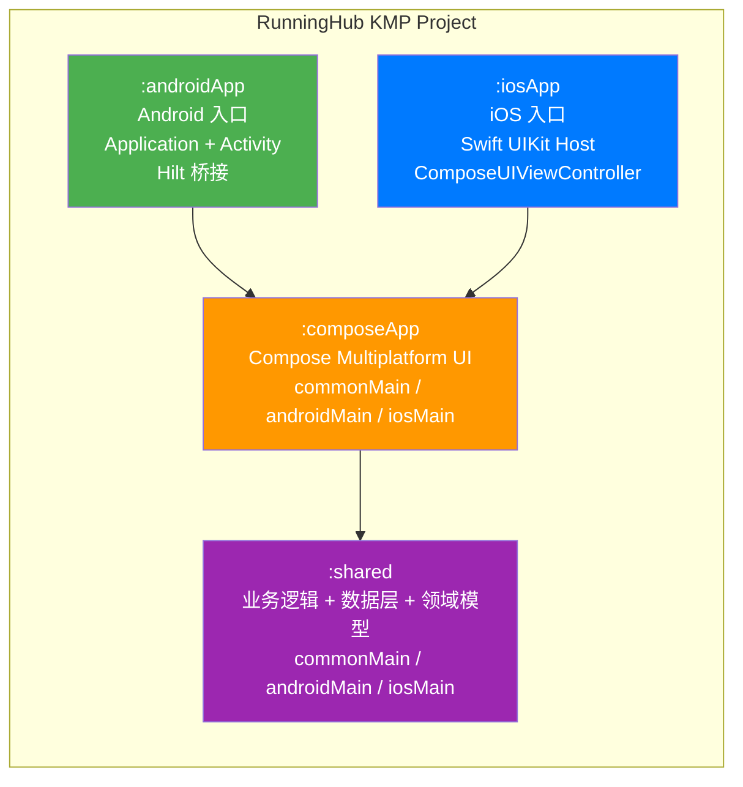
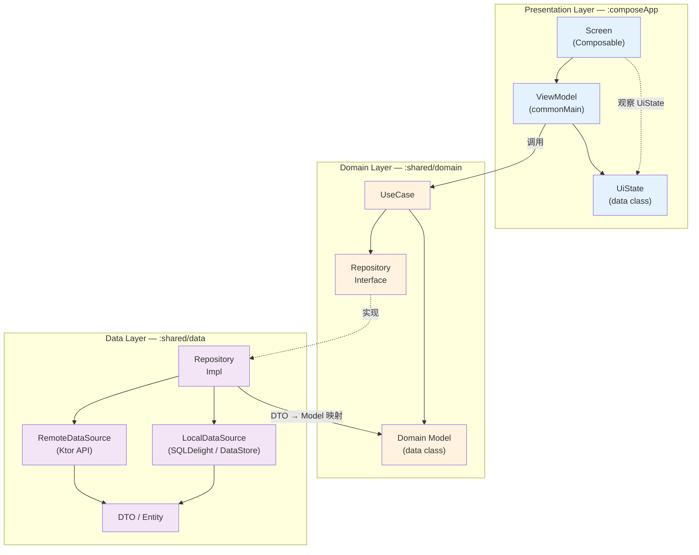
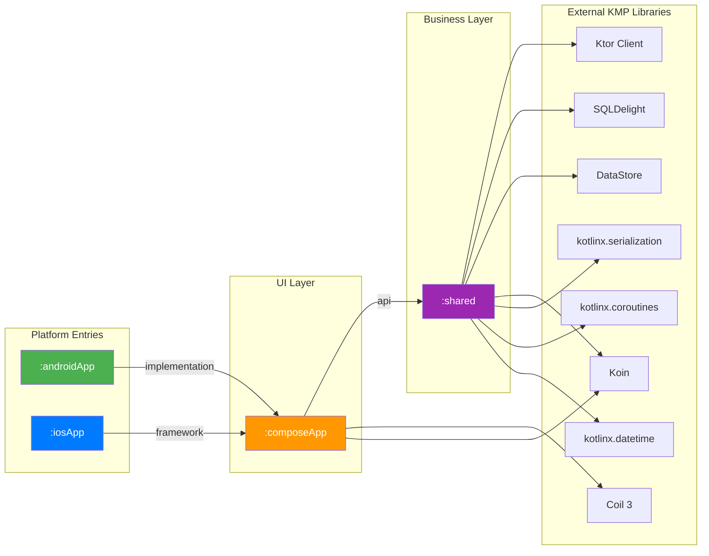
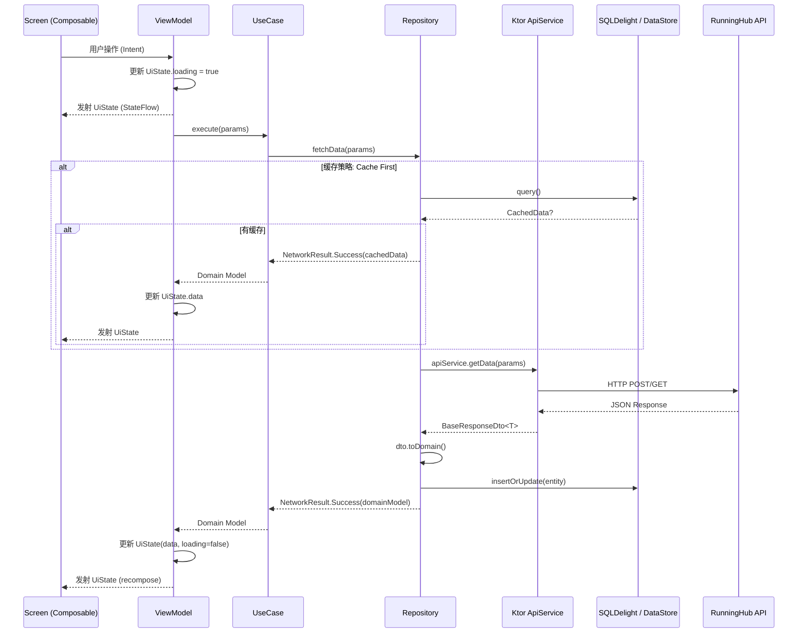
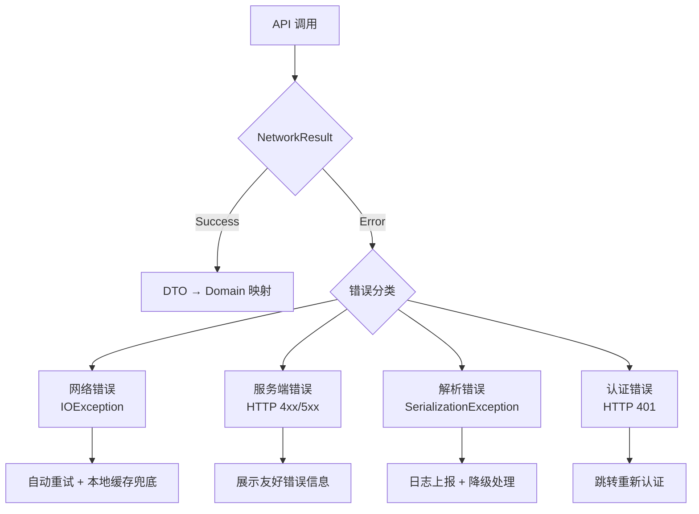
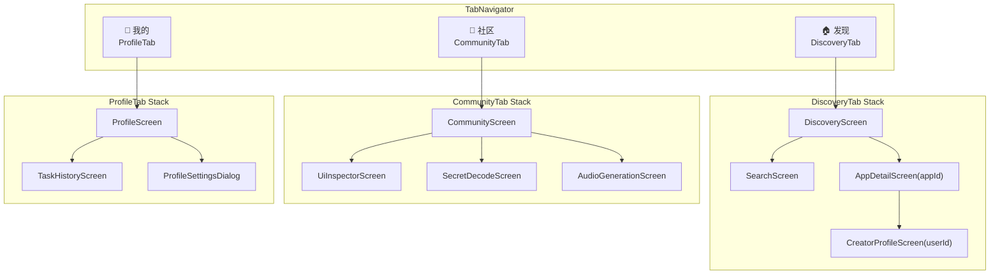
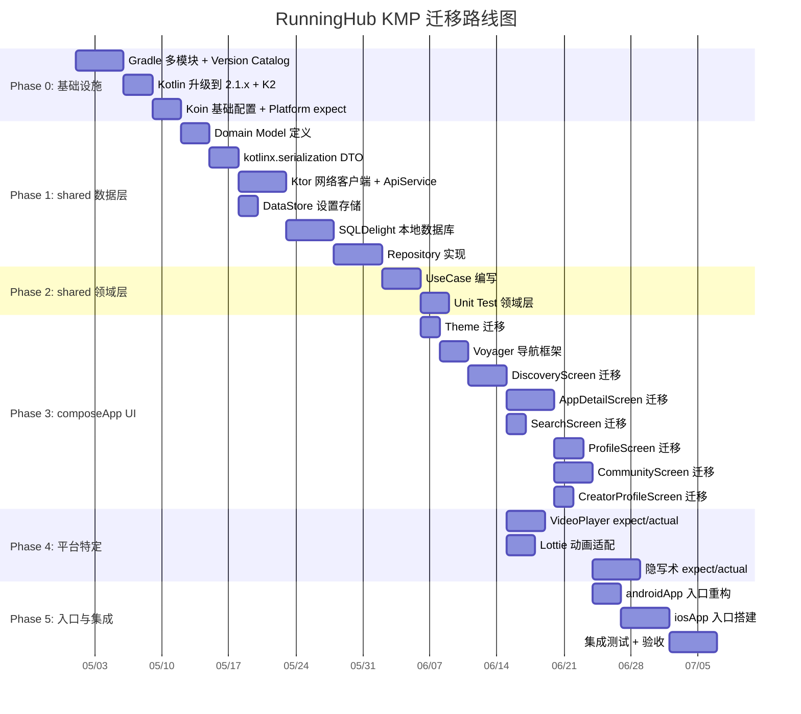

# RunningHub KMP 架构设计文档

> **版本**: 1.0  
> **日期**: 2026-04-25  
> **状态**: 设计稿  
> **范围**: 从 Android 单模块迁移至 Kotlin Multiplatform（Android + iOS）

---

## 目录

1. [目标架构（Compose Multiplatform）](#1-目标架构compose-multiplatform)
2. [分层架构（Clean Architecture）](#2-分层架构clean-architecture)
3. [技术栈迁移对照表](#3-技术栈迁移对照表)
4. [模块依赖关系](#4-模块依赖关系)
5. [shared 模块详细包结构](#5-shared-模块详细包结构)
6. [expect/actual 清单](#6-expectactual-清单)
7. [数据流架构](#7-数据流架构)
8. [导航架构](#8-导航架构)
9. [迁移优先级矩阵](#9-迁移优先级矩阵)
10. [Gradle 配置要点](#10-gradle-配置要点)

---

## 1. 目标架构（Compose Multiplatform）

### 1.1 顶层模块划分



### 1.2 各模块职责

| 模块 | Source Sets | 职责 |
|------|------------|------|
| **`:shared`** | `commonMain`, `androidMain`, `iosMain` | 领域模型、UseCase、Repository 接口与实现、网络客户端（Ktor）、本地存储（DataStore / SQLDelight）、DI 定义（Koin modules） |
| **`:composeApp`** | `commonMain`, `androidMain`, `iosMain` | Compose UI 组件、Screen、ViewModel、导航图、主题系统、图片加载（Coil 3 KMP）、平台 UI 适配 |
| **`:androidApp`** | 仅 Android | `Application` 类、`MainActivity`、`SplashActivity`、Android 清单、Koin 启动、权限声明 |
| **`:iosApp`** | 仅 iOS（Swift） | `AppDelegate` / `SceneDelegate`、`ComposeUIViewController` 桥接、Info.plist、iOS 资源 |

### 1.3 Source Set 结构

```
shared/
├── src/
│   ├── commonMain/kotlin/com/runninghub/shared/
│   ├── androidMain/kotlin/com/runninghub/shared/
│   └── iosMain/kotlin/com/runninghub/shared/

composeApp/
├── src/
│   ├── commonMain/kotlin/com/runninghub/app/ui/
│   ├── androidMain/kotlin/com/runninghub/app/
│   └── iosMain/kotlin/com/runninghub/app/

androidApp/
├── src/main/kotlin/com/runninghub/app/

iosApp/
├── iosApp/
│   ├── AppDelegate.swift
│   ├── ContentView.swift
│   └── Info.plist
```

---

## 2. 分层架构（Clean Architecture）

### 2.1 分层全景图



### 2.2 层间依赖规则

| 规则 | 说明 |
|------|------|
| **Presentation → Domain** | ViewModel 只依赖 UseCase 和 Domain Model，不直接接触 Data 层 |
| **Domain → 无外部依赖** | UseCase 和 Repository 接口定义在 Domain 层，不依赖任何框架 |
| **Data → Domain** | Repository 实现依赖 Domain 层的 Repository 接口和 Domain Model |
| **DTO ↔ Model 映射** | 在 Repository 实现中完成，使用 `.toDomain()` / `.toEntity()` 扩展函数 |

### 2.3 对应现有代码的映射

| 当前 app/ 包 | 目标分层 | 目标模块 |
|-------------|---------|---------|
| `data.remote.api` | Data Layer → RemoteDataSource | `:shared` commonMain |
| `data.remote.model` | Data Layer → DTO | `:shared` commonMain |
| `data.local` (Room) | Data Layer → LocalDataSource | `:shared` (SQLDelight 替换) |
| `data.repository` | Data Layer → Repository Impl | `:shared` commonMain |
| `di` | Data Layer → DI Modules | `:shared` commonMain (Koin) |
| `ui.feature.*Screen` | Presentation → Screen | `:composeApp` commonMain |
| `ui.feature.*ViewModel` | Presentation → ViewModel | `:composeApp` commonMain |
| `ui.feature.*UiState` | Presentation → UiState | `:composeApp` commonMain |
| `ui.navigation` | Presentation → Navigation | `:composeApp` commonMain |
| `ui.theme` | Presentation → Theme | `:composeApp` commonMain |
| `ui.component` | Presentation → Component | `:composeApp` commonMain / androidMain |

---

## 3. 技术栈迁移对照表

| 层面 | 旧 (Android) | 新 (KMP) | 迁移复杂度 | 备注 |
|------|-------------|----------|-----------|------|
| **语言版本** | Kotlin 1.9.23 | Kotlin 2.1.x | ⭐⭐ 中 | 需升级到 K2 编译器，配合 Compose 2.0 |
| **构建系统** | AGP 8.13.2 单模块 | KMP Plugin + AGP 多模块 | ⭐⭐⭐ 高 | 需重构 settings.gradle.kts，引入 Version Catalog |
| **DI 框架** | Dagger Hilt 2.50 | Koin 4.x (KMP) | ⭐⭐⭐ 高 | 注解 → 手动 DSL，需重写所有 Module |
| **网络层** | Retrofit 2.9.0 + Gson | Ktor Client 3.x + kotlinx.serialization | ⭐⭐⭐ 高 | 接口定义方式完全不同，106 行 API 需逐个迁移 |
| **JSON 序列化** | Gson (反射) | kotlinx.serialization (编译期) | ⭐⭐ 中 | DTO 加 `@Serializable`，字段命名用 `@SerialName` |
| **数据库** | Room 2.6.1 | SQLDelight 2.x | ⭐⭐⭐ 高 | DAO → `.sq` 文件，Entity → 自动生成，需重写全部查询 |
| **KV 存储** | SharedPreferences | DataStore Preferences (KMP) | ⭐ 低 | shared/ 已有 DataStore 原型，需完善 |
| **图片加载** | Coil 2.6.0 (Android) | Coil 3.x (KMP) | ⭐⭐ 中 | API 基本兼容，需调整 ImageLoader 初始化 |
| **视频播放** | Media3 ExoPlayer 1.3.1 | ExoPlayer (Android) + AVPlayer (iOS) | ⭐⭐⭐ 高 | 需 expect/actual，iOS 用 AVKit 原生实现 |
| **动画** | Lottie Compose 6.4.0 | Lottie KMP (compottie) 或 expect/actual | ⭐⭐ 中 | 可选 compottie 库或平台隔离 |
| **UI 框架** | Jetpack Compose (BOM 2024.10) | Compose Multiplatform 1.8.x | ⭐⭐ 中 | 大部分 API 一致，需替换 AndroidX 特有组件 |
| **导航** | Navigation Compose 2.7.7 | Voyager / Decompose + Compose | ⭐⭐⭐ 高 | 需替换 NavHost 体系，重写 185 行导航图 |
| **ViewModel** | AndroidX ViewModel | KMP ViewModel (Lifecycle 2.8+) / Voyager ScreenModel | ⭐⭐ 中 | 推荐用 `lifecycle-viewmodel-compose` KMP 版 |
| **Shimmer** | compose-shimmer 1.2.0 | 自实现 / KMP 兼容库 | ⭐ 低 | Modifier 实现方式在 Compose MP 通用 |
| **HTTP 日志** | OkHttp Logging Interceptor | Ktor Logging Plugin | ⭐ 低 | 配置迁移简单 |
| **文件上传** | OkHttp MultipartBody | Ktor MultiPartFormDataContent | ⭐⭐ 中 | API 差异大，需重写上传逻辑 |
| **隐写术** | Android Bitmap API | expect/actual 图像处理 | ⭐⭐⭐ 高 | SteganographyRepository 329 行强依赖 Android API |

---

## 4. 模块依赖关系

### 4.1 模块间依赖图



### 4.2 依赖传递规则

| 依赖声明 | 含义 |
|---------|------|
| `:composeApp` → `api(":shared")` | shared 的公开类型对 androidApp/iosApp 透明传递 |
| `:androidApp` → `implementation(":composeApp")` | 仅 Android 入口使用，不向上传递 |
| 三方库均用 `implementation` | 避免不必要的 API 泄漏 |

---

## 5. shared 模块详细包结构

### 5.1 commonMain 包树

```
com.runninghub.shared/
│
├── domain/                              # 领域层（纯 Kotlin，零框架依赖）
│   ├── model/                           # 领域模型
│   │   ├── WebApp.kt                    # data class WebApp, WebAppDetail, Preview, Author, Statistics
│   │   ├── Tag.kt                       # data class Tag, TagTree
│   │   ├── Account.kt                   # data class Account, MemberInfo, WalletInfo, User
│   │   ├── Audio.kt                     # data class AudioTask, AudioResult
│   │   ├── Task.kt                      # data class TaskRun, TaskOutput, TaskStatus
│   │   └── Discovery.kt                 # data class Banner, Category, AppBrief
│   │
│   ├── repository/                      # Repository 接口
│   │   ├── DiscoveryRepository.kt       # interface DiscoveryRepository
│   │   ├── UserRepository.kt            # interface UserRepository
│   │   ├── AudioRepository.kt           # interface AudioRepository
│   │   ├── WebAppRepository.kt          # interface WebAppRepository
│   │   ├── TaskRepository.kt            # interface TaskRepository
│   │   └── SettingsRepository.kt        # interface SettingsRepository（已有原型）
│   │
│   └── usecase/                         # 用例
│       ├── discovery/
│       │   ├── GetDiscoveryFeedUseCase.kt
│       │   ├── GetCarefullyChosenUseCase.kt
│       │   └── SearchWebAppsUseCase.kt
│       ├── detail/
│       │   ├── GetAppDetailUseCase.kt
│       │   ├── RunTaskUseCase.kt
│       │   ├── PollTaskOutputUseCase.kt
│       │   └── UploadFileUseCase.kt
│       ├── user/
│       │   ├── GetAccountStatusUseCase.kt
│       │   ├── GetUserInfoUseCase.kt
│       │   └── ToggleFollowUseCase.kt
│       ├── audio/
│       │   ├── CreateAudioTaskUseCase.kt
│       │   └── QueryAudioTaskUseCase.kt
│       └── settings/
│           ├── SaveApiKeyUseCase.kt
│           └── GetApiKeyUseCase.kt
│
├── data/                                # 数据层
│   ├── remote/                          # 远程数据源
│   │   ├── api/
│   │   │   ├── WebAppApiService.kt      # Ktor 实现 — 对应原 WebAppApi（106行 → Ktor 函数）
│   │   │   └── AudioApiService.kt       # Ktor 实现 — 对应原 AudioApi（32行）
│   │   ├── dto/
│   │   │   ├── BaseResponseDto.kt       # @Serializable data class BaseResponse<T>, PageData<T>
│   │   │   ├── WebAppDto.kt             # 对应原 WebAppResponse.kt 全部 DTO（198行）
│   │   │   ├── AccountDto.kt            # 对应原 AccountResponse.kt（49行）
│   │   │   ├── TagDto.kt                # 对应原 TagResponse.kt（18行）
│   │   │   ├── AudioDto.kt              # 对应原 AudioModel.kt（56行）
│   │   │   └── TaskDto.kt               # TaskRunRequest/Response, TaskStatusRequest 等
│   │   └── mapper/
│   │       ├── WebAppMapper.kt          # WebAppDto.toDomain(), WebAppDetailDto.toDomain()
│   │       ├── AccountMapper.kt         # AccountStatusDto.toDomain(), UserDto.toDomain()
│   │       ├── TagMapper.kt             # TagDto.toDomain()
│   │       ├── AudioMapper.kt           # AudioResultDto.toDomain()
│   │       └── TaskMapper.kt            # TaskOutputDto.toDomain()
│   │
│   ├── local/                           # 本地数据源
│   │   ├── db/
│   │   │   ├── RunningHubDatabase.sq    # SQLDelight schema（替换 Room AppDatabase）
│   │   │   ├── Discovery.sq             # 发现页查询（替换 DiscoveryDao 60行）
│   │   │   └── TaskHistory.sq           # 任务历史查询
│   │   ├── datastore/
│   │   │   └── SettingsDataStore.kt     # DataStore Preferences 封装（合并已有原型）
│   │   └── entity/
│   │       └── LocalEntities.kt         # SQLDelight 自动生成的类型别名
│   │
│   └── repository/                      # Repository 实现
│       ├── DiscoveryRepositoryImpl.kt   # 对应原 DiscoveryRepository（189行）
│       ├── UserRepositoryImpl.kt        # 对应原 UserRepository（110行）
│       ├── AudioRepositoryImpl.kt       # 对应原 AudioRepository（80行）
│       ├── WebAppRepositoryImpl.kt      # 拆分自原 DiscoveryRepository 中 WebApp 相关逻辑
│       ├── TaskRepositoryImpl.kt        # 拆分自原 SteganographyRepository 中 Task 相关逻辑
│       └── SettingsRepositoryImpl.kt    # 已有原型（63行），完善后迁入
│
├── di/                                  # Koin 依赖注入模块
│   ├── SharedModule.kt                  # 顶层聚合 module
│   ├── NetworkModule.kt                 # Ktor HttpClient 配置（对应原 121 行 NetworkModule）
│   ├── DatabaseModule.kt               # SQLDelight Driver 提供（对应原 32 行 DatabaseModule）
│   ├── RepositoryModule.kt             # Repository 绑定
│   └── UseCaseModule.kt                # UseCase 注册
│
├── platform/                            # expect 声明
│   ├── Platform.kt                      # expect fun getPlatform(): Platform
│   ├── DatabaseDriverFactory.kt         # expect class DatabaseDriverFactory
│   ├── DataStoreFactory.kt             # 已有原型（13行），需加 expect 声明
│   ├── HttpEngineFactory.kt            # expect fun createHttpEngine(): HttpClientEngine
│   └── ImageProcessor.kt              # expect class ImageProcessor（隐写术用）
│
└── util/                                # 通用工具
    ├── NetworkResult.kt                 # sealed class NetworkResult<T> { Success, Error, Loading }
    ├── Constants.kt                     # BASE_URL, API 路径常量
    └── DateTimeUtil.kt                  # 日期格式化工具
```

### 5.2 androidMain 包树

```
com.runninghub.shared/
├── platform/
│   ├── Platform.android.kt              # actual fun getPlatform() = AndroidPlatform
│   ├── DatabaseDriverFactory.android.kt  # actual: AndroidSqliteDriver
│   ├── DataStoreFactory.android.kt       # actual: Android Context 路径
│   ├── HttpEngineFactory.android.kt      # actual: OkHttp engine
│   └── ImageProcessor.android.kt         # actual: Android Bitmap 隐写术实现
└── di/
    └── PlatformModule.android.kt         # actual Koin module 提供 Android 依赖
```

### 5.3 iosMain 包树

```
com.runninghub.shared/
├── platform/
│   ├── Platform.ios.kt                   # actual fun getPlatform() = IOSPlatform
│   ├── DatabaseDriverFactory.ios.kt      # actual: NativeSqliteDriver
│   ├── DataStoreFactory.ios.kt           # actual: NSDocumentDirectory 路径
│   ├── HttpEngineFactory.ios.kt          # actual: Darwin engine
│   └── ImageProcessor.ios.kt            # actual: UIImage/CGImage 隐写术实现
└── di/
    └── PlatformModule.ios.kt             # actual Koin module 提供 iOS 依赖
```

---

## 6. expect/actual 清单

### 6.1 完整清单

| # | expect 声明 | 位置（commonMain） | 用途 | Android actual | iOS actual |
|---|------------|-------------------|------|---------------|------------|
| 1 | `expect fun getPlatform(): Platform` | `platform/Platform.kt` | 获取平台标识与版本 | `Build.VERSION` | `UIDevice.currentDevice` |
| 2 | `expect class DatabaseDriverFactory` | `platform/DatabaseDriverFactory.kt` | 创建 SQLDelight SqlDriver | `AndroidSqliteDriver(Context)` | `NativeSqliteDriver()` |
| 3 | `expect fun createDataStorePath(): String` | `platform/DataStoreFactory.kt` | DataStore 文件路径 | `context.filesDir + "/settings.preferences_pb"` | `NSDocumentDirectory + "/settings.preferences_pb"` |
| 4 | `expect fun createHttpEngine(): HttpClientEngine` | `platform/HttpEngineFactory.kt` | Ktor 引擎 | `OkHttp` (复用 OkHttp 拦截器生态) | `Darwin` (基于 NSURLSession) |
| 5 | `expect class ImageProcessor` | `platform/ImageProcessor.kt` | 图像隐写编码/解码 | `android.graphics.Bitmap` + `BitmapFactory` | `UIImage` + `CGBitmapContext` |
| 6 | `expect fun createUUID(): String` | `platform/Platform.kt` | 生成唯一标识 | `java.util.UUID.randomUUID()` | `NSUUID().UUIDString` |
| 7 | `expect fun openUrl(url: String)` | `platform/Platform.kt` | 打开外部链接 | `Intent(ACTION_VIEW)` | `UIApplication.shared.open()` |
| 8 | `expect fun shareText(text: String)` | `platform/Platform.kt` | 系统分享 | `Intent.ACTION_SEND` | `UIActivityViewController` |

### 6.2 平台隔离策略（非 expect/actual）

以下功能因平台差异过大，采用 **接口 + 平台注入** 而非 expect/actual：

| 功能 | 方案 | 说明 |
|------|------|------|
| **视频播放器** | `interface VideoPlayerController` + 各平台 Composable | Android: `Media3 ExoPlayer`；iOS: `AVPlayer` + `UIKitView` |
| **Lottie 动画** | `interface LottieAnimationView` + 各平台 Composable | Android: `lottie-compose`；iOS: `lottie-ios` via `UIKitView` |
| **权限管理** | `interface PermissionHandler` + 平台实现 | Android: `ActivityResultContracts`；iOS: `AVCaptureDevice.requestAccess` |
| **文件选择器** | `interface FilePickerLauncher` + 平台实现 | Android: `ActivityResultContracts.GetContent`；iOS: `PHPickerViewController` |
| **缓存管理** | `interface CacheManager` + 平台实现 | Android: `context.cacheDir`；iOS: `NSCachesDirectory` |

---

## 7. 数据流架构

### 7.1 单向数据流全景



### 7.2 状态管理模式

```kotlin
// UiState 标准模式
data class DiscoveryUiState(
    val isLoading: Boolean = true,
    val banners: List<Banner> = emptyList(),
    val categories: List<Category> = emptyList(),
    val apps: List<WebApp> = emptyList(),
    val error: String? = null,
    val isRefreshing: Boolean = false,
    val hasMore: Boolean = true
)

// ViewModel 标准模式
class DiscoveryViewModel(
    private val getDiscoveryFeedUseCase: GetDiscoveryFeedUseCase,
    private val searchWebAppsUseCase: SearchWebAppsUseCase
) : ViewModel() {

    private val _uiState = MutableStateFlow(DiscoveryUiState())
    val uiState: StateFlow<DiscoveryUiState> = _uiState.asStateFlow()

    fun onEvent(event: DiscoveryEvent) {
        when (event) {
            is DiscoveryEvent.LoadFeed -> loadFeed()
            is DiscoveryEvent.Refresh -> refresh()
            is DiscoveryEvent.LoadMore -> loadMore()
        }
    }
}
```

### 7.3 错误处理策略



---

## 8. 导航架构

### 8.1 方案选型：Voyager

| 方案 | KMP 支持 | 类型安全 | 深链接 | 动画 | 社区活跃度 | 推荐 |
|------|---------|---------|-------|------|----------|------|
| **Voyager** | ✅ 原生 | ✅ sealed class | ✅ 支持 | ✅ 内置 | 高 | **✅ 推荐** |
| Decompose | ✅ 原生 | ✅ 强 | ✅ 支持 | 需自定义 | 中 | 备选 |
| Navigation Compose KMP | ⚠️ 实验性 | ✅ 2.8+ | ✅ 支持 | ✅ 内置 | 高 | 观望 |

**选择 Voyager 的理由**：
- 原生 KMP 支持，API 简洁
- 内置 ScreenModel（类似 ViewModel），可选对接 KMP ViewModel
- 支持 Tab 导航、嵌套导航、BottomSheet 导航
- Koin 集成一等支持（`koinScreenModel()`）

### 8.2 路由定义迁移

```kotlin
// 原 Screen.kt (sealed class + String route) → Voyager Screen

// composeApp/src/commonMain/kotlin/.../navigation/Screens.kt

// 无参路由
data object DiscoveryScreen : Screen {
    @Composable
    override fun Content() {
        val viewModel = koinScreenModel<DiscoveryViewModel>()
        DiscoveryContent(viewModel)
    }
}

// 带参路由
data class AppDetailScreen(val appId: String) : Screen {
    @Composable
    override fun Content() {
        val viewModel = koinScreenModel<AppDetailViewModel>()
        LaunchedEffect(appId) { viewModel.loadDetail(appId) }
        AppDetailContent(viewModel)
    }
}

data class CreatorProfileScreen(val userId: String) : Screen {
    @Composable
    override fun Content() {
        val viewModel = koinScreenModel<CreatorProfileViewModel>()
        LaunchedEffect(userId) { viewModel.loadProfile(userId) }
        CreatorProfileContent(viewModel)
    }
}
```

### 8.3 导航图结构



### 8.4 全部路由清单

| 原路由 (String) | 新 Voyager Screen | 参数 | 所属 Tab |
|----------------|------------------|------|---------|
| `"discovery"` | `DiscoveryScreen` | — | Discovery |
| `"search"` | `SearchScreen` | — | Discovery |
| `"app_detail/{appId}"` | `AppDetailScreen(appId)` | `appId: String` | Discovery |
| `"creator_profile/{userId}"` | `CreatorProfileScreen(userId)` | `userId: String` | Discovery |
| `"community"` | `CommunityScreen` | — | Community |
| `"tool_ui_inspector"` | `UiInspectorScreen` | — | Community |
| `"tool_secret_decode"` | `SecretDecodeScreen` | — | Community |
| `"tool_audio_generation"` | `AudioGenerationScreen` | — | Community |
| `"profile"` | `ProfileScreen` | — | Profile |
| `"task_history"` | `TaskHistoryScreen` | — | Profile |

---

## 9. 迁移优先级矩阵

### 9.1 分阶段迁移计划

迁移顺序遵循**自底向上、依赖链优先**的原则：



### 9.2 优先级矩阵（详细）

| 优先级 | 阶段 | 任务 | 依赖项 | 预估工时 | 风险等级 |
|-------|------|------|--------|---------|---------|
| **P0** | 基础设施 | Gradle 多模块重构 | 无 | 5d | ⭐⭐⭐ |
| **P0** | 基础设施 | Kotlin 2.1.x 升级 | Gradle 重构 | 3d | ⭐⭐ |
| **P0** | 基础设施 | Koin 基础 + expect/actual 骨架 | Kotlin 升级 | 3d | ⭐⭐ |
| **P1** | 数据层 | Domain Model（纯 Kotlin） | Koin 基础 | 3d | ⭐ |
| **P1** | 数据层 | DTO + kotlinx.serialization | Domain Model | 3d | ⭐⭐ |
| **P1** | 数据层 | Ktor Client 网络层 | DTO 定义 | 5d | ⭐⭐⭐ |
| **P1** | 数据层 | DataStore KV 存储 | DTO 定义 | 2d | ⭐ |
| **P1** | 数据层 | SQLDelight 本地 DB | Ktor 网络层 | 5d | ⭐⭐⭐ |
| **P1** | 数据层 | Repository 实现 | SQLDelight + Ktor | 5d | ⭐⭐ |
| **P2** | 领域层 | UseCase 编写 | Repository | 4d | ⭐ |
| **P2** | 领域层 | 单元测试 | UseCase | 3d | ⭐ |
| **P3** | UI 层 | Theme 迁移 | UseCase | 2d | ⭐ |
| **P3** | UI 层 | Voyager 导航 | Theme | 3d | ⭐⭐ |
| **P3** | UI 层 | 各 Screen 迁移（6 个页面） | 导航框架 | 20d | ⭐⭐ |
| **P4** | 平台特定 | VideoPlayer / Lottie / 隐写术 | Screen 迁移 | 12d | ⭐⭐⭐ |
| **P5** | 集成 | Android 入口 + iOS 入口 + 测试 | 全部 UI | 13d | ⭐⭐⭐ |

### 9.3 风险与缓解

| 风险 | 影响 | 缓解措施 |
|------|------|---------|
| **Ktor API 与 Retrofit 行为差异** | P1 网络层可能出现细微 bug | 编写对照测试，逐 API 迁移并验证 Response 一致性 |
| **SQLDelight 与 Room 查询不兼容** | P1 数据库迁移工作量可能超预期 | 先列出全部 DAO 查询，评估 SQL 方言差异 |
| **隐写术强依赖 Android Bitmap** | P4 平台隔离工作量大 | 329 行中抽取纯算法部分到 commonMain，仅图像 I/O 走 expect/actual |
| **Compose Multiplatform 在 iOS 成熟度** | P5 iOS 端可能有 UI 渲染差异 | 采用 1.8.x 稳定版，关键组件做 iOS 测试 |
| **Kotlin 2.1 K2 编译器兼容性** | P0 部分库可能不支持 | 提前验证所有三方库 K2 兼容性 |

---

## 10. Gradle 配置要点

### 10.1 settings.gradle.kts

```kotlin
pluginManagement {
    repositories {
        google()
        mavenCentral()
        gradlePluginPortal()
    }
}

dependencyResolutionManagement {
    repositoriesMode.set(RepositoriesMode.FAIL_ON_PROJECT_REPOS)
    repositories {
        google()
        mavenCentral()
    }
}

rootProject.name = "RunningHub"

include(":shared")
include(":composeApp")
include(":androidApp")
// :iosApp 由 Xcode 管理，不在 Gradle include 中
```

### 10.2 根 build.gradle.kts

```kotlin
plugins {
    alias(libs.plugins.android.application) apply false
    alias(libs.plugins.android.library) apply false
    alias(libs.plugins.kotlin.multiplatform) apply false
    alias(libs.plugins.kotlin.serialization) apply false
    alias(libs.plugins.compose.multiplatform) apply false
    alias(libs.plugins.compose.compiler) apply false
    alias(libs.plugins.sqldelight) apply false
    alias(libs.plugins.ksp) apply false
}
```

### 10.3 gradle/libs.versions.toml（Version Catalog）

```toml
[versions]
kotlin = "2.1.10"
agp = "8.13.2"
compose-multiplatform = "1.8.0"
koin = "4.0.2"
ktor = "3.1.1"
sqldelight = "2.0.2"
kotlinx-serialization = "1.7.3"
kotlinx-coroutines = "1.9.0"
kotlinx-datetime = "0.6.1"
coil = "3.1.0"
voyager = "1.1.0-beta03"
datastore = "1.1.2"
lifecycle = "2.8.4"
media3 = "1.3.1"
ksp = "2.1.10-1.0.29"
lottie = "6.4.0"

[libraries]
# Kotlin
kotlinx-coroutines-core = { module = "org.jetbrains.kotlinx:kotlinx-coroutines-core", version.ref = "kotlinx-coroutines" }
kotlinx-serialization-json = { module = "org.jetbrains.kotlinx:kotlinx-serialization-json", version.ref = "kotlinx-serialization" }
kotlinx-datetime = { module = "org.jetbrains.kotlinx:kotlinx-datetime", version.ref = "kotlinx-datetime" }

# Ktor
ktor-client-core = { module = "io.ktor:ktor-client-core", version.ref = "ktor" }
ktor-client-content-negotiation = { module = "io.ktor:ktor-client-content-negotiation", version.ref = "ktor" }
ktor-serialization-json = { module = "io.ktor:ktor-serialization-kotlinx-json", version.ref = "ktor" }
ktor-client-logging = { module = "io.ktor:ktor-client-logging", version.ref = "ktor" }
ktor-client-okhttp = { module = "io.ktor:ktor-client-okhttp", version.ref = "ktor" }
ktor-client-darwin = { module = "io.ktor:ktor-client-darwin", version.ref = "ktor" }

# SQLDelight
sqldelight-runtime = { module = "app.cash.sqldelight:runtime", version.ref = "sqldelight" }
sqldelight-coroutines = { module = "app.cash.sqldelight:coroutines-extensions", version.ref = "sqldelight" }
sqldelight-android-driver = { module = "app.cash.sqldelight:android-driver", version.ref = "sqldelight" }
sqldelight-native-driver = { module = "app.cash.sqldelight:native-driver", version.ref = "sqldelight" }

# Koin
koin-core = { module = "io.insert-koin:koin-core", version.ref = "koin" }
koin-android = { module = "io.insert-koin:koin-android", version.ref = "koin" }
koin-compose = { module = "io.insert-koin:koin-compose", version.ref = "koin" }
koin-compose-viewmodel = { module = "io.insert-koin:koin-compose-viewmodel", version.ref = "koin" }

# Coil
coil-compose = { module = "io.coil-kt.coil3:coil-compose", version.ref = "coil" }
coil-network-ktor = { module = "io.coil-kt.coil3:coil-network-ktor3", version.ref = "coil" }

# Voyager
voyager-navigator = { module = "cafe.adriel.voyager:voyager-navigator", version.ref = "voyager" }
voyager-tab-navigator = { module = "cafe.adriel.voyager:voyager-tab-navigator", version.ref = "voyager" }
voyager-transitions = { module = "cafe.adriel.voyager:voyager-transitions", version.ref = "voyager" }
voyager-koin = { module = "cafe.adriel.voyager:voyager-koin", version.ref = "voyager" }

# DataStore
datastore-preferences = { module = "androidx.datastore:datastore-preferences-core", version.ref = "datastore" }

# Lifecycle (KMP ViewModel)
lifecycle-viewmodel-compose = { module = "org.jetbrains.androidx.lifecycle:lifecycle-viewmodel-compose", version.ref = "lifecycle" }

# Android-only
media3-exoplayer = { module = "androidx.media3:media3-exoplayer", version.ref = "media3" }
media3-ui = { module = "androidx.media3:media3-ui", version.ref = "media3" }
lottie-compose = { module = "com.airbnb.android:lottie-compose", version.ref = "lottie" }

[plugins]
android-application = { id = "com.android.application", version.ref = "agp" }
android-library = { id = "com.android.library", version.ref = "agp" }
kotlin-multiplatform = { id = "org.jetbrains.kotlin.multiplatform", version = "kotlin" }
kotlin-serialization = { id = "org.jetbrains.kotlin.plugin.serialization", version.ref = "kotlin" }
compose-multiplatform = { id = "org.jetbrains.compose", version.ref = "compose-multiplatform" }
compose-compiler = { id = "org.jetbrains.kotlin.plugin.compose", version.ref = "kotlin" }
sqldelight = { id = "app.cash.sqldelight", version.ref = "sqldelight" }
ksp = { id = "com.google.devtools.ksp", version.ref = "ksp" }
```

### 10.4 shared/build.gradle.kts

```kotlin
plugins {
    alias(libs.plugins.kotlin.multiplatform)
    alias(libs.plugins.android.library)
    alias(libs.plugins.kotlin.serialization)
    alias(libs.plugins.sqldelight)
}

kotlin {
    androidTarget {
        compilations.all {
            kotlinOptions { jvmTarget = "17" }
        }
    }

    listOf(
        iosX64(),
        iosArm64(),
        iosSimulatorArm64()
    ).forEach { target ->
        target.binaries.framework {
            baseName = "shared"
            isStatic = true
        }
    }

    sourceSets {
        commonMain.dependencies {
            implementation(libs.kotlinx.coroutines.core)
            implementation(libs.kotlinx.serialization.json)
            implementation(libs.kotlinx.datetime)
            implementation(libs.ktor.client.core)
            implementation(libs.ktor.client.content.negotiation)
            implementation(libs.ktor.serialization.json)
            implementation(libs.ktor.client.logging)
            implementation(libs.sqldelight.runtime)
            implementation(libs.sqldelight.coroutines)
            implementation(libs.datastore.preferences)
            implementation(libs.koin.core)
        }
        androidMain.dependencies {
            implementation(libs.ktor.client.okhttp)
            implementation(libs.sqldelight.android.driver)
            implementation(libs.koin.android)
        }
        iosMain.dependencies {
            implementation(libs.ktor.client.darwin)
            implementation(libs.sqldelight.native.driver)
        }
        commonTest.dependencies {
            implementation(kotlin("test"))
        }
    }
}

android {
    namespace = "com.runninghub.shared"
    compileSdk = 35
    defaultConfig { minSdk = 24 }
    compileOptions {
        sourceCompatibility = JavaVersion.VERSION_17
        targetCompatibility = JavaVersion.VERSION_17
    }
}

sqldelight {
    databases {
        create("RunningHubDatabase") {
            packageName.set("com.runninghub.shared.data.local.db")
        }
    }
}
```

### 10.5 composeApp/build.gradle.kts

```kotlin
plugins {
    alias(libs.plugins.kotlin.multiplatform)
    alias(libs.plugins.android.library)
    alias(libs.plugins.compose.multiplatform)
    alias(libs.plugins.compose.compiler)
}

kotlin {
    androidTarget {
        compilations.all {
            kotlinOptions { jvmTarget = "17" }
        }
    }

    listOf(
        iosX64(),
        iosArm64(),
        iosSimulatorArm64()
    ).forEach { target ->
        target.binaries.framework {
            baseName = "ComposeApp"
            isStatic = true
        }
    }

    sourceSets {
        commonMain.dependencies {
            api(project(":shared"))
            implementation(compose.runtime)
            implementation(compose.foundation)
            implementation(compose.material3)
            implementation(compose.materialIconsExtended)
            implementation(compose.ui)
            implementation(compose.components.resources)
            implementation(libs.voyager.navigator)
            implementation(libs.voyager.tab.navigator)
            implementation(libs.voyager.transitions)
            implementation(libs.voyager.koin)
            implementation(libs.coil.compose)
            implementation(libs.coil.network.ktor)
            implementation(libs.koin.core)
            implementation(libs.koin.compose)
            implementation(libs.koin.compose.viewmodel)
            implementation(libs.lifecycle.viewmodel.compose)
        }
        androidMain.dependencies {
            implementation(libs.media3.exoplayer)
            implementation(libs.media3.ui)
            implementation(libs.lottie.compose)
        }
        // iosMain: Lottie iOS 等平台特定 UI 依赖
    }
}

android {
    namespace = "com.runninghub.app.ui"
    compileSdk = 35
    defaultConfig { minSdk = 24 }
    compileOptions {
        sourceCompatibility = JavaVersion.VERSION_17
        targetCompatibility = JavaVersion.VERSION_17
    }
}
```

### 10.6 androidApp/build.gradle.kts

```kotlin
plugins {
    alias(libs.plugins.android.application)
    alias(libs.plugins.compose.compiler)
}

android {
    namespace = "com.runninghub.app"
    compileSdk = 35

    defaultConfig {
        applicationId = "com.runninghub.app"
        minSdk = 24
        targetSdk = 35
        versionCode = 1
        versionName = "1.0"
    }

    buildTypes {
        release {
            isMinifyEnabled = true
            proguardFiles(
                getDefaultProguardFile("proguard-android-optimize.txt"),
                "proguard-rules.pro"
            )
        }
    }

    compileOptions {
        sourceCompatibility = JavaVersion.VERSION_17
        targetCompatibility = JavaVersion.VERSION_17
    }

    buildFeatures { compose = true }
}

dependencies {
    implementation(project(":composeApp"))
    implementation(libs.koin.android)
}
```

### 10.7 关键配置差异对照

| 配置项 | 旧（app/） | 新（多模块） |
|--------|----------|------------|
| 插件声明 | 硬编码 `id("...")` | `alias(libs.plugins.xxx)` |
| 依赖版本 | 字面量 `"2.9.0"` | `libs.versions.toml` 集中管理 |
| Compose 编译器 | `composeOptions { kotlinCompilerExtensionVersion }` | Kotlin 2.x 内置 `compose-compiler` 插件 |
| KSP | Room/Hilt 注解处理 | SQLDelight 编译期生成 + Koin 无注解 |
| 模块类型 | `com.android.application` | shared/composeApp: `com.android.library` + KMP |

---

## 附录 A：现有代码行数汇总

| 模块/目录 | 文件数 | 总行数 | 迁移目标 |
|----------|--------|-------|---------|
| `app/data/remote/api` | 2 | ~138 | `:shared` data/remote/api |
| `app/data/remote/model` | 5 | ~341 | `:shared` data/remote/dto |
| `app/data/local` | 5 | ~238 | `:shared` data/local |
| `app/data/repository` | 4 | ~708 | `:shared` data/repository |
| `app/di` | 3 | ~177 | `:shared` di |
| `app/ui/navigation` | 2 | ~209 | `:composeApp` navigation |
| `app/ui/theme` | 3 | ~93 | `:composeApp` theme |
| `app/ui/component` | 3 | ~312 | `:composeApp` component |
| `app/ui/feature` | 18 | ~5,130 | `:composeApp` feature |
| `app/` 其它（Activity, Util） | 5 | ~673 | `:androidApp` / `:shared` util |
| **合计** | **50** | **~8,019** | — |

## 附录 B：API 接口迁移清单

| # | 原 Retrofit 方法 | HTTP | 路径 | Ktor 迁移方法名 |
|---|-----------------|------|------|----------------|
| 1 | `getWebAppList` | POST | `webapp/list` | `fetchWebAppList()` |
| 2 | `getCarefullyChosenList` | POST | `webapp/carefullyChosenList` | `fetchCarefullyChosenList()` |
| 3 | `getWebAppUserList` | POST | `webapp/user/list` | `fetchWebAppUserList()` |
| 4 | `getTagTree` | POST | `portal/tag/tree` | `fetchTagTree()` |
| 5 | `getApiCallDemo` | GET | `webapp/apiCallDemo` | `fetchApiCallDemo()` |
| 6 | `getWebAppDetail` | POST | `webapp/detail` | `fetchWebAppDetail()` |
| 7 | `runTask` | POST | `/task/openapi/ai-app/run` | `runTask()` |
| 8 | `getTaskOutputs` | POST | `/task/openapi/outputs` | `fetchTaskOutputs()` |
| 9 | `uploadFile` | POST | `/task/openapi/upload` | `uploadFile()` |
| 10 | `getAccountStatus` | POST | `/uc/openapi/accountStatus` | `fetchAccountStatus()` |
| 11 | `getUserInfo` | POST | `uc/getUserInfo` | `fetchUserInfo()` |
| 12 | `getUserDetail` | POST | `uc/getUserInfo` | `fetchUserDetail()` |
| 13 | `isFollow` | POST | `uc/follow/isFollow` | `checkFollowStatus()` |
| 14 | `followUser` | POST | `uc/follow/followUser` | `followUser()` |
| 15 | `unFollowUser` | POST | `uc/follow/unFollowUser` | `unfollowUser()` |
| 16 | AudioApi 全部方法 | POST | `rhart-audio/*` | `createAudioTask()` / `queryAudioTask()` |

## 附录 C：迁移检查清单

- [ ] **Phase 0**: settings.gradle.kts 注册三模块
- [ ] **Phase 0**: libs.versions.toml 创建并迁移全部依赖
- [ ] **Phase 0**: Kotlin 升级至 2.1.x，验证编译通过
- [ ] **Phase 1**: 全部 Domain Model 定义完成
- [ ] **Phase 1**: 全部 DTO 加 `@Serializable` 注解
- [ ] **Phase 1**: Ktor HttpClient 替换 Retrofit，16 个 API 迁移完成
- [ ] **Phase 1**: SQLDelight `.sq` 文件替换 Room Entity + DAO
- [ ] **Phase 1**: DataStore 替换 SharedPreferences
- [ ] **Phase 1**: 6 个 Repository 实现迁移完成
- [ ] **Phase 2**: UseCase 层编写完成
- [ ] **Phase 2**: 领域层单元测试覆盖率 > 80%
- [ ] **Phase 3**: Theme/Color/Type 迁移到 Compose Multiplatform
- [ ] **Phase 3**: Voyager 导航框架替换 Navigation Compose
- [ ] **Phase 3**: 10 个 Screen 全部迁移完成
- [ ] **Phase 4**: VideoPlayer expect/actual 实现
- [ ] **Phase 4**: Lottie 动画平台适配完成
- [ ] **Phase 4**: 隐写术 expect/actual 实现
- [ ] **Phase 5**: androidApp 入口正常启动
- [ ] **Phase 5**: iosApp 入口正常启动
- [ ] **Phase 5**: Android + iOS 集成测试通过
- [ ] **Phase 5**: 旧 `app/` 模块代码完全移除
