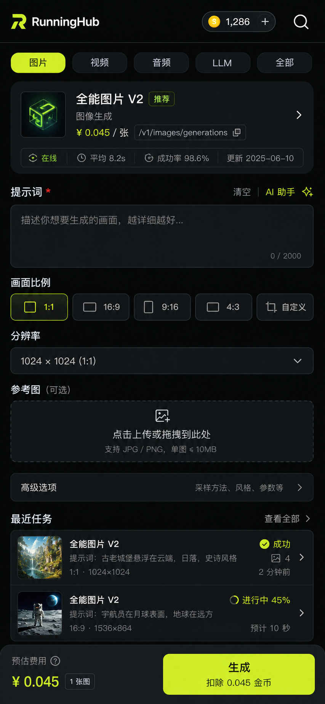
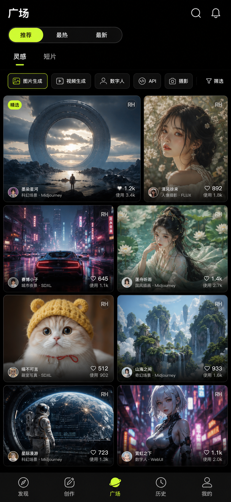
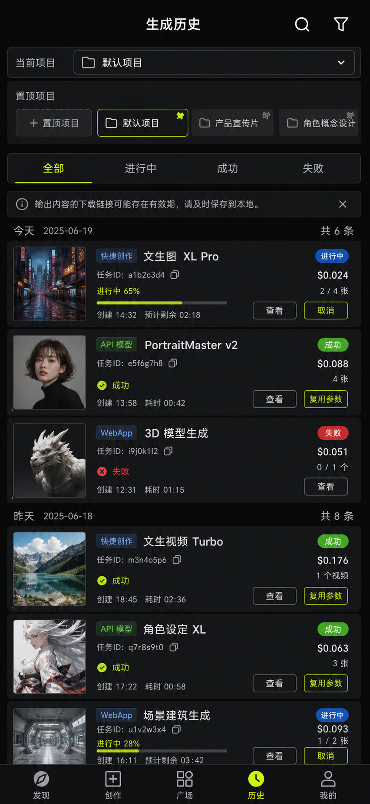

# RunningHub Creation Platform Design

> Date: 2026-06-19
> Owner: Codex
> Status: Draft for user review
> Scope: document consolidation, generation history, plaza, unified API model catalog/calling, and brand color alignment.

## 1. Source Evidence

This design is grounded in the current worktree and captured documents:

- `doc/RunningHub-call-api-models-capture-2026-06-18.md`
  - Standard model list: `/api/sku/list`
  - Standard model detail: `/api/sku/detail`
  - Standard model invocation: `POST https://www.runninghub.cn/openapi/v2{rhEndpoint}`
  - Standard model result query: `POST https://www.runninghub.cn/openapi/v2/query`
  - Media upload: `POST https://www.runninghub.cn/openapi/v2/media/upload/binary`
  - LLM model list: `GET /llm/api/models`
- `doc/RunningHub-explore-capture-2026-06-19.md`
  - Inspiration feed: `/api/portal/creation/list`
  - Tags: `/api/portal/tag/tree`
  - Creation detail: `/api/creation/detail`
  - Comments: `/api/comment/list`
  - Follow status: `/uc/follow/isFollow`
  - Short-film feed: `/canvas/community/composition/list`
- `doc/RunningHub-home-color-palette-capture-2026-06-19.md`
  - Primary web brand accent: `#CCFF00`
  - Dark surfaces: `#000000`, `#080808`, `#09090B`, `#18181B`, `#27272A`
  - Text: `#FFFFFF`, `#EFEFEF`, `#D8D8D8`, `#9DA2A8`
- Current code:
  - `shared/src/commonMain/kotlin/com/runninghub/shared/data/remote/api/QuickCreateApi.kt`
  - `shared/src/commonMain/kotlin/com/runninghub/shared/domain/repository/QuickCreateRepository.kt`
  - `composeApp/src/commonMain/kotlin/com/runninghub/app/ui/feature/community/CommunityScreen.kt`
  - `composeApp/src/commonMain/kotlin/com/runninghub/app/ui/feature/history/TaskHistoryScreen.kt`
  - `composeApp/src/commonMain/kotlin/com/runninghub/app/ui/theme/Color.kt`

## 2. Current Gaps

### Generation History

The app already has two history concepts:

- Legacy WebApp history from `RunningHubApi.getTaskHistory`.
- Quick creation history, project history, and detail data in `QuickCreateRepository`.

The gap is product shape. History is not a clear first-class workspace. Users need one place to track, inspect, reuse, cancel, and organize generated outputs.

### Plaza

`CommunityScreen` is currently a static tool grid. It is not the captured RunningHub Explore experience.

The real plaza should be a feed with:

- Inspiration creations from `/api/portal/creation/list`.
- Tags from `/api/portal/tag/tree`.
- Sort modes: `RECOMMEND`, `HOT`, `LATEST`.
- Creation detail from `/api/creation/detail`.
- Short films from `/canvas/community/composition/list`.

### Unified API Model Management

`QuickCreateApi` still contains many hardcoded model endpoints and request DTOs. The capture shows that standard models are schema-driven:

- `/api/sku/list` gives the catalog.
- `/api/sku/detail` gives `rhEndpoint` and `inputConfigJson`.
- The client should render fields from the model schema and submit to `/openapi/v2{rhEndpoint}`.

LLM models should be modeled separately from async standard models because LLM calls are token-priced and may be streaming, while standard models are async task calls.

### Color System

The current Compose tokens use a purple/cyan theme. The latest website capture shows a dark brand system with lime as the main accent. The old `doc/design-system.md` also has encoding damage and should not be treated as current design truth.

## 3. Recommended Product Direction

Use Scheme A: Unified Creation Platform.

Main tabs:

1. `发现`
   - Existing app discovery and recommended model modules.
2. `创作`
   - Unified model catalog and dynamic model form.
3. `广场`
   - Inspiration and short-film feeds.
4. `历史`
   - All generation tasks and project task history.
5. `我的`
   - Account, API keys, balance, settings.

This adds one more bottom-tab item than the current app, but it matches the real user jobs:

- Find what to use.
- Create with a model.
- Browse others' outputs.
- Manage my own outputs.
- Manage my account.

## 4. Information Architecture

```mermaid
flowchart TD
    A["Main Navigation"] --> B["发现"]
    A --> C["创作"]
    A --> D["广场"]
    A --> E["历史"]
    A --> F["我的"]

    B --> B1["WebApp discovery"]
    B --> B2["Home banners"]
    B --> B3["Recommended model matrix"]

    C --> C1["Model catalog"]
    C --> C2["Model detail"]
    C --> C3["Schema-driven form"]
    C --> C4["Fee preview"]
    C --> C5["Submit task"]
    C --> C6["Task result query"]

    D --> D1["Inspiration feed"]
    D --> D2["Short-film feed"]
    D --> D3["Creation detail"]
    D --> D4["Comments read"]
    D --> D5["Use same model/template"]

    E --> E1["All task list"]
    E --> E2["Project filter"]
    E --> E3["Task detail"]
    E --> E4["Reuse params"]
    E --> E5["Cancel running task"]

    F --> F1["Login state"]
    F --> F2["API key"]
    F --> F3["Balance"]
    F --> F4["Settings"]
```



## 5. Data Boundaries

### Model Catalog

Create a shared `ModelCatalogRepository`.

Responsibilities:

- Load standard model list from `/api/sku/list`.
- Load model detail from `/api/sku/detail`.
- Parse and cache a safe schema from `inputConfigJson`.
- Load LLM model list separately from `/llm/api/models`.
- Expose model families, model cards, field schemas, pricing summaries, endpoint metadata, and raw fallback JSON.

Do not mix model catalog with UI state. UI should consume domain models.

### Model Invocation

Create a shared `ModelInvocationRepository`.

Responsibilities:

- Upload media to `/openapi/v2/media/upload/binary`.
- Build JSON request bodies from field schema and user input.
- Submit standard model tasks to `/openapi/v2{rhEndpoint}`.
- Query standard model task results through `/openapi/v2/query`.
- Keep LLM invocation as a separate future contract until the LLM run endpoint is confirmed.

### Plaza

Create a shared `PlazaRepository`.

Responsibilities:

- Load tags.
- Load inspiration cards by sort and tags.
- Load creation details.
- Load comments.
- Load short-film categories and list.

Write actions such as like, collect, comment, follow, and use-same should remain future scope unless endpoints are captured.

### History

Create a `GenerationHistoryRepository` facade over existing sources.

Responsibilities:

- List quick creation tasks.
- List quick creation project tasks.
- Load quick creation task detail.
- Optionally include legacy WebApp history as a source-labeled item.
- Normalize status, thumbnails, outputs, cost, source, task ID, model name, and creation time.

## 6. UX Principles

- Treat the app as an operational creation tool, not a landing page.
- Prefer dense but readable layouts.
- Avoid nested cards.
- Use full-width surfaces and lightweight row dividers.
- Use media thumbnails for plaza and history wherever possible.
- Keep `#CCFF00` for primary actions, selected states, and key highlights only.
- Keep old teal only for compatibility or low-level controls if needed.
- Do not use purple/cyan gradients in new surfaces.

## 7. Wireframe Directions

Three visual concepts were generated with ImageGen as independent mobile UI directions.

### Concept 1: Unified Creation Hub

Purpose: make `创作` the main model-calling surface.



```
┌──────────────────────────────┐
│ RunningHub        RH 71   🔍 │
├──────────────────────────────┤
│ 图片  视频  音频  LLM  全部   │
├──────────────────────────────┤
│ 全能图片 V2        ¥0.16/次   │
│ /rhart-image...  队列 1000    │
├──────────────────────────────┤
│ Prompt                       │
│ ┌──────────────────────────┐ │
│ │ 输入提示词...             │ │
│ └──────────────────────────┘ │
│ 比例  1:1  3:4  16:9  9:16  │
│ 清晰度  720p ▼              │
│ ┌──────────────────────────┐ │
│ │ + 上传参考图              │ │
│ └──────────────────────────┘ │
├──────────────────────────────┤
│ 最近生成                     │
│ 缩略图  成功  全能图片 V2    │
│ 缩略图  进行中  Seedance     │
├──────────────────────────────┤
│ 预估费用          生成       │
└──────────────────────────────┘
```

Best for the first development milestone because it directly addresses unified API model management and calling.

### Concept 2: Plaza First

Purpose: make `广场` a real content discovery surface.



```
┌──────────────────────────────┐
│ 广场                    🔍   │
│ 推荐  最热  最新             │
│ 灵感        短片             │
│ 图片生成 视频生成 数字人 API │
├──────────────┬───────────────┤
│ 大图作品     │ 作品卡        │
│ 作者  赞 用  │ 作者  赞 用   │
├──────────────┼───────────────┤
│ 视频卡       │ 图片卡        │
│ 00:42        │ 水印          │
├──────────────┴───────────────┤
│ 发现 创作 广场 历史 我的      │
└──────────────────────────────┘
```

Best for engagement and public content browsing. It should be developed after the repository and media-card foundations are stable.

### Concept 3: History Operations Console

Purpose: make generated outputs manageable and reusable.



```
┌──────────────────────────────┐
│ 生成历史          项目 ▼  筛选│
│ 全部  进行中  成功  失败      │
├──────────────────────────────┤
│ 置顶项目: 商拍图 / 小剧场     │
├──────────────────────────────┤
│ 缩略图  全能图片 V2   成功    │
│ task_x92a  ¥0.16  2 outputs  │
│ 查看   复用参数              │
├──────────────────────────────┤
│ 缩略图  Seedance 2.0  46%    │
│ task_8f21  排队/运行中       │
│ 查看   取消                  │
├──────────────────────────────┤
│ 注意: 输出链接可能过期        │
│ 发现 创作 广场 历史 我的      │
└──────────────────────────────┘
```

Best for reliability and user trust. It should become a first-class tab, not a small block inside the create screen.

## 8. Milestones

### Milestone 1: Foundation

- Replace design token source of truth with web-captured dark/lime palette.
- Add model catalog and field schema domain models.
- Add repository boundaries for model catalog, invocation, plaza, and unified history.
- Keep existing UI usable while new screens are introduced.

### Milestone 2: Unified Creation

- Build model catalog list and model detail.
- Render schema-driven forms for standard models.
- Upload media, preview cost when supported, submit task, and query task.
- Route successful submissions into history.

### Milestone 3: Generation History

- Add first-class `历史` tab.
- Normalize quick creation and legacy task history.
- Add task detail, output preview, retry/reuse, and cancel for running tasks.

### Milestone 4: Plaza

- Replace static community tool grid with real plaza feeds.
- Support inspiration and short-film tabs.
- Add tags, sort, pagination, pull-to-refresh, and detail read view.

### Milestone 5: Cleanup

- Remove duplicated hardcoded model invocation paths where dynamic invocation covers them.
- Keep specialty quick-create flows only where they provide extra product value.
- Update docs and tests.

## 9. Explicit Non-Goals For First PRD

- Do not implement write actions for plaza unless endpoints are captured.
- Do not implement LLM streaming until the run endpoint is verified.
- Do not replace every legacy WebApp API path in the first pass.
- Do not build a marketing-style homepage.
- Do not invent backend fields not present in capture docs.

## 10. Open Decisions

Recommended defaults if the user does not override:

- Use five bottom tabs.
- Make `创作` the first implementation focus.
- Make `历史` first-class in the same PRD but implement after model invocation foundation.
- Make `广场` read-only for the first release.
- Use `#CCFF00` as primary accent and move away from purple/cyan.

## 11. Spec Self-Review

- Completion marker scan: no unfinished markers remain.
- Consistency check: tab model, repository boundaries, and milestones all use the same feature split.
- Scope check: the full goal is large. The PRD should preserve the whole product direction, while implementation planning should split into separate plans by foundation, creation, history, plaza, and theme.
- Ambiguity check: write actions, LLM invocation, and legacy WebApp migration are explicitly scoped.
