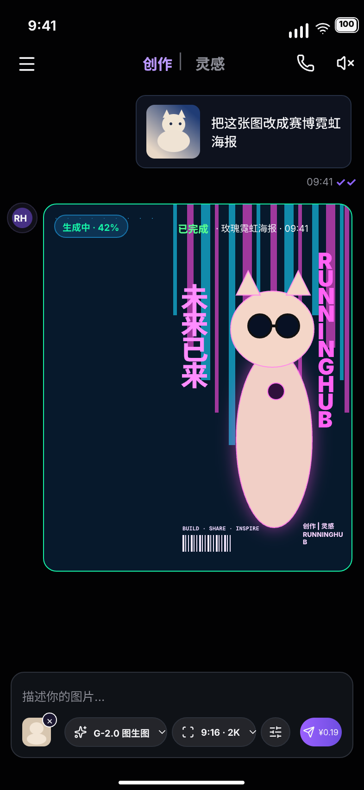
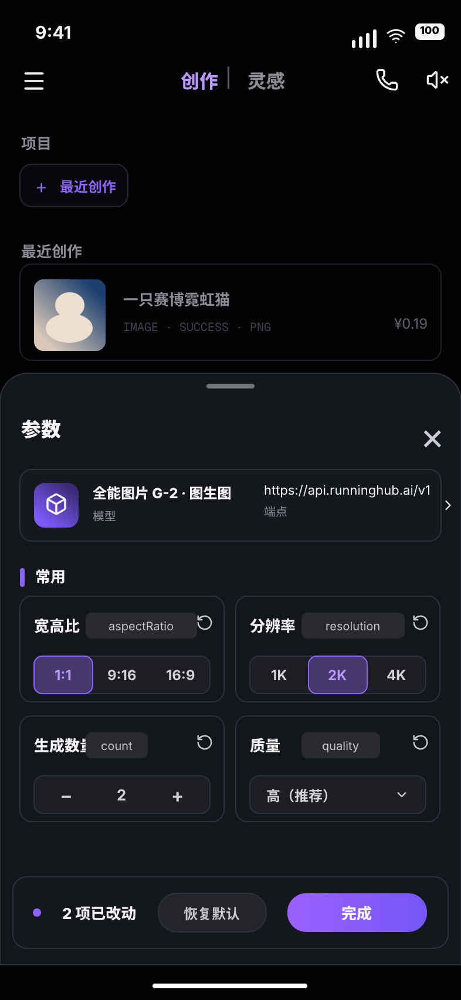
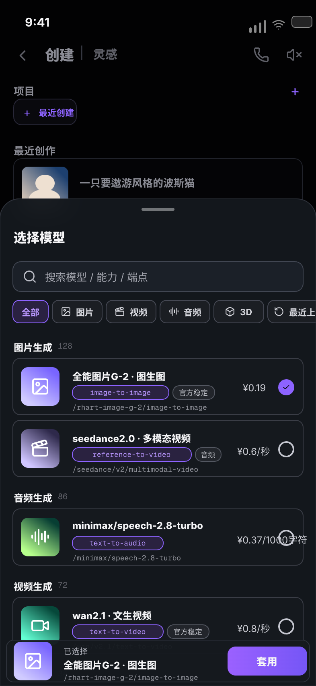

# RunningHub 快捷创作 UI 草稿说明

更新时间：2026-06-23  
设计来源：用户提供的 3 张移动端 UI 截图  
设计工具：已打开的 Pencil 文件 `pencil-welcome-desktop.pen`

## 画板与导出

| 截图状态 | Pencil 画板 | 节点 ID | 导出图 |
| --- | --- | --- | --- |
| 创作生成页 | `01 创作生成页` | `WyT0Y` | `images/quickcreate-generate.png` |
| 参数底部弹层 | `02 参数底部弹层` | `NSgRI` | `images/quickcreate-params-sheet.png` |
| 选择模型底部弹层 | `03 选择模型底部弹层` | `AF0dG` | `images/quickcreate-model-sheet.png` |

## 整体设计判断

该组界面是 RunningHub 快捷创作的暗色移动端工作流，核心路径为：

1. 用户在创作页输入图片改写提示词并发起图生图任务。
2. 用户通过参数弹层调整模型、宽高比、分辨率、生成数量和质量。
3. 用户通过模型选择弹层搜索并切换不同能力模型。

界面不是营销页，而是高频生产工具页。草稿保留截图中的高信息密度、暗色沉浸背景、紫色品牌强调、底部可触达操作区和 AI 生成状态反馈。

## 画布规格

- 画板尺寸：`393 × 852`，对应 iPhone 竖屏比例草稿。
- 背景：近黑色基底，叠加极弱蓝紫光晕。
- 状态栏：高度约 44，时间位于左上，信号、Wi-Fi、电池位于右上。
- 顶部导航：居中 `创作 | 灵感`，当前页用紫色高亮。
- 主内容安全边距：左右约 16-18。
- 底部 Home Indicator：白色 132-136 宽胶囊。

## 视觉 Token

| 类型 | Token | 值 | 用途 |
| --- | --- | --- | --- |
| 背景 | `rh-bg` | `#020203` | 页面主背景 |
| 面板 | `rh-panel` | `#11151AEE` | 输入栏、底部弹层 |
| 深面板 | `rh-panel-2` | `#171A20F2` | 卡片内层、控件底色 |
| 描边 | `rh-stroke` | `#2D313A` | 面板和卡片边框 |
| 弱描边 | `rh-stroke-soft` | `#232731` | 次级按钮和历史卡 |
| 主文本 | `rh-text` | `#F5F5F7` | 标题、主要操作 |
| 次文本 | `rh-muted` | `#8B8C95` | 标签、元信息 |
| 弱文本 | `rh-dim` | `#5F6068` | 背景页弱化文本 |
| 品牌紫 | `rh-purple` | `#8D63FF` | 选中、按钮、强调 |
| 浅紫 | `rh-purple-soft` | `#B997FF` | 当前 tab、选中标签 |
| 成功绿 | `rh-green` | `#16F4A7` | 生成状态、完成状态 |
| 霓虹青 | `rh-cyan` | `#16D8FF` | 海报和光效辅助 |
| 霓虹粉 | `rh-pink` | `#FF5CF4` | 海报和光效辅助 |

## 页面 1：创作生成页

### 结构

- 顶部为状态栏和 `创作 | 灵感` 导航。
- 右上保留电话与静音图标，左上为菜单图标。
- 用户消息气泡位于右上区域，包含猫图缩略图和提示词：
  `把这张图改成赛博霓虹海报`
- 气泡下方展示时间 `09:41` 和紫色双勾已读状态。
- 生成结果卡位于中部，左侧有 RH 头像。
- 结果卡为大尺寸海报预览，描边使用成功绿。
- 卡片左上为 `生成中 · 42%` 胶囊，右上为 `已完成 · 玫瑰霓虹海报 · 09:41`。
- 底部输入栏包含占位文案、已选图片、模型、比例分辨率、参数入口和发送价格按钮。

### 海报草稿

截图中的最终海报是位图生成结果。Pencil 草稿使用矢量占位复刻其视觉信息：

- 右侧为赛博霓虹猫海报区域。
- 保留 `未来已来` 中文竖排。
- 保留 `RUNNINGHUB` 英文竖排。
- 使用粉紫与青蓝灯柱模拟霓虹城市背景。
- 使用猫头、猫身、墨镜、项圈吊牌表达主体。
- 底部保留条形码、品牌角标和小字信息。

实现时应将该矢量占位替换为真实生成图片缩略图或远端图片资源。

## 页面 2：参数底部弹层

### 背景层

背景页弱化显示项目入口和最近创作卡，底部弹层从屏幕中下部覆盖，参考截图中的半透明玻璃质感。

### 弹层结构

- 顶部拖拽条居中。
- 左侧标题 `参数`，右侧关闭 `×`。
- 第一张卡为当前模型摘要：
  - 模型：`全能图片 G-2 · 图生图`
  - 端点：`https://api.runninghub.ai/v1`
  - 右侧进入箭头。
- `常用` 分区使用紫色竖条强调。
- 参数以 2 × 2 网格呈现：
  - 宽高比 `aspectRatio`：`1:1` 选中，`9:16`、`16:9` 未选。
  - 分辨率 `resolution`：`2K` 选中，`1K`、`4K` 未选。
  - 生成数量 `count`：步进器显示 `- 2 +`。
  - 质量 `quality`：下拉显示 `高（推荐）`。
- 底部操作栏：
  - 左侧 `2 项已改动`。
  - 中间 `恢复默认`。
  - 右侧主按钮 `完成`。

### 交互状态

- 选中项使用紫色半透明底和紫色描边。
- 未选项使用深灰底，文本为浅灰。
- 每个参数卡右上角保留重置图标。
- 底部操作栏应只在有参数变更时显示改动数量。

## 页面 3：选择模型底部弹层

### 背景层

背景页与参数页类似，但顶部标题在截图中呈现 `创建 | 灵感` 的弱化状态，并在右侧保留加号入口。

### 弹层结构

- 顶部拖拽条和标题 `选择模型`。
- 搜索框占位：
  `搜索模型 / 能力 / 端点`
- 分类筛选：
  - `全部` 选中。
  - `图片`、`视频`、`音频`、`3D`、`最近上新` 未选。
- 分组列表：
  - 图片生成 `128`
  - 音频生成 `86`
  - 视频生成 `72`
  - 3D 生成 `34`
- 模型条目包含图标、名称、能力标签、稳定/质量标签、端点路径、价格和单选圆。
- 当前选中模型：
  `全能图片G-2 · 图生图`
  - 能力：`image-to-image`
  - 标签：`官方稳定`
  - 路径：`/rhart-image-g-2/image-to-image`
  - 价格：`¥0.19`
- 底部固定选择栏：
  - 左侧显示选中模型图标。
  - 中间显示 `已选择`、模型名称和路径。
  - 右侧主按钮 `套用`。

### 列表裁切

截图中的模型弹层表现为可滚动列表，底部 3D 条目被底部固定栏部分遮挡。Pencil 画板中按截图保留这种裁切关系，用于表达滚动容器和固定底栏的层级。

## 组件与实现建议

### 可抽象组件

- 顶部状态栏与创作/灵感导航。
- 历史创作卡。
- 底部输入栏。
- 参数卡。
- 分段选择器。
- 模型列表项。
- 底部固定操作栏。

### Compose 实现边界

- Composable 只负责渲染状态，不直接调用网络、存储或模型 API。
- 参数变更通过 `Action` 或 `Intent` 上送给 ScreenModel/StateHolder。
- 模型列表来源应来自 Domain Repository 或 UseCase，不在 UI 中硬编码业务数据。
- 价格、端点、能力标签应保持为模型元数据，不要在 Data 层生成最终 UI 文案。
- 生成任务进度、完成状态、失败状态应由状态流驱动。

### 状态字段建议

- `selectedModel`
- `prompt`
- `selectedInputImages`
- `aspectRatio`
- `resolution`
- `count`
- `quality`
- `changedParameterCount`
- `generationProgress`
- `generationStatus`
- `recentCreations`
- `modelSearchQuery`
- `modelCategory`
- `selectedModelId`

## 与截图的对应关系

| 截图元素 | 草稿处理 |
| --- | --- |
| 暗色背景 | 保留近黑背景和微弱蓝紫光晕 |
| 紫色品牌强调 | 用于当前 tab、选中 chip、主按钮和单选态 |
| 赛博猫生成图 | 使用矢量海报占位复刻结构，后续替换真实生成图 |
| 参数弹层玻璃质感 | 使用半透明深色面板、描边和背景模糊效果 |
| 模型列表 | 保留搜索、分类、分组数量、价格、路径、单选态 |
| 底部操作 | 保留输入栏、完成按钮、套用按钮和价格按钮 |

## 验证记录

- 已在 Pencil 中创建 3 个顶层手机画板。
- 已通过 Pencil `get_screenshot` 分别检查 3 个画板可渲染。
- 已通过 Pencil `export_nodes` 导出 3 张 PNG。
- 第三屏模型列表底部裁切为参考截图的滚动容器表现，不视为布局缺陷。

## 剩余风险

- 海报和猫图当前为矢量占位，不是最终生成位图。
- Pencil 草稿用于视觉和结构对齐，不包含真实滚动、输入、选择或网络行为。
- 最终 Compose 实现需要补齐多状态：空态、失败态、生成中、已完成、余额不足、模型加载失败。
